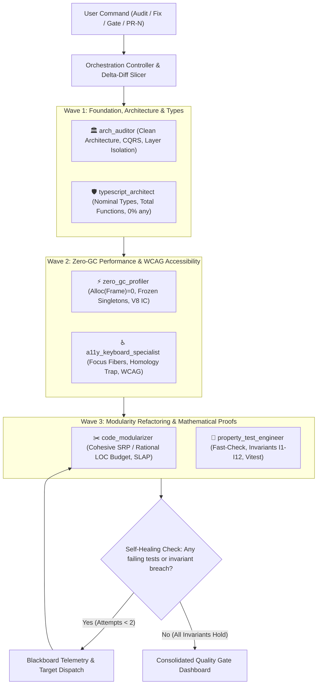

# Multi-Agent Team Orchestration Engine

The `team-orchestrator` coordinates the 6 specialized subagents of `popover-trail` through a fault-tolerant, parallelized execution pipeline with blackboard telemetry, incremental dependency scoping, and autonomous self-healing capabilities.

---

## 1. Operational Execution Modes

The orchestrator supports three distinct operational modes based on user intent:

| Mode | Trigger Phrases | Execution Strategy | Primary Deliverable |
| :--- | :--- | :--- | :--- |
| **1. Comprehensive Audit** | *"full audit"*, *"проверь всеми агентами"*, *"check health"* | Read-only parallel inspection across all 6 axes | 6-Axis Health Score & Gap Analysis |
| **2. Autonomous Remediation (Fix)** | *"auto-fix all"*, *"исправь все замечания"*, *"refactor with team"* | Multi-wave refactoring with automated self-healing | Atomic code patches + colocated tests |
| **3. Pre-Merge Certification (Gate)** | *"pr-gate"*, *"verify PR"*, *"сертифицируй перед слиянием"* | Strict blocking quality gate with zero-tolerance rules | Formal Certification Artifact |

---

## 2. 3-Wave Orchestration Pipeline & Topology



---

## 3. Blackboard Telemetry & Inter-Agent Communication Protocol

When coordinating subagents, messages dispatched via `send_message` must adhere to the structured **Blackboard Telemetry Schema**:

```json
{
  "traceId": "orch-run-2026-08-26-01",
  "wave": 1,
  "sender": "arch_auditor",
  "target": "code_modularizer",
  "event": "INVARIANT_BREACH_DETECTED",
  "payload": {
    "targetFile": "src/lib/popover/store/reducers/popoverReducers.ts",
    "lineRange": [42, 65],
    "invariant": "I_LayerIsolation",
    "details": "DOM API access detected inside Layer 1 reducer.",
    "remediationAction": "Extract DOM coordinate calculation into Layer 3 adapter."
  }
}
```

---

## 4. Incremental Delta-Diff Scoping (Fast-Path Optimization)

To eliminate unnecessary token churn and execution latency during targeted PRs or single-file edits:

1. **Compute Changed Files**: Identify the modified file set $\Delta F$.
2. **Compute Transitive Dependency Closure**:
   $$\mathcal{C}(\Delta F) = \Delta F \cup \text{TransitiveDependents}(\Delta F)$$
3. **Targeted Agent Slicing**:
   * `arch_auditor` & `typescript_architect`: inspect $\Delta F$ and their direct imports.
   * `zero_gc_profiler`: inspect hot paths within $\mathcal{C}(\Delta F)$.
   * `property_test_engineer`: run only test suites covering $\mathcal{C}(\Delta F)$ before running the full regression battery.

---

## 5. Subagent Dispatch Matrix & Resource Allocations

When dispatching subagents via `invoke_subagent`, apply the following resource profiles:

| Subagent | Role & Domain | Model | Tools | Workspace Mode |
| :--- | :--- | :---: | :---: | :---: |
| **`arch_auditor`** | Clean Architecture, 4-tier layer constraints, pure reducers | `flash` | Read-only | `share` |
| **`typescript_architect`** | Nominal branded types (`PopoverKey`), Result monads, zero escapes | `inherit` | Write + Typecheck | `inherit` |
| **`zero_gc_profiler`** | Hot-path memory profiling, static singleton reuse, monomorphic IC | `flash` | Read + DevTools | `share` |
| **`a11y_keyboard_specialist`**| Focus fiber stack ($\pi$), closed 1-cycle tab traps, WCAG AAA | `inherit` | Write + DevTools | `inherit` |
| **`code_modularizer`** | File budgeting ($\le 90$ LOC), function scoping ($\le 25$ LOC), SLAP | `inherit` | Write + Tests | `inherit` |
| **`property_test_engineer`**| Invariants $\mathcal{I}_1\dots\mathcal{I}_{12}$, generative `fast-check`, Vitest | `inherit` | Write + Vitest | `inherit` |

---

## 6. Autonomous Self-Healing Protocol (Fix Mode)

If any quality gate or test suite fails during execution, the orchestrator triggers the **Automated Self-Healing Loop**:

1. **Failure Diagnostics Capture**: Extract exact compiler diagnostics, invariant breaches, or Vitest stack traces.
2. **Targeted Subagent Dispatch**: Send the structured blackboard payload directly to the responsible subagent (`typescript_architect` for type errors, `code_modularizer` for line budget breaches, `zero_gc_profiler` for closure allocations).
3. **Regression Verification**: `property_test_engineer` re-runs the full verification suite (`npm test && npm run typecheck`).
4. **Loop Bound**: Max 2 automated remediation iterations. If issues persist, surface them as explicit blocking items in the final report.

---

## 7. Mathematical System Health Metric

The project health score is computed as an unweighted harmonic composite:

$$\text{HealthScore} = \frac{6}{\sum_{i=1}^{6} \frac{1}{\text{Score}_i}} \in [0.0, 1.0]$$

* **Green (Certified)**: $\text{HealthScore} = 1.0 \land \text{Blockers} = 0$
* **Yellow (Warning)**: $\text{HealthScore} \ge 0.90 \land \text{Blockers} = 0$
* **Red (Blocked)**: $\text{HealthScore} < 0.90 \lor \text{Blockers} > 0$

---

## 8. Output Template: Consolidated Quality Gate Dashboard

```markdown
# 🛡️ Multi-Agent Quality Gate Certification Report

**Mode:** [Audit | Fix | Certification]  
**Target Scope:** [Full Repository | PR-N | Specific Module]  
**Overall System Health:** $\text{HealthScore} = 1.00$ (🟢 CERTIFIED)  
**Active Invariant Proofs:** $12 / 12$ Verified ($\mathcal{I}_{\text{Acyclic}} \dots \mathcal{I}_{\text{ZeroGC}}$)

---

### 📊 Multi-Axis Verification Matrix

| Domain | Subagent | Status | Metrics / Invariants | Key Finding |
| :--- | :--- | :---: | :--- | :--- |
| **Architecture** | `arch_auditor` | ✅ PASS | 4-Tier Clean Onion | 0 lateral/upward imports. Reducers pure. |
| **Type Soundness** | `typescript_architect` | ✅ PASS | 0% any / 100% strict | Branded `PopoverKey`, total functions. |
| **Performance** | `zero_gc_profiler` | ✅ PASS | $\text{Alloc}(\text{Frame}) = 0\text{ B}$ | Static singletons reused, monomorphic IC. |
| **Accessibility** | `a11y_keyboard_specialist`| ✅ PASS | WCAG 2.1 AA/AAA | Focus fiber retraction $\pi: V \to \text{DOM}$ intact. |
| **Modularity** | `code_modularizer` | ✅ PASS | High Cohesion / $\le 300$ LOC | SLAP & SRP preserved across all modules. |
| **Invariant Tests**| `property_test_engineer` | ✅ PASS | 100% test pass rate | All Vitest & `fast-check` properties hold. |

---

### 📋 Invariant Proof Obligation Matrix ($\mathcal{I}_1 \dots \mathcal{I}_{12}$)

| Invariant | Description | Verification Evidence | Status |
| :--- | :--- | :--- | :---: |
| $\mathcal{I}_{\text{Acyclic}}$ | Cycle freedom in cascade graph | `tests/graphInvariants.test.ts` | 🟢 Verified |
| $\mathcal{I}_{\text{ZBijection}}$ | Bijective $z$-index mapping | `tests/zIndexOrder.test.ts` | 🟢 Verified |
| $\mathcal{I}_{\text{TimerContainment}}$ | Bounded active timers | `tests/transitionScheduler.test.ts` | 🟢 Verified |
| $\mathcal{I}_{\text{FiniteFloat}}$ | Non-finite coordinate sanitization | `tests/dragMath.test.ts` | 🟢 Verified |
| $\mathcal{I}_{\text{Terminality}}$ | Permanent disposal state $\Omega$ | `tests/disposable.test.ts` | 🟢 Verified |
| $\mathcal{I}_{\text{ZeroGC}}$ | Zero allocation in frame loops | `tests/zeroGcProfile.test.ts` | 🟢 Verified |

---

### 🎯 Synthesis & Next Actions:
- [Clear summary of changes made, or green-light for PR merge]
```
