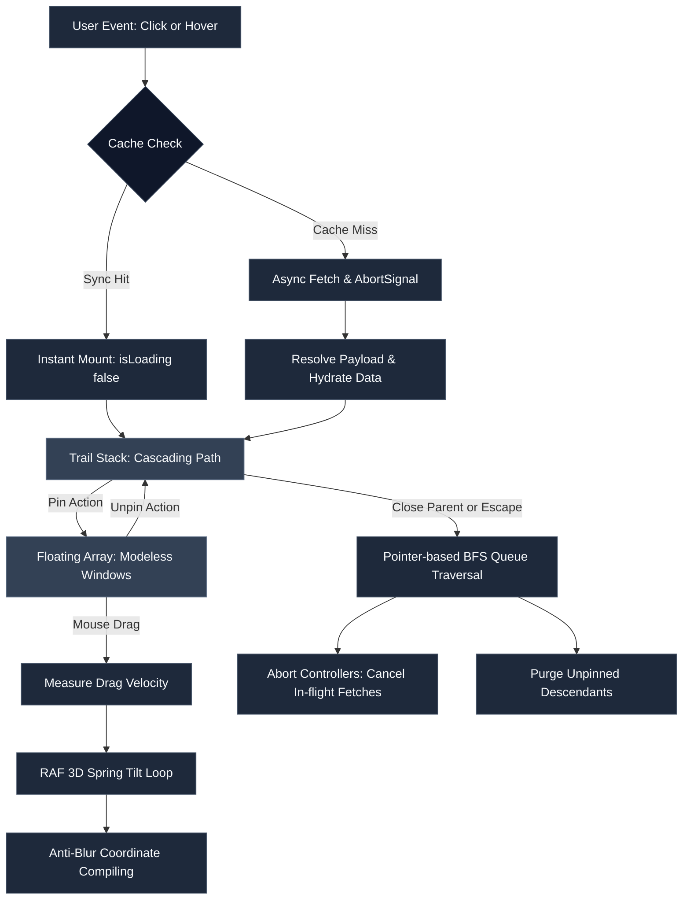

# Popover Trail 🪄

[](https://www.npmjs.com/package/popover-trail)
[](https://bundlephobia.com/package/popover-trail)
[](./LICENSE)
[](https://www.typescriptlang.org/)

A lightweight, headless React 19 library for building cascading popover trails, spatial draggable windows, and physics-driven UI cards.

---

## 💡 Why Popover Trail?

Standard popover libraries treat popovers as simple, isolated dropdowns. But what happens when your users need to drill down into complex data — exploring nested formulas, inspecting child nodes, or comparing multiple items side-by-side?

**Popover Trail** turns popovers into a connected, hierarchical tree:
- **Cascading Trails**: Open popovers recursively. Opening a child auto-aligns to its parent.
- **Pin & Drag**: Pin any popover to break it out of the trail and turn it into a free-floating, modeless window.
- **3D Spring Physics**: Dragged cards swing naturally with velocity-sensitive inertia physics.
- **Smart Cleanup**: Closing a parent popover cleanly closes its unpinned children, aborts in-flight network requests, and prevents memory leaks.
- **Zero-Flicker Caching**: Instantly renders cached data without loading spinner flashes.

---

## 🎮 Try the Interactive Playground

We included a live interactive math formula drill-down playground in the repo:

```bash
git clone https://github.com/HerAnsu/popover-trail.git
cd popover-trail
npm install
npm run dev
```

Open `http://localhost:5173` to explore live nested expression parsing, drag-to-pin physics, and keyboard navigation.

---

## ⚙️ How it Works under the Hood



### 1. Dual-Stack State Engine
At its core, Popover Trail maintains two state lists in Zustand:
- `trail`: The active cascading path (unpinned popovers tied to their triggers).
- `floating`: Pinned popovers that float freely anywhere on the viewport.

Pinning a card moves it from `trail` to `floating`. Unpinning returns it to the trail stack, preserving its original parent relationship.

### 2. Automatic Tree Cleansing & Request Cancellation
Closing a parent popover automatically triggers a Breadth-First Search (BFS) to find and unmount all unpinned child popovers down the tree. Any active `fetch` requests for closed cards are canceled immediately using `AbortController`.

### 3. Velocity Spring Physics
When you drag a pinned card, the physics engine measures your cursor's velocity:
$$\text{Velocity} = \frac{\Delta \text{position}}{\Delta \text{time}}$$

It applies a dynamic 3D tilt rotation ($\text{rotateX}$, $\text{rotateY}$, $\text{rotateZ}$) that smoothly settles back to $0^\circ$ using inertia dampening when released.

---

## 📦 Installation

```bash
npm install popover-trail @floating-ui/react
```

---

## 🚀 Quick Start

### Step 1: Set up your typed Popover Factory

Create a type-safe provider and trigger set using `createPopoverTrail<TData, TContext, TPopoverKey>()`:

```tsx
import { createPopoverTrail, type PopoverResolver } from 'popover-trail';

interface ItemData {
  title: string;
  details: string;
}

type ItemKey = 'engine' | 'transmission' | 'brakes';

export const { PopoverProvider, PopoverTrigger, usePopover } = 
  createPopoverTrail<ItemData, Record<string, unknown>, ItemKey>();

// Fetch resolver with AbortSignal support
const itemResolver: PopoverResolver<ItemData> = async (key, parentData, context, signal) => {
  const res = await fetch(`/api/items/${key}`, { signal });
  return res.json();
};
```

### Step 2: Wrap your App with Provider

```tsx
import React from 'react';
import { PopoverProvider, itemResolver } from './popoverConfig';
import { Workspace } from './Workspace';

export default function App() {
  return (
    <PopoverProvider
      resolveData={itemResolver}
      clickOutside={{ enabled: true }}
      enableKeyboardClose
      cascadeOffsetStep={16}>
      <Workspace />
    </PopoverProvider>
  );
}
```

### Step 3: Add Triggers

```tsx
import React from 'react';
import { PopoverTrigger } from './popoverConfig';

export function Toolbar() {
  return (
    <PopoverTrigger
      popoverKey="engine"
      placement="bottom-start"
      options={{
        hover: { enabled: true, openDelay: 150, closeDelay: 200 },
        allowDragWhenUnpinned: true,
      }}>
      <button className="btn">Inspect Engine</button>
    </PopoverTrigger>
  );
}
```

### Step 4: Render Cards & Canvas

```tsx
import React from 'react';
import { isResolvedEntry, usePopoverHydration, type TrailEntry } from 'popover-trail';
import { PopoverCanvas, usePopoverDraggableCard } from 'popover-trail/dnd';
import type { ItemData } from './popoverConfig';

function Card({ entry, index, isPinned }: { entry: TrailEntry<ItemData>; index: number; isPinned: boolean }) {
  const { isLoading, error, reload } = usePopoverHydration(entry.key);
  const { ref, style, isTop, dragHandleProps, handlePinToggle, actions } = 
    usePopoverDraggableCard({ entry, index, isPinned, placement: 'bottom' });

  return (
    <div
      ref={ref}
      style={style}
      role="dialog"
      aria-modal={!isPinned}
      className={`card ${isTop ? 'topmost' : ''} ${isPinned ? 'pinned' : ''}`}>
      
      <div className="header" {...dragHandleProps}>
        <span>{isLoading ? 'Loading...' : entry.data?.title}</span>
        <button onClick={handlePinToggle}>{isPinned ? '📌' : '📍'}</button>
        <button onClick={() => actions.closeFrom(index)}>✕</button>
      </div>

      <div className="body">
        {isLoading ? (
          <div>Loading data...</div>
        ) : error ? (
          <div>
            <p>Error: {error.message}</p>
            <button onClick={reload}>Retry</button>
          </div>
        ) : isResolvedEntry(entry) ? (
          <div>
            <h3>{entry.data.title}</h3>
            <p>{entry.data.details}</p>
          </div>
        ) : null}
      </div>
    </div>
  );
}

export function Canvas() {
  return (
    <PopoverCanvas<ItemData>>
      {({ entry, index, isPinned }) => (
        <Card key={entry.key} entry={entry} index={index} isPinned={isPinned} />
      )}
    </PopoverCanvas>
  );
}
```

---

## ⌨️ Accessibility & Shortcuts

Out of the box, Popover Trail handles WAI-ARIA accessibility attributes and keyboard shortcuts:

| Shortcut | Action | Description |
| :--- | :--- | :--- |
| `Escape` | Close popover | Closes the topmost unpinned popover in the active trail. |
| `ArrowLeft` | Focus parent | Moves keyboard focus to the parent popover in the cascade. |
| `ArrowRight` | Focus child | Moves keyboard focus to the child popover in the cascade. |

---

## ⚙️ API Summary

### `PopoverProvider` Props

| Prop | Type | Default | Description |
| :--- | :--- | :--- | :--- |
| `resolveData` | `PopoverResolver` | *Required* | Data fetch function. |
| `cache` | `PopoverCache` | `undefined` | Cache provider instance. |
| `clickOutside` | `{ enabled: boolean }` | `{ enabled: true }` | Dismiss when clicking outside. |
| `enableKeyboardClose` | `boolean` | `true` | Close popovers with `Escape`. |
| `cascadeOffsetStep` | `number` | `16` | Step offset (in px) for cascading layers. |

---

## 📄 License

MIT License © 2026. Free for open-source and commercial projects.
