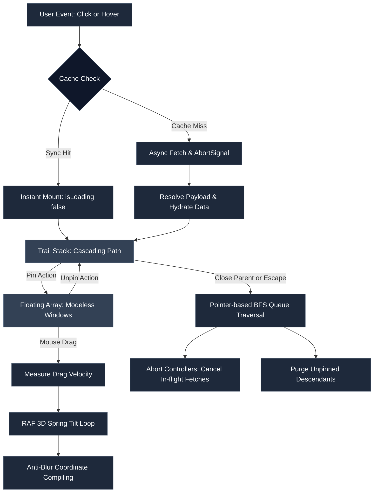

# Popover Trail 🪄

[](https://www.npmjs.com/package/popover-trail)
[](https://bundlephobia.com/package/popover-trail)
[](./LICENSE)
[](https://www.typescriptlang.org/)

A headless, ultra-performant React 19 engine for declarative cascading popover trails, modal-to-modeless spatial window transitions, velocity-based 3D spring tilt physics, and hybrid data caching.

---

## 💡 Why Popover Trail?

Standard overlay components treat popovers as isolated, temporary dropdowns. But complex workspace interfaces — such as graph inspectors, multi-level formula builders, nested code drill-downs, or CAD hierarchy viewers — require users to explore multi-layered trees of data without losing context.

**Popover Trail** models popovers as nodes in an active hierarchy tree, solving the core challenges of spatial workspace UIs:

1. **Cascading Trails**: Drill down into data recursively. Each child popover attaches relative to its parent trigger node.
2. **Modal-to-Modeless Pinning**: Pin any popover card to detach it from the relative trail stack and turn it into an independent, modeless floating window anywhere on the canvas.
3. **Velocity-Sensitive 3D Spring Physics**: Dragged cards swing naturally with real-time 3D tilt Euler physics ($\text{rotateX}$, $\text{rotateY}$, $\text{rotateZ}$).
4. **Automated Tree Cleansing & Request Cancellation**: Closing a parent node unmounts its active descendant trail and instantly aborts pending network fetches via `AbortController`.
5. **Zero-Flicker Caching**: Synchronously resolved cache hits bypass loading states entirely, eliminating 1-frame loading spinner flicker.

---

## ⚙️ Deep-Dive Architecture & Core Engine



### 1. Dual-Stack State Machine
The core engine is driven by a vanilla Zustand store managing two primary arrays:
- **`trail`**: A linear, ordered stack representing the active cascading path of unpinned popovers. Only one active trail path exists at a time.
- **`floating`**: An unordered list of pinned, modeless popover cards floating independently on the spatial canvas.

Toggling a card's pinned state (`togglePin(key)`) splices it from `trail` into `floating` (or vice-versa), preserving its original parent relationship (`originalParentKey`) and layout coordinates.

### 2. Sub-Pixel Layout Compiling & Sub-pixel Anti-Blurring
Popover Trail computes absolute viewport coordinates for every popover card by combining Floating UI positioning with internal cascade steps and drag translations:

$$\text{Final Position} = \text{Floating UI Placement} + \text{Cascade Step} + \text{Drag Offset} + \text{Drag Translation}$$

To prevent browser compositor sub-pixel anti-aliasing (which causes text and fine border lines to look blurry on non-retina displays), the layout engine explicitly rounds coordinate values using `Math.round()` before outputting CSS styles.

### 3. Real-Time 3D Inertia Velocity Physics
When dragging a pinned card, the `usePopoverDragAndDrop` hook tracks mouse movement velocity across consecutive animation frames:

$$\text{Velocity}_X = \frac{\Delta x}{\Delta t}, \quad \text{Velocity}_Y = \frac{\Delta y}{\Delta t}$$

A hardware-accelerated `requestAnimationFrame` loop calculates Euler 3D tilt angles:
- Horizontal drag velocity ($\text{Velocity}_X$) drives vertical axis rotation ($\text{rotateY}$).
- Vertical drag velocity ($\text{Velocity}_Y$) drives horizontal axis rotation ($\text{rotateX}$).
- Secondary velocity drives flat roll rotation ($\text{rotateZ}$).

When released, rotations decay exponentially back to $0^\circ$ using spring dampening:

$$\text{Angle}_{t} = \text{Angle}_{t-1} \times 0.82$$

Once the tilt angle drops below $0.05^\circ$, frame updates automatically halt to prevent idle CPU cycles.

### 4. Hierarchical BFS Tree Cleansing & Hydration Counters
- **Pointer-Based BFS Unmounting**: Closing an ancestor popover triggers a Breadth-First Search (BFS) queue traversal over child linkage maps, unmounting all unpinned descendants in a single state patch.
- **`AbortController` Cancellation**: Every pending resolver request is assigned a dedicated `AbortController`. If a node closes while fetching, its `abort()` signal fires immediately, preventing memory leaks and orphaned network responses.
- **Hydration Counters**: Overlapping trigger clicks increment an internal node counter (`nestedHydrationRequestCounters`). Stale promises whose counter does not match the active state tick are discarded automatically.

---

## 🎮 Interactive Demo

Clone the repo to launch the live interactive math expression drill-down playground:

```bash
git clone https://github.com/HerAnsu/popover-trail.git
cd popover-trail
npm install
npm run dev
```

Open `http://localhost:5173` to test live formula parsing, interactive pinning, 3D inertia drag physics, and keyboard navigation.

---

## 📦 Installation

```bash
npm install popover-trail @floating-ui/react
```

---

## 🚀 Complete Step-by-Step Integration Guide

### Step 1: Define Typed Factory & Data Resolver

Use `createPopoverTrail<TData, TContext, TPopoverKey>()` to create strongly-typed components bound to your domain data:

```tsx
import { createPopoverTrail, type PopoverResolver } from 'popover-trail';

// 1. Define data payload shape
export interface NodeData {
  title: string;
  expression: string;
  value: number;
  leftExpr?: string;
  rightExpr?: string;
}

// 2. Define global context shape
export interface AppContext {
  theme: 'dark' | 'light';
}

// 3. Define valid popover keys
export type NodeKey = string;

// 4. Create pre-typed components and hooks
export const { PopoverProvider, PopoverTrigger, usePopover } = 
  createPopoverTrail<NodeData, AppContext, NodeKey>();

// 5. Define data fetch resolver with AbortSignal support
export const nodeResolver: PopoverResolver<NodeData, AppContext> = async (
  key,
  parentData,
  context,
  signal
) => {
  const res = await fetch(`/api/nodes/${encodeURIComponent(key)}`, { signal });
  if (!res.ok) throw new Error(`Failed to resolve node: ${key}`);
  return res.json();
};
```

### Step 2: Wrap Application with Provider

```tsx
import React from 'react';
import { PopoverProvider, nodeResolver } from './popoverConfig';
import { SpatialWorkspace } from './SpatialWorkspace';

export default function App() {
  return (
    <PopoverProvider
      resolveData={nodeResolver}
      initialContext={{ theme: 'dark' }}
      clickOutside={{ enabled: true }}
      enableKeyboardClose
      closePinnedDescendants={false}
      cascadeOffsetStep={16}>
      <SpatialWorkspace />
    </PopoverProvider>
  );
}
```

### Step 3: Add Root and Nested Triggers

Use `<PopoverTrigger>` for root elements, or `usePopoverNestedTrigger` for nested cascades inside popover cards:

```tsx
import React from 'react';
import { PopoverTrigger } from './popoverConfig';

export function Toolbar() {
  return (
    <PopoverTrigger
      popoverKey="(10 + 20) * 3"
      placement="bottom"
      options={{
        allowDragWhenUnpinned: true,
        hover: { enabled: true, openDelay: 150, closeDelay: 200 },
        ariaDescribedby: 'Evaluation details for formula',
      }}>
      <button className="btn-primary">Inspect Formula</button>
    </PopoverTrigger>
  );
}
```

### Step 4: Render Spatial Canvas & Draggable Cards

Combine `PopoverCanvas`, `usePopoverDraggableCard`, `isResolvedEntry`, and `usePopoverHydration`:

```tsx
import React from 'react';
import { isResolvedEntry, usePopoverHydration, type TrailEntry } from 'popover-trail';
import { PopoverCanvas, usePopoverDraggableCard } from 'popover-trail/dnd';
import type { NodeData } from './popoverConfig';

interface CardProps {
  entry: TrailEntry<NodeData>;
  index: number;
  isPinned: boolean;
}

function NodeCard({ entry, index, isPinned }: CardProps) {
  // Access hydration state (isLoading, error, reload)
  const { isLoading, error, reload } = usePopoverHydration<NodeData>(entry.key);

  // Access layout ref, spring transform styles, and dnd handles
  const { ref, style, isTop, dragHandleProps, handlePinToggle, actions } = 
    usePopoverDraggableCard({ entry, index, isPinned, placement: 'bottom' });

  return (
    <div
      ref={ref}
      style={style}
      role="dialog"
      aria-modal={!isPinned}
      aria-labelledby={`title-${entry.key}`}
      className={`popover-card ${isTop ? 'topmost' : ''} ${isPinned ? 'pinned' : ''}`}>
      
      {/* Header with Drag Handle */}
      <div className="card-header" {...dragHandleProps}>
        <span id={`title-${entry.key}`} className="card-title">
          {isLoading ? 'Evaluating...' : entry.data?.title}
        </span>
        <div className="card-actions">
          <button type="button" onClick={handlePinToggle} title={isPinned ? 'Unpin' : 'Pin'}>
            {isPinned ? '📌' : '📍'}
          </button>
          <button type="button" onClick={() => actions.closeFrom(index)} title="Close">
            ✕
          </button>
        </div>
      </div>

      {/* Card Body */}
      <div className="card-body">
        {isLoading ? (
          <div className="spinner">Parsing node payload...</div>
        ) : error ? (
          <div className="error-state">
            <p>Error: {error.message}</p>
            <button type="button" onClick={reload}>Retry</button>
          </div>
        ) : isResolvedEntry(entry) ? (
          <div className="content">
            <code>{entry.data.expression}</code>
            <p>Calculated Result: <strong>{entry.data.value}</strong></p>
          </div>
        ) : null}
      </div>
    </div>
  );
}

export function SpatialWorkspace() {
  return (
    <PopoverCanvas<NodeData>>
      {({ entry, index, isPinned }) => (
        <NodeCard key={entry.key} entry={entry} index={index} isPinned={isPinned} />
      )}
    </PopoverCanvas>
  );
}
```

---

## 💡 Advanced Production Patterns

### Pattern A: LRU Data Caching with `SimplePopoverCache`

Pass `SimplePopoverCache` to `PopoverProvider` to enable TTL expiration and maximum memory bounds (FIFO/LRU eviction):

```tsx
import { PopoverProvider, SimplePopoverCache } from 'popover-trail';

// 5-minute TTL expiration, maximum 100 cached entries
const memoryCache = new SimplePopoverCache(5 * 60 * 1000, 100);

export function App() {
  return (
    <PopoverProvider resolveData={myResolver} cache={memoryCache}>
      <MainWorkspace />
    </PopoverProvider>
  );
}
```

### Pattern B: Custom Viewport Clamping Boundaries

Clamp popovers within specific DOM elements (e.g., scrollable canvas panes) via `CollisionConfig`:

```tsx
<PopoverTrigger
  popoverKey="sub-detail"
  options={{
    collision: {
      boundary: () => document.getElementById('workspace-container')!,
      padding: 16,
      flip: { fallbackPlacements: ['top', 'right'] },
    },
  }}>
  <button>Open Clamped Card</button>
</PopoverTrigger>
```

### Pattern C: Custom Animations via CSS Custom Properties

Popover Trail automatically outputs CSS Variables directly on element styles:

```css
.popover-card {
  transform: translate(var(--popover-translate-x), var(--popover-translate-y))
             rotateX(var(--popover-rotate-x))
             rotateY(var(--popover-rotate-y))
             rotateZ(var(--popover-rotate-z));
  z-index: var(--popover-z-index);
  will-change: transform;
  transition: transform 0.2s cubic-bezier(0.16, 1, 0.3, 1);
}
```

---

## ⌨️ Accessibility & Shortcuts

Popover Trail manages WAI-ARIA accessibility attributes and keyboard shortcuts automatically:

| Shortcut | Action | Description |
| :--- | :--- | :--- |
| `Escape` | Dismiss popover | Closes the topmost unpinned popover card in the active trail. |
| `ArrowLeft` | Focus parent | Moves focus backward to the parent popover card in the trail. |
| `ArrowRight` | Focus child | Moves focus forward to the child popover card in the trail. |

### Managed WAI-ARIA Attributes
- **Triggers**: `aria-haspopup="dialog"`, `aria-expanded={isOpen}`, `aria-controls={`popover-card-${key}`}`.
- **Cards**: `role="dialog"`, `aria-modal={!isPinned}`, `id={`popover-card-${key}`}`, `aria-labelledby`, `aria-describedby`.

---

## ⚙️ Exhaustive API Reference

### `PopoverProvider` Props

| Prop | Type | Default | Description |
| :--- | :--- | :--- | :--- |
| `resolveData` | `PopoverResolver<TData, TContext>` | *Required* | Data resolver function. |
| `initialContext` | `TContext` | `undefined` | Shared global context payload. |
| `cache` | `PopoverCache<TData>` | `undefined` | Cache provider instance. |
| `clickOutside` | `ClickOutsideConfig` | `{ enabled: true }` | Outside click backdrop dismissal config. |
| `enableKeyboardClose` | `boolean` | `true` | Enables closing active cards with `Escape`. |
| `enableArrowNavigation` | `boolean` | `false` | Enables `ArrowLeft` / `ArrowRight` trail keyboard navigation. |
| `closePinnedDescendants` | `boolean` | `false` | Closes pinned descendants when a parent card is closed. |
| `cascadeOffsetStep` | `number` | `16` | Step offset in pixels for cascading popover layers. |

---

### `usePopoverCard` / `usePopoverDraggableCard` Options

| Option | Type | Default | Description |
| :--- | :--- | :--- | :--- |
| `entry` | `TrailEntry<TData>` | *Required* | Target popover trail entry node. |
| `index` | `number` | *Required* | Stacking depth index. |
| `isPinned` | `boolean` | *Required* | Pinned/floating status. |
| `placement` | `PopoverPlacement` | `'bottom'` | Base layout placement direction preference. |
| `enableTilt` | `boolean` | `true` | Enables 3D spring tilt physics during drag operations. |
| `maxTiltAngle` | `number` | `5` | Maximum tilt swing angle in degrees. |
| `tiltSensitivity` | `number` | `8` | Velocity scaling multiplier for tilt response. |
| `dragAxis` | `'x' \| 'y' \| 'both'` | `'both'` | Locks dragging coordinates to specific axes. |

---

### `CollisionConfig` Options

```typescript
interface CollisionConfig {
  boundary?: 'clippingAncestors' | HTMLElement | HTMLElement[] | (() => HTMLElement | HTMLElement[] | null);
  padding?: number | { top?: number; right?: number; bottom?: number; left?: number };
  flip?: Parameters<typeof flip>[0] | boolean;
  shift?: Parameters<typeof shift>[0] | boolean;
  size?: Parameters<typeof size>[0] | boolean;
}
```

---

### Helper Utilities & Hooks

#### `isResolvedEntry(entry)`
Type guard function narrowing `entry.data` from `TData | undefined` to `TData` safely when `isLoading` is false and `error` is null:
```typescript
if (isResolvedEntry(entry)) {
  console.log(entry.data.title); // Strongly typed as TData
}
```

#### `usePopoverHydration(key)`
Returns hydration status indicators for a given popover key:
```typescript
const { isLoading, error, reload } = usePopoverHydration(key);
```

#### `getPopoverStyles(params)`
Compiles coordinates, offsets, and tilt angles into a unified `CSSProperties` object containing CSS Custom Properties (`--popover-translate-x`, `--popover-rotate-z`, etc.).

---

## ❓ Technical FAQ

<details>
<summary><strong>Q: How does Popover Trail prevent memory leaks when users rapidly click triggers?</strong></summary>
<p>Every asynchronous resolver invocation is tied to an internal <code>AbortController</code> and an incremental hydration counter. Unmounting a popover triggers <code>controller.abort()</code> immediately, and stale promise responses whose counter tick has passed are automatically discarded.</p>
</details>

<details>
<summary><strong>Q: How does z-index promotion work for pinned windows?</strong></summary>
<p>Clicking or dragging any pinned card automatically dispatches <code>actions.bringToFront(key)</code>. This promotes the card to the end of the <code>zIndexOrder</code> array and updates its CSS <code>zIndex</code> style dynamically.</p>
</details>

<details>
<summary><strong>Q: Is Popover Trail tied to any CSS framework?</strong></summary>
<p>No. Popover Trail is 100% headless. It outputs layout coordinates, inline style objects, and CSS Custom Properties, leaving styling completely to Vanilla CSS, Tailwind CSS, CSS Modules, or Emotion.</p>
</details>

---

## 📄 License

MIT License © 2026. Free for open-source and commercial applications.
