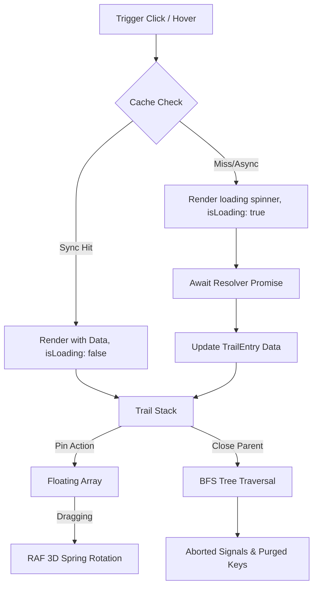

# Popover Trail 🪄

[](https://www.npmjs.com/package/popover-trail)
[](https://bundlephobia.com/package/popover-trail)
[](./LICENSE)
[](https://www.typescriptlang.org/)

A headless, ultra-performant React 19 library for declarative cascading popover trails, drag-to-pin spatial windows, physical spring-tilt interactions, and hybrid data caching.

Instead of treating popovers as isolated, temporary overlays, **Popover Trail** treats them as nodes in a hierarchical tree. You can build multi-level detail drills, pin any level as an independent floating card, and drag them around with velocity-sensitive 3D swing physics.

---

## 🎮 Interactive Demo & Playground

Experience the interactive math expression drill-down playground included in the repository:

```bash
git clone https://github.com/your-org/popover-trail.git
cd popover-trail
npm install
npm run dev
```

Open `http://localhost:5173` in your browser to test live formula parsing, interactive pinning, physical 3D swing dragging, and keyboard navigation.

---

## ⚙️ How it Works under the Hood (Architecture)

To use the library effectively, it helps to understand its underlying state and layout architecture.



### 1. The Dual-Stack State Machine
The core state is managed by a single Zustand store containing two primary arrays:
*   `trail`: A linear stack representing the active, unpinned cascading path. Only one active path can exist at a time.
*   `floating`: An unordered list of pinned, modeless popovers that float independently above the workspace.

When a trigger is activated, the library resolves the data and pushes a new `TrailEntry` into the `trail`. If you pin a popover, it is spliced out of the `trail` and pushed into `floating`. Unpinning it returns it to the trail stack, restoring its original hierarchy.

### 2. Hierarchical Lifecycles & Tree Cleansing
Every `TrailEntry` maintains a `parentKey` (current parent) and an `originalParentKey` (stored when pinned). 
*   **Branch-wide Unmounting**: When a parent popover is closed, the library performs a Breadth-First Search (BFS) using a pointer-based queue to locate all recursive descendants in both the `trail` and `floating` lists.
*   **Cancellation**: Active network requests for all closed popovers are aborted immediately via their associated `AbortController` signals, preventing memory leaks and trailing background fetches.
*   **Orphan Control**: If `closePinnedDescendants` is set to `true`, closing a parent also closes its pinned descendants. By default (`false`), pinned cards remain open on the screen as standalone windows.

### 3. Rendering & Coordinate Assembly
Popover Trail is 100% headless; it calculates coordinates and styles but leaves DOM rendering to your components.
*   **Virtual Positioning**: The triggering element's `DOMRect` (or Floating UI `VirtualElement`) is captured on activation and converted into a virtual anchor. Floating UI uses this anchor to compute coordinate placements (`flip`, `shift`, `size`).
*   **Translation Compositions**: The final coordinate returned by the style compiler `getPopoverStyles` combines:
    $$\text{Final Position} = \text{Floating UI Placement} + \text{Cascade Offset} + \text{Drag Offset} + \text{Drag Translation}$$
*   **Anti-Blur Compiling**: To prevent browsers from rendering blurry text and sub-pixel borders on standard-DPI screens, the style engine rounds all layout coordinates using `Math.round()` before applying the CSS `transform` and `top`/`left` rules.

### 4. 3D Inertia Spring Physics
When a pinned card is dragged, the `usePopoverDragAndDrop` hook monitors horizontal and vertical coordinate displacements across animation frames:
$$\text{Velocity}_X = \frac{\Delta x}{\Delta t}, \quad \text{Velocity}_Y = \frac{\Delta y}{\Delta t}$$

A `requestAnimationFrame` loop calculates Euler 3D spring tilt angles ($\text{rotateX}$, $\text{rotateY}$, $\text{rotateZ}$) proportional to this velocity. When released, the rotation decays back to $0^\circ$ using inertia dampening:
$$\text{Angle}_{t} = \text{Angle}_{t-1} \times 0.82$$

Once the rotation angle falls below a threshold ($<0.05^\circ$), the loop cancels its frames to prevent idle CPU cycles.

---

## 🌟 Unique Capabilities (How it Differs from Others)

Traditional popover libraries (like Radix, Ariakit, or standard Floating UI) are designed for single-level dropdowns or rigid nested menus. Popover Trail is built for spatial canvas UIs:

*   **Draggable Pinning (Trail to Floating)**: Popovers transition smoothly from relative alignment (clamped to their trigger buttons) to absolute viewport positions, becoming modeless draggable cards.
*   **Synchronous Resolver Skipping**: If the cache resolves data synchronously, the library mounts the popover immediately in the same render tick with `isLoading: false`. This avoids the typical 1-frame loading spinner flicker common in promise-based resolvers.
*   **WAI-ARIA Out-of-the-Box**: Automatically manages `role="dialog"`, `aria-modal`, `aria-haspopup="dialog"`, `aria-expanded`, and `aria-controls` for accessibility compliance.
*   **CSS Custom Properties Integration**: Exposes `--popover-translate-x`, `--popover-translate-y`, `--popover-rotate-x`, `--popover-rotate-y`, `--popover-rotate-z`, and `--popover-z-index` directly on style objects for external CSS animations.
*   **Stale Response Protection**: Every nested path maintains a hydration counter. If a user clicks triggers rapidly, late-resolving promises are discarded if their hydration counter does not match the active state.

---

## ⌨️ Keyboard Shortcuts & Accessibility

Popover Trail provides comprehensive keyboard navigation and focus management:

| Shortcut | Action | Description |
| :--- | :--- | :--- |
| `Escape` | Dismiss active popover | Closes the topmost unpinned popover in the active trail stack. |
| `ArrowLeft` | Focus previous layer | Navigates focus backward to the parent popover card in the trail. |
| `ArrowRight` | Focus next layer | Navigates focus forward to the child popover card in the trail. |
| `Tab` / `Shift+Tab` | Focus trap locking | When `FocusLock` is active on topmost cards, traps focus inside. |

---

## 📦 Installation

```bash
npm install popover-trail @floating-ui/react
# or
yarn add popover-trail @floating-ui/react
# or
pnpm add popover-trail @floating-ui/react
```

---

## 🚀 Quick Start

### 1. Define Typed Factory & Resolver

Create a type-safe provider and trigger set using `createPopoverTrail<TData, TContext, TPopoverKey>()`:

```tsx
import { createPopoverTrail, type PopoverResolver } from 'popover-trail';

// Data payload shape
interface BlueprintData {
  title: string;
  description: string;
  specs: string[];
}

// Global shared context shape
interface AppContext {
  theme: 'dark' | 'light';
}

// Valid popover key union
type BlueprintKey = 'engine-spec' | 'chassis-spec' | 'avionics-spec';

// Instantiate typed factory
export const { PopoverProvider, PopoverTrigger, usePopover } = 
  createPopoverTrail<BlueprintData, AppContext, BlueprintKey>();

// Fetch resolver with AbortSignal support
const blueprintResolver: PopoverResolver<BlueprintData, AppContext> = async (
  key,
  parentData,
  context,
  signal
) => {
  const response = await fetch(`/api/blueprints/${key}`, { signal });
  if (!response.ok) throw new Error('Failed to load blueprint');
  return response.json();
};
```

### 2. Wrap Application with Provider

```tsx
import React from 'react';
import { PopoverProvider, blueprintResolver } from './popoverConfig';
import { Workspace } from './Workspace';

export default function App() {
  return (
    <PopoverProvider
      resolveData={blueprintResolver}
      initialContext={{ theme: 'dark' }}
      clickOutside={{ enabled: true }}
      enableKeyboardClose
      closePinnedDescendants={false}
      cascadeOffsetStep={16}>
      <Workspace />
    </PopoverProvider>
  );
}
```

### 3. Bind Triggers

Use `<PopoverTrigger>` to open root popovers or nested cascades:

```tsx
import React from 'react';
import { PopoverTrigger } from './popoverConfig';

export function NavigationToolbar() {
  return (
    <div className="toolbar">
      <PopoverTrigger
        popoverKey="engine-spec"
        placement="bottom-start"
        options={{
          allowDragWhenUnpinned: true,
          hover: { enabled: true, openDelay: 150, closeDelay: 200 },
        }}>
        <button className="btn">Inspect Engine</button>
      </PopoverTrigger>
    </div>
  );
}
```

### 4. Render Spatial Popover Canvas & Cards

Use `PopoverCanvas` and `usePopoverDraggableCard` alongside `isResolvedEntry` for safe rendering:

```tsx
import React from 'react';
import { isResolvedEntry, usePopoverHydration, type TrailEntry } from 'popover-trail';
import { PopoverCanvas, usePopoverDraggableCard } from 'popover-trail/dnd';
import type { BlueprintData } from './popoverConfig';

interface PopoverCardProps {
  entry: TrailEntry<BlueprintData>;
  index: number;
  isPinned: boolean;
}

function BlueprintCard({ entry, index, isPinned }: PopoverCardProps) {
  const { isLoading, error, reload } = usePopoverHydration(entry.key);
  const { ref, style, isTop, dragHandleProps, handlePinToggle, actions } = 
    usePopoverDraggableCard({ entry, index, isPinned, placement: 'bottom' });

  return (
    <div
      ref={ref}
      style={style}
      role="dialog"
      aria-modal={!isPinned}
      className={`popover-card ${isTop ? 'topmost' : ''} ${isPinned ? 'pinned' : ''}`}>
      
      <div className="header" {...dragHandleProps}>
        <span>{isLoading ? 'Loading...' : entry.data?.title}</span>
        <button onClick={handlePinToggle}>{isPinned ? '📌' : '📍'}</button>
        <button onClick={() => actions.closeFrom(index)}>✕</button>
      </div>

      <div className="body">
        {isLoading ? (
          <div className="spinner">Fetching blueprint details...</div>
        ) : error ? (
          <div className="error-box">
            <p>{error.message}</p>
            <button onClick={reload}>Retry</button>
          </div>
        ) : isResolvedEntry(entry) ? (
          <div>
            <h3>{entry.data.title}</h3>
            <p>{entry.data.description}</p>
          </div>
        ) : null}
      </div>
    </div>
  );
}

export function WorkspaceCanvas() {
  return (
    <PopoverCanvas<BlueprintData>>
      {({ entry, index, isPinned }) => (
        <BlueprintCard key={entry.key} entry={entry} index={index} isPinned={isPinned} />
      )}
    </PopoverCanvas>
  );
}
```

---

## 💡 Advanced Recipes & Patterns

### Pattern A: LRU Data Caching with `SimplePopoverCache`

Pass the built-in `SimplePopoverCache` to `PopoverProvider` to enable automatic TTL expiration and maximum memory size bounds:

```tsx
import { PopoverProvider, SimplePopoverCache } from 'popover-trail';

// 5-minute TTL, maximum 50 cached popovers (FIFO eviction)
const popoverCache = new SimplePopoverCache(5 * 60 * 1000, 50);

export function App() {
  return (
    <PopoverProvider resolveData={myResolver} cache={popoverCache}>
      <MainApp />
    </PopoverProvider>
  );
}
```

### Pattern B: Custom Viewport Clamping Boundaries

Clamp cascading popovers to specific container elements (e.g. scrollable editor panes):

```tsx
<PopoverTrigger
  popoverKey="sub-item"
  options={{
    collision: {
      boundary: () => document.getElementById('editor-pane')!,
      padding: 12,
      flip: { fallbackPlacements: ['top', 'right'] },
    },
  }}>
  <button>Open Clamped Popover</button>
</PopoverTrigger>
```

### Pattern C: Custom CSS Animations via Custom Properties

Customize keyframe animations using generated CSS Variables:

```css
.popover-card {
  transform: translate(var(--popover-translate-x), var(--popover-translate-y))
             rotateX(var(--popover-rotate-x))
             rotateY(var(--popover-rotate-y))
             rotateZ(var(--popover-rotate-z));
  z-index: var(--popover-z-index);
  transition: transform 0.2s cubic-bezier(0.16, 1, 0.3, 1);
}
```

---

## ⚙️ API Reference

### `PopoverProvider` Props

| Property | Type | Default | Description |
| :--- | :--- | :--- | :--- |
| `resolveData` | `PopoverResolver<TData, TContext>` | *Required* | Async or sync data resolver function. |
| `initialContext` | `TContext` | `undefined` | Shared global context object. |
| `cache` | `PopoverCache<TData>` | `undefined` | Synchronous/asynchronous cache provider instance. |
| `clickOutside` | `ClickOutsideConfig` | `{ enabled: true }` | Configuration for click-outside backdrop dismissals. |
| `enableKeyboardClose` | `boolean` | `true` | Closes active popovers on `Escape` keypress. |
| `enableArrowNavigation` | `boolean` | `false` | Enables `ArrowLeft` / `ArrowRight` trail keyboard navigation. |
| `closePinnedDescendants` | `boolean` | `false` | Closes pinned descendants when a parent card is closed. |
| `cascadeOffsetStep` | `number` | `16` | Pixel step offset applied to cascading popover layers. |

---

### `usePopoverCard` / `usePopoverDraggableCard` Options

| Option | Type | Default | Description |
| :--- | :--- | :--- | :--- |
| `entry` | `TrailEntry<TData>` | *Required* | Target popover trail entry node. |
| `index` | `number` | *Required* | Stacking depth index. |
| `isPinned` | `boolean` | *Required* | Pinned/floating status. |
| `placement` | `PopoverPlacement` | `'bottom'` | Base layout placement direction preference. |
| `enableTilt` | `boolean` | `true` | Enables velocity-sensitive 3D spring tilt physics during drag. |
| `maxTiltAngle` | `number` | `5` | Maximum tilt swing angle in degrees. |
| `tiltSensitivity` | `number` | `8` | Velocity scaling multiplier for tilt response. |
| `dragAxis` | `'x' \| 'y' \| 'both'` | `'both'` | Locks dragging coordinates to specific axes. |

---

### `CollisionConfig` Interface

```typescript
interface CollisionConfig {
  /** Boundary element or getter function to clamp popover position within. */
  boundary?: 'clippingAncestors' | HTMLElement | HTMLElement[] | (() => HTMLElement | HTMLElement[] | null);
  /** Safety padding around boundary edges. */
  padding?: number | { top?: number; right?: number; bottom?: number; left?: number };
  /** Floating UI flip middleware options. */
  flip?: Parameters<typeof flip>[0] | boolean;
  /** Floating UI shift middleware options. */
  shift?: Parameters<typeof shift>[0] | boolean;
  /** Floating UI size middleware options. */
  size?: Parameters<typeof size>[0] | boolean;
}
```

---

### Helper Utilities & Hooks

#### `isResolvedEntry(entry)`
Type guard function that narrows `entry.data` from `TData | undefined` to `TData` safely when `isLoading` is false and `error` is null.

#### `usePopoverHydration(key)`
Returns hydration status indicators for a given popover key:
```typescript
const { isLoading, error, reload } = usePopoverHydration(key);
```

#### `getPopoverStyles(params)`
Compiles layout coordinates, drag offsets, and rotation angles into a unified `CSSProperties` object containing CSS Custom Properties (`--popover-translate-x`, `--popover-rotate-z`, etc.).

---

## ❓ Frequently Asked Questions (FAQ)

<details>
<summary><strong>Q: How does Popover Trail prevent memory leaks during rapid navigation?</strong></summary>
<p>Every asynchronous data resolution is bound to an internal <code>AbortController</code>. When a popover parent is unmounted or closed, its active request is immediately aborted, preventing trailing background fetches and unhandled promise rejections.</p>
</details>

<details>
<summary><strong>Q: Can I use Tailwind CSS or CSS Modules instead of Vanilla CSS?</strong></summary>
<p>Yes! Popover Trail is 100% headless. It provides layout coordinates and CSS Custom Properties, leaving class names and styling entirely to your framework of choice.</p>
</details>

<details>
<summary><strong>Q: How does z-index depth stacking work for pinned cards?</strong></summary>
<p>Clicking or dragging any pinned card automatically calls <code>actions.bringToFront(key)</code>, promoting it to the top of the internal <code>zIndexOrder</code> array and updating its CSS <code>zIndex</code> style.</p>
</details>

---

## 📄 License

MIT License © 2026. Crafted for rich, developer-grade workspace applications.
