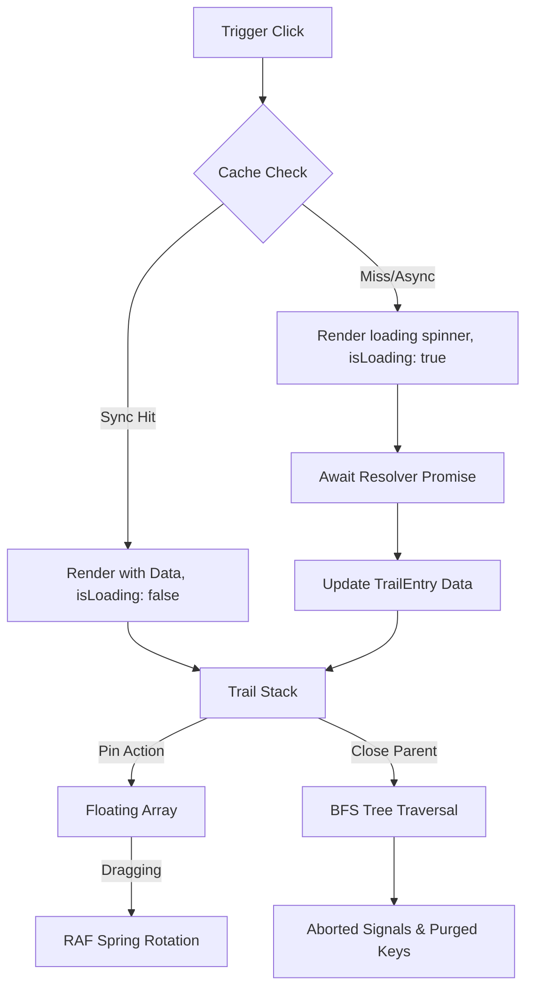

# Popover Trail 🪄

A headless, lightweight React library for managing cascading popover paths, drag-to-pin spatial windows, and hybrid data caching. 

Instead of treating popovers as isolated, temporary overlays, **Popover Trail** treats them as nodes in a hierarchical tree. You can build multi-level detail drills, pin any level as an independent floating card, and drag them around with velocity-sensitive swing physics.

---

## ⚙️ How it Works under the Hood (Architecture)

To use the library effectively, it helps to understand its underlying state and layout architecture.



### 1. The Dual-Stack State Machine
The core state is managed by a single Zustand store containing two primary arrays:
*   `trail`: A linear stack representing the active, unpinned cascading path. Only one active path can exist at a time.
*   `floating`: An unordered list of pinned, independent popovers.

When a trigger is clicked, the library resolves the data and pushes a new `TrailEntry` into the `trail`. If you pin a popover, it is spliced out of the `trail` and pushed into `floating`. Unpinning it returns it to the trail stack, restoring its original hierarchy.

### 2. Hierarchical Lifecycles & Tree Cleansing
Every `TrailEntry` maintains a `parentKey` (current parent) and an `originalParentKey` (stored when pinned). 
*   **Branch-wide Unmounting**: When a parent popover is closed, the library performs a Breadth-First Search (BFS) using a pointer-based queue to locate all recursive descendants in both the `trail` and `floating` lists.
*   **Cancellation**: Active network requests for all closed popovers are aborted immediately via their associated `AbortController` signals, preventing memory leaks and trailing background fetches.
*   **Orphan Control**: If `closePinnedDescendants` is set to `true`, closing a parent also closes its pinned descendants. By default (`false`), pinned cards remain open on the screen as standalone windows.

### 3. Rendering & Coordinate Assembly
Popover Trail is headless; it calculates coordinates and styles but renders no DOM nodes itself.
*   **Virtual Positioning**: The triggering element's `DOMRect` is captured on click and converted into a Floating UI virtual element. Floating UI uses this virtual anchor to compute coordinate placements.
*   **Translation Compositions**: The final coordinate returned by the style compiler `getPopoverStyles` combines:
    $$\text{Final Position} = \text{Floating UI Placement} + \text{Drag Offset} + \text{Drag Translation}$$
*   **Anti-Blur Compiling**: To prevent browsers from rendering blurry text and borders on standard-DPI screens due to fractional sub-pixels, the style engine rounds all coordinates using `Math.round()` before applying the CSS `transform` and `top`/`left` rules.

### 4. Inertia Spring Physics
When a pinned card is dragged, the `usePopoverDragAndDrop` hook monitors the change in horizontal displacement over time:
$$\text{Velocity} = \frac{\Delta x}{\Delta t}$$
A `requestAnimationFrame` loop calculates a spring rotation angle proportional to this velocity. When released, the rotation decays back to $0$ using inertia dampening:
$$\text{Angle}_{t} = \text{Angle}_{t-1} \times 0.82$$
Once the rotation angle falls below a threshold ($<0.05^\circ$), the loop cancels its frames to prevent idle CPU cycles.

---

## 🌟 Unique Capabilities (How it Differs from Others)

Traditional popover libraries (like Radix, Ariakit, or standard Floating UI) are designed for single-level dropdowns or rigid nested menus. Popover Trail is built for spatial canvas UI:

*   **Draggable Pinning (Trail to Floating)**: Popovers can transition from relative alignment (clamped to their trigger buttons) to absolute viewport positions, becoming draggable cards.
*   **Synchronous Resolver Skipping**: If the cache resolves data synchronously, the library mounts the popover immediately in the same render tick with `isLoading: false`. This avoids the typical 1-frame loading spinner flicker common in promise-based resolvers.
*   **Dynamic Viewport Constraining**: The boundary middlewares dynamically merge global viewport boundary defaults with local overrides per trigger. You can supply a lazy DOM-getter function (`() => HTMLElement`) to lock specific cards inside scrollable panels or dashboards.
*   **Stale Response Protection**: Every nested path maintains a hydration counter. If a user clicks triggers rapidly, late-resolving promises are discarded if their hydration counter does not match the active state.

---

## 📦 Quick Start

### 1. Setup the PopoverProvider
Wrap your app region and supply your fetch resolver. You can also pass a custom cache map to enable zero-flicker cached loads:

```tsx
import { PopoverProvider } from 'popover-trail';

const dataResolver = async (key: string, parentData?: any, context?: any, signal?: AbortSignal) => {
  const res = await fetch(`/api/details/${key}`, { signal });
  return res.json();
};

const memoryCache = new Map();

export default function App() {
  return (
    <PopoverProvider resolveData={dataResolver} cache={memoryCache}>
      <Workspace />
    </PopoverProvider>
  );
}
```

### 2. Bind Triggers
Attach triggers to buttons via Props Spreading. Use `usePopoverTrigger` for root entries and `usePopoverNestedTrigger` for nested cascades:

```tsx
import { usePopoverTrigger, usePopoverNestedTrigger } from 'popover-trail';

// Root Trigger
export function InspectButton() {
  const trigger = usePopoverTrigger('blueprint-1');
  return <button {...trigger}>Inspect</button>;
}

// Nested Cascade Trigger (renders inside a popover card)
export function SeeMoreButton({ sourceKey }: { sourceKey: string }) {
  const trigger = usePopoverNestedTrigger('blueprint-subdetails', sourceKey);
  return <button {...trigger}>See Details</button>;
}
```

### 3. Create the Card
Implement `usePopoverCard` to capture layout offsets, spring transforms, and drag handle binds.

```tsx
import { usePopoverCard, usePopoverActions, type TrailEntry } from 'popover-trail';

export function PopoverCard({ entry, index, isPinned }: { entry: TrailEntry; index: number; isPinned: boolean }) {
  const { togglePin, closeByKey } = usePopoverActions();
  const { ref, style, dragHandleProps, handlePinToggle } = usePopoverCard({
    entry,
    index,
    isPinned,
    placement: 'bottom-start'
  });

  return (
    <div ref={ref} style={style} className="popover-card">
      <div className="drag-handle" {...dragHandleProps}>
        <span>{entry.data?.title || 'Loading...'}</span>
        <button onClick={handlePinToggle}>{isPinned ? '📌' : '📍'}</button>
        <button onClick={() => closeByKey(entry.key)}>✕</button>
      </div>
      <div className="content">
        {entry.data?.description}
      </div>
    </div>
  );
}
```

---

## ⚙️ API Reference

### `usePopoverCard` Configurations

| Property | Type | Default | Description |
| :--- | :--- | :--- | :--- |
| `entry` | `TrailEntry` | *Required* | Popover state node. |
| `index` | `number` | *Required* | Stacking depth order index. |
| `isPinned` | `boolean` | *Required* | Floating/pinned status. |
| `placement` | `PopoverPlacement` | `'bottom'` | Base layout placement relative to anchor. |
| `enableDrag` | `boolean` | `true` | Allows dragging when pinned. |
| `enableTilt` | `boolean` | `true` | Enables velocity-sensitive spring tilt. |
| `maxTiltAngle`| `number` | `5` | Maximum tilt swing in degrees. |
| `tiltSensitivity`| `number`| `8` | Velocity to rotation scaling multiplier. |

### `CollisionConfig` Interface
```typescript
interface CollisionConfig {
  /** Element or callback to constrain the popover within (default: 'clippingAncestors') */
  boundary?: 'clippingAncestors' | HTMLElement | HTMLElement[] | (() => HTMLElement | HTMLElement[] | null);
  /** Safety margins around the boundary */
  padding?: number | { top?: number; right?: number; bottom?: number; left?: number };
}
```

---

## 📄 License
MIT License. Crafted for rich, developer-grade workspace applications.
