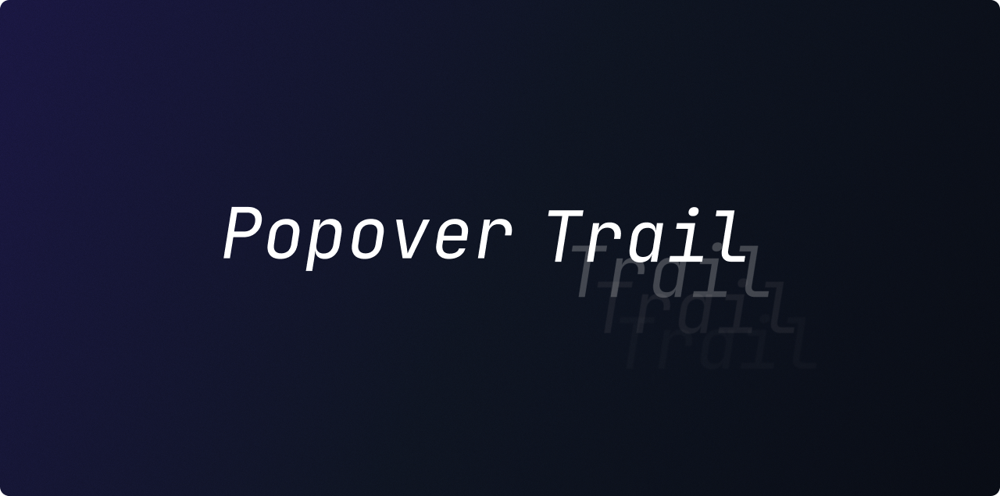

<p align="center">
  
</p>

# popover-trail

Headless React 19 library for nested cascading popovers and draggable floating windows with async data resolution.

## Install

```bash
npm install popover-trail @floating-ui/react zustand
```

Optional peer dependencies:

```bash
npm install @dnd-kit/core react-focus-lock
```

## Quick Start

```tsx
import { createPopoverTrail, PopoverCard, PopoverTrail } from 'popover-trail';

// 1. Define schema with data resolvers
const trail = createPopoverTrail({
  userCard: {
    resolver: async (userId: string) => fetch(`/api/users/${userId}`).then((r) => r.json()),
    placement: 'right',
  },
  detailsCard: {
    resolver: async (detailsId: string) => fetch(`/api/details/${detailsId}`).then((r) => r.json()),
    placement: 'bottom',
  },
});

// 2. Render provider, trigger, and trail container
export function App() {
  return (
    <trail.PopoverProvider>
      <trail.PopoverTrigger popoverKey="userCard">
        <button type="button">Open User</button>
      </trail.PopoverTrigger>

      <PopoverTrail
        renderCard={(entry, index, isPinned) => (
          <PopoverCard key={entry.key} entry={entry} index={index} isPinned={isPinned}>
            {entry.isLoading && <p>Loading...</p>}
            {entry.data && <div>{entry.data.name}</div>}
          </PopoverCard>
        )}
      />
    </trail.PopoverProvider>
  );
}
```

## Core Concepts

- **Cascading trail:** Popovers stack in a parent-child breadcrumb. Closing a parent cleans up its child branch.
- **Pin to float:** Pinning a card detaches it from the cascade stack into an independent floating window with drag physics.
- **Async resolution:** Data fetching resolves per card key without blocking UI renders or causing layout shifts.

## Documentation

Full API reference, props, and store actions are documented in [docs/API.md](docs/API.md).

## License

[MIT](LICENSE)
