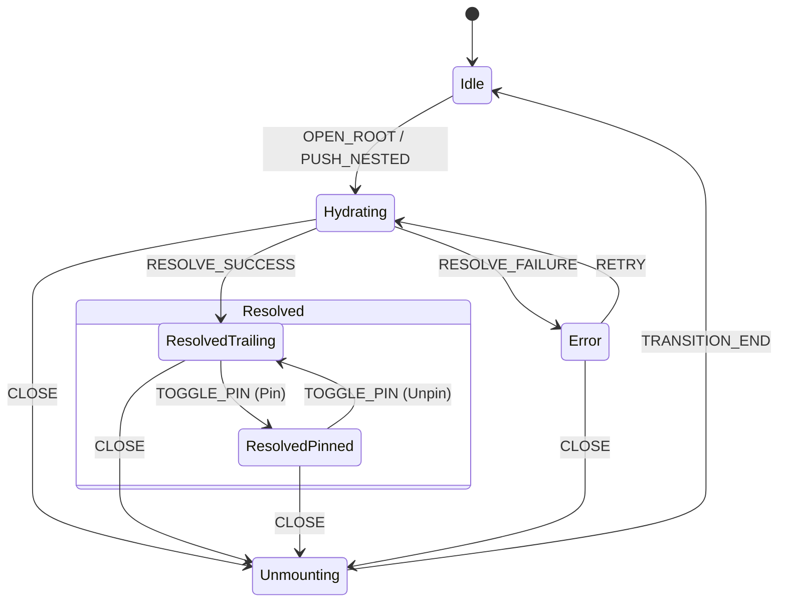

# popover-trail

[](https://www.npmjs.com/package/popover-trail)
[](LICENSE)

Headless React 19 library for cascading popover paths, draggable floating windows, and async data hydration.

Nested popovers usually mean fragmented state and focus traps. `popover-trail` treats popovers as a stateful tree. Unpinned cards stack in a linear trail. Pinning a card detaches it from the breadcrumb stack into an independent floating canvas window with pointer drag tracking and spring tilt physics.

## Features

* **Cascading trails**: Automatic parent-child breadcrumb tracking with BFS teardown when a parent closes.
* **Floating canvas windows**: Pin cards to drag them anywhere with pointer tracking and velocity tilt.
* **Async data hydration**: Offload data fetching to background resolvers or Web Workers without blocking the UI thread.
* **Strict type safety**: Infer keys, payloads, and context types directly from your schema definition.

## Installation

```bash
npm install popover-trail @floating-ui/react zustand
```

Optional dependencies for drag-and-drop or focus locking:

```bash
npm install @dnd-kit/core react-focus-lock
```

## Quick start

Define your popover schema and wrap your app with the provider:

```tsx
import React from 'react';
import {
  createPopoverTrail,
  PopoverCard,
  PopoverTrail,
  isResolvedEntry,
} from 'popover-trail';

// 1. Define typed popover schema
export const trail = createPopoverTrail({
  userCard: {
    resolver: async (key) => fetch(`/api/users/${key}`).then((r) => r.json()),
    placement: 'right',
  },
  detailsCard: {
    resolver: async (key) => fetch(`/api/details/${key}`).then((r) => r.json()),
    placement: 'bottom',
  },
});

// 2. Render provider and trail container
export function App() {
  return (
    <trail.PopoverProvider>
      <trail.PopoverTrigger popoverKey="userCard">
        <button type="button">Open User Card</button>
      </trail.PopoverTrigger>

      <PopoverTrail
        renderCard={(entry, index, isPinned) => (
          <PopoverCard key={entry.key} entry={entry} index={index} isPinned={isPinned}>
            {isResolvedEntry(entry) && (
              <div>
                <h3>{entry.data.name}</h3>
                <p>{entry.data.email}</p>
              </div>
            )}
          </PopoverCard>
        )}
      />
    </trail.PopoverProvider>
  );
}
```

## Architecture

State transitions run through a deterministic state machine backed by an isolated Zustand store:


```mermaid
stateDiagram-v2
    [*] --> Idle
    Idle --> Hydrating: OPEN_ROOT / PUSH_NESTED
    Hydrating --> ResolvedTrailing: RESOLVE_SUCCESS
    Hydrating --> Error: RESOLVE_FAILURE
    Hydrating --> Unmounting: CLOSE

    state Resolved {
        ResolvedTrailing --> ResolvedPinned: TOGGLE_PIN (Pin)
        ResolvedPinned --> ResolvedTrailing: TOGGLE_PIN (Unpin)
    }

    ResolvedTrailing --> Unmounting: CLOSE
    ResolvedPinned --> Unmounting: CLOSE
    Error --> Hydrating: RETRY
    Error --> Unmounting: CLOSE

    Unmounting --> Idle: TRANSITION_END
```

Resolvers return a `Result<T, E>` pattern to isolate failures without breaking component render trees:

```typescript
import { isOk, type Result } from 'popover-trail';

function handleUserData(result: Result<UserData, PopoverError>) {
  if (isOk(result)) {
    console.log('User loaded:', result.data.name);
  } else {
    console.error('Failed to load user:', result.error.message);
  }
}
```

## API reference

### Components

| Component | Purpose |
| :--- | :--- |
| `<PopoverProvider>` | Top-level context provider managing the Zustand state store. |
| `<PopoverTrail>` | Renders active trailing cards and pinned floating windows. |
| `<PopoverCard>` | Card container with handle, pin, and close actions. |
| `<PopoverTrigger>` | Interactive trigger wrapper anchoring cards on click or hover. |
| `<PopoverPortal>` | Portal container embedding cards directly into `document.body`. |

### Hooks

| Hook | Returns | Purpose |
| :--- | :--- | :--- |
| `usePopover(key)` | `{ entry, isOpen, isPinned, open, close, togglePin }` | Complete reactive control for a single popover key. |
| `usePopoverActions()` | `PopoverActions` | Imperative action dispatchers (`closeByKey`, `closeAll`, `togglePin`). |
| `usePopoverOffsets()` | `Record<string, { x, y }>` | Pixel offsets for all active popovers. |
| `usePopoverDragAndDrop()` | `UsePopoverDragAndDropResult` | Drag coordinates and spring velocity tilt values. |

## License

[MIT](LICENSE)
