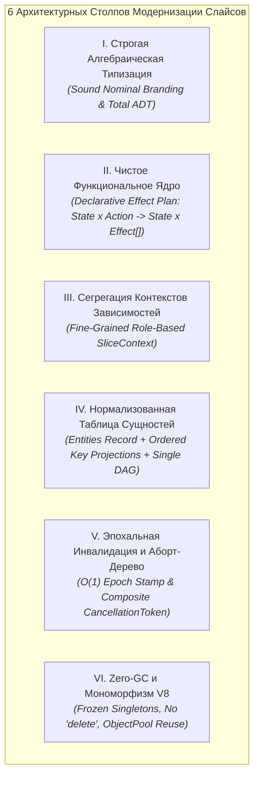

# 🏛️ Глобальный архитектурный мастер-план: Комплексная модернизация и оптимизация слайсов `popover-trail`

---

## Введение и цель документа

Настоящий документ представляет собой **исчерпывающее техническое руководство и архитектурную спецификацию** для глубокой модернизации подсистемы состояния (`src/lib/popover/store/slices/*`, `store/reducers/*`, `store/resolver/*` и смежных модулей ядра) библиотеки `popover-trail`.

Документ спроектирован как **универсальный системный артефакт (Blueprint)**: его можно целиком передавать языковым моделям, автономным субагентам (`team-orchestrator`, `typescript_architect`, `code_modularizer` и др.) и ведущим инженерам для пошаговой реализации, верификации и сертификации кодовой базы.

---

## 1. Диагностика архитектуры и системный аудит

Текущее состояние хранилища `popover-trail` зрелое (модульный корень Zustand, направленный ациклический граф `PopoverDAG`, Result-монада, CQRS-фасад, ~580+ тестов), однако содержит **6 системных архитектурных ограничений**, препятствующих достижению максимальной производительности, типобезопасности и масштабируемости:

```
┌────────────────────────────────────────────────────────────────────────┐
│                        ТЕКУЩИЕ УЗКИЕ МЕСТА                             │
├────────────────────────────────────────────────────────────────────────┤
│ 1. Fat Context Smell: SliceContext передает 20+ сервисов всем слайсам │
│ 2. Утечка эффектов: Слайсы смешивают расчет стейта с таймерами и DOM  │
│ 3. Дуализм топологии: Рассинхрон trail[], floating[] и узлов PopoverDAG│
│ 4. Phantom Nominal Branding: Брендирование типов не защищает на 100%   │
│ 5. GC-Pressure при мутациях: Лишние get() и аллокации промежуточных Set │
│ 6. Реактивная инвалидация: Ручной перебор счетчиков вместо эпох        │
└────────────────────────────────────────────────────────────────────────┘
```

---

## 2. Шесть столпов глобальной модернизации слайсов



---

## 3. Архитектурная спецификация модернизации

### Столп I. Sound Nominal Branding & Алгебраическая Типизация Состояний

#### 1. Устранение дефекта Phantom Optional Branding
* **Проблема:** В `types/branded.ts` бренд был объявлен как `Brand<T, B> = T & { readonly [__brandSymbol]?: B }`. Из-за опциональности `?` компилятор TypeScript допускает присвоение сырой строки `string` брендированному типу `PopoverKey` без валидации.
* **Решение:** Делаем символ бренда строго обязательным на уровне типов.
```typescript
declare const __brandSymbol: unique symbol;

export type Brand<T, B extends string> = T & {
  readonly [__brandSymbol]: B;
};

export type PopoverKey = Brand<string, 'PopoverKey'>;
export type OwnerId = Brand<string, 'OwnerId'>;
export type StackGroupId = Brand<string, 'StackGroupId'>;
export type DurationMs = Brand<number, 'DurationMs'>;
export type ZIndexDepth = Brand<number, 'ZIndexDepth'>;

// Smart Constructors с Fail-Fast проверками
export function toPopoverKey(key: string): PopoverKey {
  if (typeof key !== 'string' || key.trim().length === 0) {
    throw new TypeError('[popover-trail]: PopoverKey must be a non-empty string.');
  }
  return key as unknown as PopoverKey;
}

export function isPopoverKey(val: unknown): val is PopoverKey {
  return typeof val === 'string' && val.trim().length > 0;
}
```

#### 2. Дискриминированный союз `TrailEntry` (State Elimination)
* **Проблема:** Интерфейс `TrailEntry` содержит одновременно опциональные `status?`, `data?`, `error?`, `isLoading?`. Это порождает невалидные состояния (например, `status: 'success'`, но `data: undefined`) и требует силовых утверждений `entry.data!`.
* **Решение:** Полный переход на алгебраические типы данных (ADT).
```typescript
export interface BaseTrailEntry<TPopoverKey extends PopoverKey = PopoverKey>
  extends PopoverDisplayOptions {
  readonly key: TPopoverKey;
  readonly parentKey?: TPopoverKey;
  readonly originalParentKey?: TPopoverKey;
  readonly rect?: DOMRect;
  readonly originalRect?: DOMRect;
  readonly transitionStatus: PopoverTransitionStatus;
}

export interface IdleTrailEntry<TPopoverKey extends PopoverKey = PopoverKey>
  extends BaseTrailEntry<TPopoverKey> {
  readonly status: 'idle';
  readonly isLoading: false;
  readonly data: undefined;
  readonly error: null;
}

export interface LoadingTrailEntry<TPopoverKey extends PopoverKey = PopoverKey>
  extends BaseTrailEntry<TPopoverKey> {
  readonly status: 'loading';
  readonly isLoading: true;
  readonly data: undefined;
  readonly error: null;
}

export interface SuccessTrailEntry<TData, TPopoverKey extends PopoverKey = PopoverKey>
  extends BaseTrailEntry<TPopoverKey> {
  readonly status: 'success';
  readonly isLoading: false;
  readonly data: TData;
  readonly error: null;
}

export interface ErrorTrailEntry<TPopoverKey extends PopoverKey = PopoverKey>
  extends BaseTrailEntry<TPopoverKey> {
  readonly status: 'error';
  readonly isLoading: false;
  readonly data: undefined;
  readonly error: Error;
}

export type TrailEntry<TData = unknown, TPopoverKey extends PopoverKey = PopoverKey> =
  | IdleTrailEntry<TPopoverKey>
  | LoadingTrailEntry<TPopoverKey>
  | SuccessTrailEntry<TData, TPopoverKey>
  | ErrorTrailEntry<TPopoverKey>;
```

---

### Столп II. Чистое Функциональное Ядро и Декларативный План Эффектов

Каждый экшен любого слайса обязан следовать математической формуле:
$$\delta: \mathcal{S} \times \mathcal{A} \to \mathcal{S}' \times \vec{\mathcal{E}}$$

```
┌─────────────────┐       ┌─────────────────┐       ┌─────────────────┐       ┌─────────────────┐
│ 1. Guard Input  │  ──>  │  2. Pure Plan   │  ──>  │ 3. Atomic Commit│  ──>  │ 4. Run Effects  │
│  (assert/parse) │       │ (State -> Plan) │       │ (set(nextPatch))│       │  (ctx.runPlan)  │
└─────────────────┘       └─────────────────┘       └─────────────────┘       └─────────────────┘
```

#### Спецификация плана эффектов (`StateTransitionPlan`)
```typescript
export type Effect<TData = unknown, TPopoverKey extends PopoverKey = PopoverKey> =
  | { readonly type: 'CANCEL_TIMERS'; readonly keys: readonly TPopoverKey[] }
  | { readonly type: 'CANCEL_ALL_TIMERS' }
  | { readonly type: 'SCHEDULE_TIMER'; readonly key: TPopoverKey; readonly duration: DurationMs; readonly kind: 'hover' | 'exit' }
  | { readonly type: 'ABORT_IN_FLIGHT'; readonly keys: readonly TPopoverKey[] }
  | { readonly type: 'ABORT_ALL_IN_FLIGHT' }
  | { readonly type: 'PRUNE_DAG'; readonly keys: readonly TPopoverKey[] }
  | { readonly type: 'RECORD_HISTORY_SNAPSHOT' }
  | { readonly type: 'NOTIFY_USER_CALLBACK'; readonly key: TPopoverKey; readonly callbackType: 'onClose' | 'onPin' | 'onOpen'; readonly payload?: unknown }
  | { readonly type: 'EMIT_EVENT'; readonly event: PopoverStoreEvent<TData> };

export interface StateTransitionPlan<TData = unknown, TPopoverKey extends PopoverKey = PopoverKey> {
  readonly nextPatch: StatePatch<TData, unknown, TPopoverKey>;
  readonly effects: readonly Effect<TData, TPopoverKey>[];
}
```

* **Правило:** В файлах `store/slices/*.ts` **категорически запрещены** прямые вызовы `setTimeout`, `new AbortController()`, мутации DAG или неизолированные вызовы пользовательских функций. Все сайд-эффекты описываются как данные (DTO) и выполняются централизованным `effectRunner.ts`.

---

### Столп III. Сегрегация Контекстов Зависимостей (ISP)

* **Проблема:** Сейчас интерфейс `ActionRegistryDependencies` содержит 25+ полей. Любой слайс имеет доступ к чужим внутренностям (например, `sliceConfig` может мутировать `undoStack` или напрямую закрывать контроллеры).
* **Решение:** Каждый слайс получает строго суженный, типобезопасный интерфейс зависимостей.

```typescript
// store/slices/context.ts
export interface BaseSliceContext<TData, TContext, TPopoverKey extends PopoverKey> {
  readonly set: StoreSetFn<TData, TContext, TPopoverKey>;
  readonly get: StoreGetFn<TData, TContext, TPopoverKey>;
}

export interface TrailSliceContext<TData, TContext, TPopoverKey extends PopoverKey>
  extends BaseSliceContext<TData, TContext, TPopoverKey> {
  readonly deps: {
    readonly popoverDAG: PopoverDAG<TPopoverKey>;
    readonly runEffects: (effects: readonly Effect<TData, TPopoverKey>[]) => void;
    readonly findEntryByKey: (key: TPopoverKey) => TrailEntry<TData, TPopoverKey> | undefined;
    readonly resetStoreState: () => void;
  };
}

export interface ResolverSliceContext<TData, TContext, TPopoverKey extends PopoverKey>
  extends BaseSliceContext<TData, TContext, TPopoverKey> {
  readonly deps: {
    readonly resolvePopoverEntry: (params: ResolvePopoverEntryParams<TData, TContext, TPopoverKey>) => Promise<void>;
    readonly cache: PopoverCache<TData>;
    readonly getEpoch: () => number;
    readonly runEffects: (effects: readonly Effect<TData, TPopoverKey>[]) => void;
  };
}
```

---

### Столп IV. Нормализованная Модель Сущностей и Конвергенция с DAG

* **Проблема:** Состояние хранит одновременно `trail: TrailEntry[]`, `floating: TrailEntry[]`, `offsets: Record<Key, DragOffset>`, `pinnedStates: Record<Key, boolean>`, `zIndexOrder: Key[]`. На каждую операцию происходят множественные поиски по массивам ($O(N)$).
* **Решение:** Нормализованная структура хранения с индексами быстрого доступа $O(1)$:

```typescript
export interface NormalizedPopoverState<TData = unknown, TContext = unknown, TPopoverKey extends PopoverKey = PopoverKey> {
  readonly stateRevision: number;
  // Единый словарь сущностей (Single Source of Truth)
  readonly entries: Readonly<Record<TPopoverKey, TrailEntry<TData, TPopoverKey>>>;
  
  // Упорядоченные проекции ключей
  readonly trailOrder: readonly TPopoverKey[];
  readonly floatingKeys: ReadonlySet<TPopoverKey>;
  readonly zIndexOrder: readonly TPopoverKey[];
  
  // Геометрические проекции (Zero-GC)
  readonly offsets: Readonly<Record<TPopoverKey, DragOffset>>;
  
  // Служебные поля
  readonly ownerId: OwnerId | null;
  readonly context: TContext | null;
}
```

* **Селекторы переходят на мгновенное $O(1)$ чтение:**
    - `selectEntryByKey(key)` $\to$ `state.entries[key]`
    - `selectIsPinned(key)` $\to$ `state.floatingKeys.has(key)`
    - `selectActiveTrail(state)` $\to$ `state.trailOrder.map(k => state.entries[k])`

---

### Столп V. Эпохальная Инвалидация и CancellationToken Tree

* **Проблема:** При частой смене резолвера или быстром переключении вкладок перебор `nestedCounters` требует прохода по всем ключам.
* **Решение:** Внедрение **монотонного счетчика эпохи резолвера** (`epoch: number`).
    1. При вызове `setResolveData` счетчик эпохи инкрементируется: `epoch++` ($O(1)$).
    2. Все запущенные в предыдущей эпохе промисы при завершении сравнивают `requestEpoch === currentEpoch`. Если эпоха изменилась — результат сбрасывается без применения патча.
    3. Устраняется риск гонок при смене окружения или пользователя.

---

### Столп VI. Zero-GC Discipline и Мономорфизм V8

1. **Запрет оператора `delete`:** При удалении карточки или сбросе смещения запрещено вызывать `delete offsets[key]`, так как это разрушает оптимизацию V8 Hidden Classes. Используется неизменяемый сборщик `omitRecordKey(record, key)` без оператора `delete`.
2. **Переиспользование статически замороженных структур:**
    - `EMPTY_ARRAY` $\to$ `Object.freeze([])`
    - `EMPTY_OBJECT` $\to$ `Object.freeze({})`
    - `ZERO_OFFSET` $\to$ `Object.freeze({ x: 0, y: 0 })`
3. **Пул объектов для высокочастотных кадров:** При драге и анимациях координаты переиспользуются через `ObjectPool<Point2D>`, гарантируя $\text{Alloc}(\text{Frame}) = 0\text{ bytes}$.

---

## 4. Глубокая спецификация по каждому слайсу

### 4.1. `store/slices/trail/` (Каскадный стек и DAG-навигация)
* **Роль:** Управление древовидным стеком карточек, каскадным открытием и топологическим закрытием поддеревьев.
* **Модернизация:**
    - `openRoot`: Вычисляет чистый план `planOpenRoot(state, ownerId, entry)`.
    - `pushNested`: Проверяет ацикличность в графе $G$. При попытке добавить цикл возвращает `Result.Err(ERR_CIRCULAR_CASCADE)`.
    - `closeByKey` / `closeFrom`: Генерирует BFS-план каскадного закрытия через `dag.getDescendantKeys(key)`. Возвращает `CANCEL_TIMERS`, `ABORT_IN_FLIGHT`, `PRUNE_DAG` в списке эффектов.
    - `teardownExecution`: Анимированное размонтирование (`unmounting`) с автоматическим переходом в `Idle` по завершении таймера.

### 4.2. `store/slices/resolver/` (Конвейер асинхронной гидратации)
* **Роль:** Разрешение данных карточек, дедупликация in-flight запросов, L1/L2 кэширование, retry и предзагрузка.
* **Модернизация:**
    - Декомпозиция на звенья Middleware:
      `withL1Cache` $\to$ `withInFlightDeduplication` $\to$ `withAbortSignal` $\to$ `withEpochGuard`.
    - Автоматическое детектирование сигнатуры резолвера (позиционная vs объект параметров) с кэшированием в `WeakMap<Function, 'positional' | 'object'>`.
    - Изолированный `prefetchPipeline` — предзагрузка не мутирует активный стек поповеров.

### 4.3. `store/slices/pinning/` (Плавающий режим и геометрия)
* **Роль:** Переключение между привязанным каскадом (`trail`) и независимым окном (`floating`), расчет смещений перетаскивания и подъем по z-index.
* **Модернизация:**
    - `togglePin`: Чистая трансформация узла `toFloatingEntry(entry, rect)` / `toTrailEntry(entry)`.
    - `updateOffset`: Валидация конечных чисел `Number.isFinite(x) && Number.isFinite(y)` + шорт-серкит при неизменных координатах `isDragOffsetEqual`.
    - `bringToFront`: Однопроходный подъем поддерева потомков на вершину `zIndexOrder` с сохранением относительного порядка.

### 4.4. `store/slices/config/` (Конфигурация и интеракции)
* **Роль:** Атомарное обновление настроек, ховер-таймеры, анимационные статусы.
* **Модернизация:**
    - Разделение на 3 подмодуля:
        1. `setters.ts` — чистый атомарный конфигуратор `actions.updateConfig(partialConfig)`.
        2. `hover.ts` — ховер-задержки `hoverEnter`, `hoverLeave` с отменой таймеров предков по DAG за $O(\text{Depth})$.
        3. `lifecycle.ts` — переходы фаз анимации (`mounting` $\to$ `mounted` $\to$ `unmounting`) с валидацией через битовую матрицу `FSMStatusBit`.

### 4.5. `store/slices/persistence/` (Сериализация и межвкладочный мост)
* **Роль:** Сохранение состояния в `localStorage`/`sessionStorage` и синхронизация между вкладками браузера.
* **Модернизация:**
    - Версионированный конверт `PersistedEnvelope` (`schemaVersion: 1`).
    - Causal Consistency: стабильный `tabId` на уровне экземпляра стора для подавления эхо-сообщений.
    - 100% защита от Prototype Pollution (`__proto__`, `constructor`, `prototype`).
    - Graceful Fallback: при поврежденном JSON или несовпадении версий стор инициализируется с чистым начальным состоянием.

### 4.6. `store/slices/transactions/` (Транзакции и Time-Travel)
* **Роль:** Атомарные транзакции с откатом при сбоях (Rollback) и Undo/Redo на кольцевом буфере `RingBuffer`.
* **Модернизация:**
    - Выделение класса `TransactionScope` с поддержкой `executeResult()` и автоматическим откатом `AbortController` и мутаций состояния.
    - Кольцевой буфер `RingBuffer<HistorySnapshot>` с фиксированной емкостью (по умолчанию 30) для исключения утечек памяти.
    - Коалесценция мелких изменений перемещения (Drag Coalescing), чтобы драг не забивал стек истории.

### 4.7. `store/slices/subscriptions/` (Шина событий и селективные подписки)
* **Роль:** Подписка на доменные события (`open_root`, `pin`, `close`, `resolve_perf`) и точечные изменения отдельных ключей (`subscribeKey`).
* **Модернизация:**
    - Изоляция ошибок подписчиков: исключение в пользовательском обработчике перехватывается через `safeCallback` и не ломает уведомительный цикл.
    - Очистка подписок через стандартный протокол `[Symbol.dispose]`.

---

## 5. Матрица формальных математических инвариантов ($I_1 - I_{12}$)

Каждая модификация любого слайса обязана строго сохранять инварианты системы:

| Инвариант | Формальное математическое определение | Способ автоматической проверки |
| :--- | :--- | :--- |
| **$I_{\text{Acyclic}}$** | $\text{Cycles}(G(\mathcal{S})) = \emptyset$ | `tests/dag.property.test.ts` (Fast-Check) |
| **$I_{\text{ZBijection}}$** | $\mathcal{Z}: V \to \{1, \dots, \|V\|\} \quad \text{bijective}$ | `tests/stackReducers.test.ts` |
| **$I_{\text{StackUniqueness}}$** | $\forall i \neq j, \quad \text{zIndexOrder}[i] \neq \text{zIndexOrder}[j]$ | `tests/storeInvariants.test.ts` |
| **$I_{\text{TimerContainment}}$** | $\|\text{ActiveTimers}(\mathcal{S})\| \le \|V(\mathcal{S})\| \times K_{\max}$ | `tests/keyedTimerPool.test.ts` |
| **$I_{\text{FiniteFloat}}$** | $\forall v \in V(\mathcal{S}), \quad \text{isFinite}(\text{pos}_x(v)) \land \text{isFinite}(\text{pos}_y(v))$ | `tests/dragMath.test.ts` |
| **$I_{\text{OrphanFreedom}}$** | $\forall v \in V_{\text{trail}}(\mathcal{S}), \quad \exists \text{ path } \text{Root} \rightsquigarrow v \text{ in } G(\mathcal{S})$ | `tests/trailProperties.test.ts` |
| **$I_{\text{MonotonicRevision}}$** | $\mathcal{S}_{t+1} \not\equiv \mathcal{S}_t \iff \text{Revision}_{t+1} > \text{Revision}_t$ | `tests/storeInvariants.test.ts` |
| **$I_{\text{Discrimination}}$** | $\mathcal{S}_{\text{entry}} \in \mathcal{S}_{\text{idle}} \uplus \mathcal{S}_{\text{loading}} \uplus \mathcal{S}_{\text{success}} \uplus \mathcal{S}_{\text{error}}$ | `tests/types.test-d.ts` |
| **$I_{\text{Terminality}}$** | $\mathcal{S} = \Omega \implies \forall a \in \mathcal{A}, \quad \delta(\Omega, a) = \Omega$ | `tests/disposable.test.ts` |
| **$I_{\text{CausalLinearity}}$** | $\lambda_{\text{remote}} \le \lambda_{\text{local}} \implies \text{Drop}(e)$ | `tests/persistenceProperties.test.ts` |
| **$I_{\text{ViewportContainment}}$** | $\forall v \in V(\mathcal{S}), \quad B(v) \cap \Omega_{\text{viewport}} = B(v)$ | `tests/layoutStrategies.test.ts` |
| **$I_{\text{ZeroGC}}$** | $\text{Alloc}(\text{Frame}) = 0\text{ bytes}$ | `tests/zeroGcProfile.test.ts` |

---

## 6. Пошаговый план реализации (Actionable Roadmap)

Рекомендуемый порядок внедрения улучшений разбит на **7 изолированных этапов**:

```
Этап 1: Типизация и Nominal Branding (types/branded.ts, entryTypes.ts)
  │
Этап 2: Сегрегация контекстов SliceContext (store/slices/context.ts)
  │
Этап 3: Перевод экшенов на Declarative Effect Plans (store/reducers/*, store/effects/*)
  │
Этап 4: Модернизация Resolver Pipeline и Эпохальная Инвалидация (store/resolver/*)
  │
Этап 5: Оптимизация Pinning & Stacking (store/reducers/pinning/*, stack/*)
  │
Этап 6: Укрепление Персистентности и Транзакций (store/persistence/*, transactions/*)
  │
Этап 7: Property-Based Тестирование и Сертификация CI (fast-check, dependency-cruiser)
```

---

## 7. Чек-лист проверки качества перед мерджем (Quality Gate)

Перед принятием любого PR с изменениями слайсов выполнить проверку:

- [ ] **TypeScript:** `npm run typecheck` завершается с **0 ошибок** (при включенных `strict: true`, `noImplicitAny: true`, `exactOptionalPropertyTypes: true`).
- [ ] **Тесты:** `npm test` показывает **100% зелёных тестов** (все 580+ модульных, интеграционных и property-based тестов).
- [ ] **Линтинг:** `npm run lint` и `npm run format` проходят без единого замечания (Oxlint + ESLint).
- [ ] **Слои:** `npm run lint:arch` (dependency-cruiser) подтверждает отсутствие запрещенных циклических и восходящих импортов ($L_1 \to L_2 \to L_3 \to L_4$).
- [ ] **Размер бандла:** Headless Store (`dist/store.js`) весит **$\le 7$ KB** (min+gzip).

---

> 💡 **Инструкция для ИИ-агентов:** При получении команды на улучшение любого конкретного слайса используйте данный документ как канонический стандарт архитектуры, строго соблюдая 4-шаговый пайплайн экшенов, интерфейсную сегрегацию и инварианты $I_1 - I_{12}$.