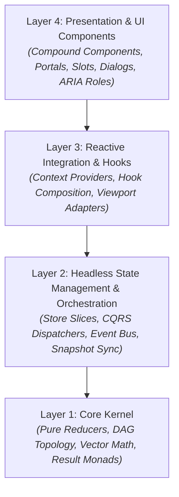

# Popover Trail - API Reference

Complete technical specification for components, hooks, schema builders, core engines, type definitions, and diagnostic validators in `popover-trail`.

---

## Table of contents

1. [Quick start](#1-quick-start)
2. [Architecture: 4-tier clean architecture model](#2-architecture-4-tier-clean-architecture-model)
3. [Global type augmentation and module registration](#3-global-type-augmentation-and-module-registration)
4. [Typed schema builder and factory](#4-typed-schema-builder-and-factory)
   - [createPopoverSchema](#createpopoverschema)
   - [DomainPopoverKey](#domainpopoverkey)
   - [mergePopoverSchemas](#mergepopoverschemas)
   - [createPopoverTrail](#createpopovertrail)
   - [definePopoverContext](#definepopovercontext)
   - [defineSchemaNode and toSchemaKey](#defineschemanode-and-toschemakey)
5. [Components and compound layouts](#5-components-and-compound-layouts)
   - [PopoverProvider](#popoverprovider)
   - [PopoverCard and compound subcomponents](#popovercard-and-compound-subcomponents)
   - [PopoverCardHeader](#popovercardheader)
   - [PopoverTrail](#popovertrail)
   - [PopoverTimeline and subcomponents](#popovertimeline-and-subcomponents)
   - [PopoverPortal](#popoverportal)
   - [PopoverTrigger](#popovertrigger)
   - [FocusTrap](#focustrap)
   - [Slot and mergeProps (Polymorphism)](#slot-and-mergeprops)
6. [Hooks, selectors, and React 19 concurrency](#6-hooks-selectors-and-react-19-concurrency)
   - [usePopover](#usepopover)
   - [usePopoverData and Suspense](#usepopoverdata-and-suspense)
   - [usePopoverAction](#usepopoveraction)
   - [usePopoverOptimistic](#usepopoveroptimistic)
   - [usePopoverTimeline](#usepopovertimeline)
   - [usePopoverCard](#usepopovercard)
   - [usePopoverActions](#usepopoveractions)
   - [usePopoverGeometry and QuadTree collision](#usepopovergeometry-and-quadtree-collision)
   - [usePopoverDragAndDrop](#usepopoverdraganddrop)
   - [usePopoverHydration](#usepopoverhydration)
   - [useIsPopoverOpen and state selectors](#useispopoveropen-and-state-selectors)
   - [Utility and adapter hooks](#utility-and-adapter-hooks)
7. [DND sub-package (popover-trail/dnd)](#7-dnd-sub-package-popover-traildnd)
   - [PopoverCanvas](#popovercanvas)
   - [PopoverCard (DND version)](#popovercard-dnd-version)
   - [usePopoverDraggableCard](#usepopoverdraggablecard)
8. [Core engines and architecture](#8-core-engines-and-architecture)
   - [Transactions and atomic batching](#transactions-and-atomic-batching)
   - [Persistence and cross-tab synchronization](#persistence-and-cross-tab-synchronization)
   - [Middleware pipeline and telemetry interceptors](#middleware-pipeline-and-telemetry-interceptors)
   - [FSM statechart engine and bitmask transition algebra](#fsm-statechart-engine)
   - [DAG cascading graph and topological order](#dag-cascading-graph)
   - [QuadTree 2D spatial partitioning and affine geometry](#quadtree-2d-spatial-partitioning-index)
   - [PopoverTransitionScheduler](#popovertransitionscheduler)
   - [CQRS query and command buses](#cqrs-query-and-command-buses)
   - [EventBus and CustomEvent engine](#eventbus-and-customevent-engine)
   - [Pluggable layout strategies](#pluggable-layout-strategies)
   - [Theme tokens and CSS custom variables](#theme-tokens-and-css-custom-variables)
   - [Result pattern (Result<T, E>)](#result-pattern)
   - [Disposable pattern and RAII scopes (using, usingResult)](#disposable-pattern)
   - [Bounded ring buffer and result operations](#bounded-ring-buffer)
   - [Geometry value objects](#geometry-value-objects)
   - [ObjectPool and MemorySentinel](#objectpool-and-memorysentinel)
9. [Multi-stack zones and micro-frontends](#9-multi-stack-zones-and-micro-frontends)
   - [Stack group isolation (stackGroup)](#stack-group-isolation-stackgroup)
   - [Z-index base map partitioning (zIndexBaseMap)](#z-index-base-map-partitioning-zindexbasemap)
10. [Types and discriminated unions](#10-types-and-discriminated-unions)
   - [PopoverStateData full property table](#popoverstatedata)
   - [CollisionConfig specification](#collisionconfig-specification)
   - [FocusLockOptions specification](#focuslockoptions-specification)
   - [PopoverPersistConfig specification](#popoverpersistconfig-specification)
   - [TrailEntry and state subtypes](#trailentry-and-state-subtypes)
   - [StoreActionPayload discriminated union](#storeactionpayload)
   - [PopoverStoreEvent, ResolutionMetric, and event maps](#popoverstoreevent)
   - [StoreSliceDescriptor and SliceContext](#storeslicedescriptor-and-slicecontext)
   - [ActiveTimelineStep, UndoneTimelineStep, and PopoverTimelineItem](#timeline-step-types)
   - [AnchorEventLike, ValidatedAnchorRef, and ResolverParams](#anchor-and-resolver-types)
   - [PopoverResponsiveMode and PopoverLayoutStrategy](#responsive-modes-and-layout-strategies)
   - [PopoverStoreDiscriminatedState](#popoverstorediscriminatedstate)
   - [PopoverFSMState](#popoverfsmstate)
   - [PopoverEntryDiscriminatedState](#popoverentrydiscriminatedstate)
   - [PolymorphicPropsWithRef](#polymorphicpropswithref)
   - [TypedMiddlewarePatch](#typedmiddlewarepatch)
   - [Branded primitive types and constructors](#branded-primitive-types-and-constructors)
   - [Store slices and defineStoreSlice](#store-slices-and-definestoreslice)
   - [Domain error models](#domain-error-models)
   - [React 19 Action and Optimistic types](#react-19-action-and-optimistic-types)
11. [Type guards and pattern matchers](#11-type-guards-and-pattern-matchers)
   - [Entry type guards](#entry-type-guards)
   - [Anchor type guards](#anchor-type-guards)
   - [Store event type guards](#store-event-type-guards)
   - [Type-safe builder helpers](#type-safe-builder-helpers)
   - [matchEntryState pattern matching](#matchentrystate)
   - [matchActionState pattern matching](#matchactionstate)
12. [Utilities, caching, and controllers](#12-utilities-caching-and-controllers)
   - [createPopoverStore direct API](#createpopoverstore)
   - [PopoverCache, SimplePopoverCache, and storage adapters](#popovercache-simplepopovercache-and-storage-adapters)
   - [createWorkerResolver and definePopoverWorkerRPC](#createworkerresolver-and-definepopoverworkerrpc)
   - [createPopoverController and PopoverCardFluentBuilder](#createpopovercontroller-and-popovercardfluentbuilder)
   - [Display options extraction and comparison helpers](#display-options-extraction-and-comparison-helpers)
   - [PopoverError and error codes](#popovererror-and-error-codes)
13. [Recipes and common patterns](#13-recipes-and-common-patterns)
   - [Skeleton UI during resolution](#recipe-skeleton-ui-during-resolution)
   - [Retry with backoff via retryPopover](#recipe-retry-with-backoff)
   - [Prefetch on hover](#recipe-prefetch-on-hover)
   - [Nested cascade (3-level drilldown)](#recipe-nested-cascade)
   - [Pinning with drag onto canvas](#recipe-pinning-with-drag-onto-canvas)
14. [Server-Side Rendering (SSR) and Next.js / Remix guide](#14-server-side-rendering-ssr-and-nextjs--remix-guide)
15. [Performance optimization and zero-GC memory hygiene](#15-performance-optimization-and-zero-gc-memory-hygiene)
16. [Testing guide](#16-testing-guide)
17. [Guardrail warnings registry (PT-108 to PT-130)](#17-guardrail-warnings-registry)
18. [CSS custom variables and theme tokens](#18-css-custom-variables-and-theme-tokens)
19. [Keyboard accessibility, focus fiber restoration, and ARIA matrix](#19-keyboard-accessibility-focus-fiber-restoration-and-aria-matrix)

---

## 1. Quick start

Install `popover-trail` and its peer dependencies:

```bash
npm install popover-trail @floating-ui/react zustand
```

### 1. Define your typed schema

```tsx
// schema.ts
import { createPopoverSchema } from 'popover-trail';

export interface UserProfile {
  id: string;
  name: string;
  role: string;
}

export const appSchema = createPopoverSchema({
  userProfile: {
    resolver: async (key, _parentData, _context, signal) => {
      const res = await fetch(`/api/users/${key}`, { signal });
      if (!res.ok) throw new Error(`User not found: ${key}`);
      return (await res.json()) as UserProfile;
    },
    placement: 'right',
    offset: 12,
  },
});
```

### 2. Wrap your app in `<PopoverProvider>`

```tsx
// App.tsx
import React from 'react';
import { PopoverProvider, PopoverTrail, PopoverCard, PopoverTrigger } from 'popover-trail';
import { appSchema } from './schema';

export function App() {
  return (
    <PopoverProvider schema={appSchema}>
      <main style={{ padding: 40 }}>
        <h1>Team Directory</h1>
        
        {/* Trigger opening the root card */}
        <PopoverTrigger popoverKey="userProfile">
          <button type="button">Inspect Alex</button>
        </PopoverTrigger>
      </main>

      {/* Renders active cascade cards */}
      <PopoverTrail
        renderCard={(entry, index, isPinned) => (
          <PopoverCard key={entry.key} entry={entry} index={index} isPinned={isPinned}>
            <PopoverCard.Handle>
              <strong>{entry.key}</strong>
            </PopoverCard.Handle>
            <PopoverCard.Content>
              {entry.isLoading && <p>Loading profile...</p>}
              {entry.error && <p style={{ color: 'red' }}>{entry.error.message}</p>}
              {entry.data && (
                <div>
                  <p>Name: {entry.data.name}</p>
                  <p>Role: {entry.data.role}</p>
                </div>
              )}
            </PopoverCard.Content>
            <PopoverCard.PinButton />
            <PopoverCard.CloseButton />
          </PopoverCard>
        )}
      />
    </PopoverProvider>
  );
}
```

---

## 2. Architecture: 4-tier clean architecture model

`popover-trail` follows a strict Clean Architecture (Onion) topology. Dependencies point inward only. Outer layers never dictate domain logic to inner layers, and the core kernel contains zero dependencies on React, Zustand, DOM elements, or browser APIs.



### Layer responsibilities and constraints

- **Layer 1: Core Kernel (Pure Functional Domain)**
  - *Responsibilities*: Pure state transition reducers, topological DAG algorithms, 2D coordinate geometry, Result monads, error models, and invariant validators.
  - *Constraints*: Zero external dependencies. Completely decoupled from React, Zustand, Floating UI, DOM interfaces (`window`, `document`, `HTMLElement`), and Web APIs.
- **Layer 2: Headless State Management (Orchestration)**
  - *Responsibilities*: Zustand store composition, CQRS command and query dispatchers, event bus implementations, storage persistence, history management, and transition scheduling.
  - *Constraints*: Orchestration only. Delegates all business calculations and coordinate math to Layer 1. Never imports React components, JSX, or DOM renderer internals.
- **Layer 3: Reactive Integration & Hooks**
  - *Responsibilities*: React lifecycle adapters, context providers, coordinate synchronization hooks, keyboard managers, and DOM event listeners.
  - *Constraints*: Bridges Headless State with React reactivity. Never imports UI compound components or renders JSX markup.
- **Layer 4: Presentation & UI Components**
  - *Responsibilities*: Compound UI components (`PopoverCard`, `PopoverTrail`, `PopoverTimeline`, `PopoverTrigger`), portal integrations, accessible DOM wrappers, and polymorphic slots.
  - *Constraints*: Thin declarative wrappers around Layer 3 hooks and contexts. Implements zero raw state logic or mathematical coordinate transformations.

---

## 3. Global type augmentation and module registration

`popover-trail` exports a global `Register` interface. Augmenting this interface in your project enables workspace-wide autocompletion for popover keys, child hierarchy validation, and resolved payload data types across all components and hooks without passing generic parameters manually.

### How to augment the `Register` interface

Create a declaration file (for example `popover.d.ts` or at the bottom of your `schema.ts`):

```typescript
// schema.ts
import { createPopoverSchema } from 'popover-trail';

export const myAppSchema = createPopoverSchema({
  userProfile: {
    resolver: async (key: string) => ({ id: key, name: 'Alice', role: 'Admin' }),
    children: ['userStats', 'userSettings'] as const,
  },
  userStats: {
    resolver: async (key: string, parentData: { id: string }) => ({ views: 1200, score: 98 }),
  },
  userSettings: {
    resolver: async () => ({ theme: 'dark', notifications: true }),
  },
});

// Register schema globally for project-wide autocompletion
declare module 'popover-trail' {
  interface Register {
    schema: typeof myAppSchema;
  }
}
```

### Inferred registration types

Once registered, utility types automatically extract registered keys and payload structures:

```typescript
import type {
  RegisteredSchema,
  RegisteredKeys,
  RegisteredDataMap,
  ResolveRegisteredData,
} from 'popover-trail';

// 1. Union of all schema keys: 'userProfile' | 'userStats' | 'userSettings'
type Keys = RegisteredKeys;

// 2. Map of key to resolved data payload type:
// { userProfile: { id: string; name: string; role: string }; userStats: { views: number; score: number }; ... }
type DataMap = RegisteredDataMap;

// 3. Strongly typed payload extraction for a specific key:
type User = ResolveRegisteredData<'userProfile'>; // { id: string; name: string; role: string }
```

When no schema is registered globally, `RegisteredKeys` safely defaults to `string` and `RegisteredDataMap` defaults to `Record<string, unknown>`.

---

## 4. Typed schema builder and factory

### `createPopoverSchema`

Factory function that creates a typed schema instance. Consolidates data resolvers, placement defaults, key unions, typed triggers, and typed hooks into a single declaration.

```tsx
import { createPopoverSchema } from 'popover-trail';

export const appSchema = createPopoverSchema({
  userProfile: {
    resolver: async (key, _parentData, _context, signal) => {
      const res = await fetch(`/api/users/${key}`, { signal });
      return res.json();
    },
    placement: 'right',
    offset: 12,
    children: ['userStats', 'userSettings'] as const,
    hover: { enabled: true, openDelay: 200, closeDelay: 300 },
  },
  userStats: {
    resolver: async (key, parentData: { id: string }) => {
      const res = await fetch(`/api/users/${parentData.id}/stats`);
      return res.json();
    },
    placement: 'bottom',
  },
  userSettings: {
    resolver: async (key) => ({ theme: 'dark', notifications: true }),
    placement: 'left',
  },
});
```

#### Node options (`PopoverSchemaNode<TData, TParentData, TContext>`)

| Option                  | Type                                                               | Default     | Description                                                                                 |
| :---------------------- | :----------------------------------------------------------------- | :---------- | :------------------------------------------------------------------------------------------ |
| `resolver`              | `(key, parentData?, context?, signal?) => TData \| Promise<TData>` | Required    | Data fetcher resolving state for the popover key. Supports `AbortSignal`.                   |
| `children`              | `ReadonlyArray<string>`                                            | `undefined` | Restricts allowed child popover keys when calling `openNestedWithResolver`.                 |
| `placement`             | `PopoverPlacement`                                                 | `'right'`   | Preferred alignment placement relative to anchor element.                                   |
| `offset`                | `number`                                                           | `8`         | Distance gap in pixels between anchor element and popover container.                        |
| `collision`             | `CollisionConfig`                                                  | `undefined` | Boundary collision settings (`boundary`, `padding`, `flip`, `shift`, `size`).               |
| `hover`                 | `HoverConfig`                                                      | `undefined` | Hover trigger delay parameters (`enabled`, `openDelay`, `closeDelay`, `closeOnMouseLeave`). |
| `allowDragWhenPinned`   | `boolean`                                                          | `true`      | Enable pointer dragging when card is pinned floating window.                                |
| `allowDragWhenUnpinned` | `boolean`                                                          | `true`      | Enable pointer dragging when card is in trailing stack.                                     |

#### 1. Typed `parentData` propagation in cascade chains

When defining nested nodes in a schema, the resolver for child cards receives the strongly typed data payload of the initiating parent card:

```typescript
interface OrgData { id: string; orgName: string; }
interface TeamData { teamId: string; members: string[]; }

export const appSchema = createPopoverSchema({
  orgCard: {
    resolver: async (key: string): Promise<OrgData> => {
      const res = await fetch(`/api/orgs/${key}`);
      return res.json();
    },
    children: ['teamCard'] as const,
    placement: 'right',
  },
  teamCard: {
    // parentData is strongly typed as OrgData:
    resolver: async (key: string, parentData: OrgData, ctx, signal): Promise<TeamData> => {
      const res = await fetch(`/api/orgs/${parentData.id}/teams/${key}`, { signal });
      return res.json();
    },
    placement: 'right',
  },
});
```

#### 2. Compile-time DAG constraint checking (`children: [...] as const`)

Declaring `children: ['childA', 'childB'] as const` enforces Directed Acyclic Graph topology directly at compile time. TypeScript rejects illegal or undeclared child keys:

```typescript
const actions = appSchema.useActions();

// OK: 'teamCard' is declared in orgCard's children array
actions.openNestedWithResolver('teamCard', 'orgCard');

// TypeScript Compilation Error:
// Argument of type '"billingCard"' is not assignable to parameter of type '"teamCard"'.
actions.openNestedWithResolver('billingCard', 'orgCard');
```

#### Schema instance properties (`PopoverSchemaInstance<TSchema>`)

| Property              | Type                                       | Description                                                                         |
| :-------------------- | :----------------------------------------- | :---------------------------------------------------------------------------------- |
| `definition`          | `TSchema`                                  | Raw input definition object.                                                        |
| `keys`                | `{ [K in keyof TSchema]: K }`              | Typed key mapping object (`appSchema.keys.userProfile`).                            |
| `createResolver()`    | `() => PopoverResolver`                    | Factory generating unified resolver for `<PopoverProvider>`.                        |
| `Trigger`             | `React.ComponentType`                      | Typed trigger component `<appSchema.Trigger popoverKey="...">`.                     |
| `useData(key)`        | `(key) => SchemaData \| null \| undefined` | Hook returning typed data payload for specified schema key.                         |
| `useEntry(key)`       | `(key) => TrailEntry \| undefined`         | Hook returning active `TrailEntry` for specified schema key.                        |
| `usePopover(key)`     | `(key) => UsePopoverResult<SchemaData>`    | All-in-one hook for data, status, and actions for specified key.                    |
| `useBreadcrumbs(key)` | `(key) => readonly SchemaKeys[]`           | Hook returning ancestor keys path from root to key.                                 |
| `useChildren(key)`    | `(key) => readonly SchemaKeys[]`           | Hook returning active direct child keys spawned from key.                           |
| `useParent(key)`      | `(key) => SchemaKeys \| undefined`         | Hook returning parent popover key.                                                  |
| `useDepth(key)`       | `(key) => number`                          | Hook returning nesting depth level (0 for root).                                    |
| `useIsOpen(key)`      | `(key) => boolean`                         | Hook checking whether popover is currently active in trail or floating stack.       |
| `useIsPinned(key)`    | `(key) => boolean`                         | Hook checking whether popover is pinned as floating window.                         |
| `useIsTopMost(key)`   | `(key) => boolean`                         | Hook checking whether popover is top-most in z-index order.                         |
| `useIsLoading(key)`   | `(key) => boolean`                         | Hook checking whether data resolution is in progress for key.                       |
| `useActions()`        | `() => SchemaActions`                      | Hook returning store dispatch methods bound to schema keys and child relationships. |

#### Methods on `schema.useActions()`

- `openRootWithResolver(key, anchorEvent, options?)`: Opens root popover with typed key autocompletion.
- `openNestedWithResolver(key, sourceKey, options?)`: Pushes nested child popover. When parent defines `children`, `key` is constrained to `AllowedChildrenOf<TSchema, sourceKey>` at compile time.
- `closeByKey(key, options?)`: Closes target popover and its active descendants.
- `closeAll(options?)`: Closes all popovers.
- `clearTrail(options?)`: Clears active trail while preserving pinned floating cards.
- `togglePin(key, rect?)`: Toggles pinned floating state.
- `bringToFront(key)`: Raises popover to top of stack.
- `retryPopover(key, options?)`: Retries data resolution.
- `prefetchPopover(key, parentData?)`: Prefetches data resolution into cache without opening.
- `invalidate(keyOrKeys)`: Invalidates cache and refetches one or more keys.
- `clear(options?)`: Closes all trail and floating popovers immediately.

---

### `DomainPopoverKey`

Template literal type `${TDomain}:${TName}` exported from `storeTypes.ts`. Use this pattern for multi-domain architectures where popover keys need explicit domain prefixes to prevent collisions across micro-frontends or modular feature slices:

```typescript
import type { DomainPopoverKey } from 'popover-trail';

export type UserDomainKey = DomainPopoverKey<'user', 'profile' | 'settings' | 'billing'>;
// Result: 'user:profile' | 'user:settings' | 'user:billing'

export type AnalyticsDomainKey = DomainPopoverKey<'analytics', 'chart' | 'logs'>;
// Result: 'analytics:chart' | 'analytics:logs'

export type AppPopoverKey = UserDomainKey | AnalyticsDomainKey;
```

---

### `mergePopoverSchemas`

Merges multiple schema instances into a single combined schema definition with unified keys and resolvers. This allows modularizing popover topologies across domain modules in large codebases:

```tsx
import { createPopoverSchema, mergePopoverSchemas, PopoverProvider } from 'popover-trail';

// 1. User Domain Module:
const userSchema = createPopoverSchema({
  userProfile: {
    resolver: async (key: string) => fetchUser(key),
    children: ['userBilling'] as const,
    placement: 'right',
  },
  userBilling: {
    resolver: async (key: string, parentUser: { id: string }) => fetchBilling(parentUser.id),
    placement: 'bottom',
  },
});

// 2. Workspace Domain Module:
const workspaceSchema = createPopoverSchema({
  projectDetails: {
    resolver: async (key: string) => fetchProject(key),
    placement: 'right',
  },
});

// 3. Combined Root Schema:
export const appSchema = mergePopoverSchemas(userSchema, workspaceSchema);

// Inferred Keys: 'userProfile' | 'userBilling' | 'projectDetails'
export type AppPopoverKeys = keyof typeof appSchema.keys;
```

---

### `createPopoverTrail`

Overloaded factory supporting schema-driven definitions and generic type bindings.

```tsx
// 1. Schema mode: keys and data types inferred from schema
const trail = createPopoverTrail({
  accountCard: { resolver: (key) => fetchAccount(key) },
});
const { PopoverProvider, PopoverTrigger, PopoverPortal, usePopover } = trail;

// 2. Generic mode: dynamic keys or global PopoverRegistry augmentation
const trail = createPopoverTrail<UserData, GlobalContextType>();
const { PopoverProvider, PopoverTrigger, PopoverPortal, usePopover, usePopoverActions, usePopoverContext } = trail;
```

> **Warning (PT-126)**: `createPopoverTrail` must be called at module scope, not inside a React render body. The library emits a dev-mode guardrail warning if this is violated.

---

### `definePopoverContext`

Factory generating pre-bound React Context hooks and provider components typed for a specific global `TContext` structure.

```tsx
import { definePopoverContext } from 'popover-trail';

export interface AppContext { userId: string; theme: 'light' | 'dark'; }

export const { Provider, useContext, useActions, useStoreApi } =
  definePopoverContext<AppContext>();
```

---

### `defineSchemaNode` and `toSchemaKey`

Helper utilities for building schema nodes and validating schema keys with compiler inference:

```tsx
import { defineSchemaNode, toSchemaKey } from 'popover-trail';

const profileNode = defineSchemaNode<UserProfileData>({
  resolver: async (key) => fetchProfile(key),
  placement: 'right',
});

const validKey = toSchemaKey(appSchema, 'userProfile');
```

---

## 5. Components and compound layouts

### `<PopoverProvider>`

Instantiates the Zustand store, injects context into the React tree, and manages global event listeners for Escape key, keyboard navigation, and click-outside dismissal.

```tsx
<PopoverProvider
  schema={appSchema}
  clickOutside={{ enabled: true, ignoreSelector: '.modal-backdrop' }}
  baseZIndex={1000}
  cascadeOffsetStep={24}
  exitTransitionDuration={200}>
  <MainLayout />
  <PopoverTrail />
</PopoverProvider>
```

#### Provider properties (`PopoverProviderProps<TData, TContext, TSlices>`)

| Prop                     | Type                                               | Default             | Description                                                                                                                |
| :----------------------- | :------------------------------------------------- | :------------------ | :------------------------------------------------------------------------------------------------------------------------- |
| `children`               | `React.ReactNode`                                  | Required            | Child elements rendered within context scope.                                                                              |
| `schema`                 | `PopoverSchemaInstance`                            | `undefined`         | Typed schema instance from `createPopoverSchema`.                                                                          |
| `resolveData`            | `PopoverResolver`                                  | `undefined`         | Data resolver `(key, parentData?, context?, signal?) => TData \| Promise<TData>`.                                          |
| `initialContext`         | `TContext`                                         | `undefined`         | Global shared context passed to all resolvers.                                                                             |
| `slices`                 | `StoreSliceDescriptor[]`                           | `undefined`         | Custom extensible OCP domain slices registered into the store pipeline.                                                    |
| `clickOutside`           | `ClickOutsideConfig`                               | `{ enabled: true }` | Click-outside auto-closing settings (`enabled`, `ignoreSelector`, `ignoreClass`, `popoverSelector`, `onClickOutside`).     |
| `enableKeyboardClose`    | `boolean`                                          | `true`              | Close topmost popover when Escape key is pressed.                                                                          |
| `enableArrowNavigation`  | `boolean`                                          | `true`              | Enable keyboard arrow key navigation between active popovers.                                                              |
| `closePinnedDescendants` | `boolean`                                          | `false`             | Close pinned floating child popovers when a parent closes.                                                                 |
| `allowDragWhenPinned`    | `boolean`                                          | `true`              | Allow mouse and touch dragging when card is pinned floating.                                                               |
| `allowDragWhenUnpinned`  | `boolean`                                          | `true`              | Allow mouse and touch dragging when card is unpinned trailing.                                                             |
| `cache`                  | `PopoverCache<TData>`                              | `undefined`         | Cache implementation for resolver promises.                                                                                |
| `collision`              | `CollisionConfig`                                  | `undefined`         | Global boundary collision configuration.                                                                                   |
| `baseZIndex`             | `number`                                           | `1000`              | Base z-index depth factor.                                                                                                 |
| `cascadeOffsetStep`      | `number`                                           | `8`                 | Pixel offset shift added per nesting level.                                                                                |
| `exitTransitionDuration` | `number`                                           | `0`                 | Unmount delay in milliseconds for CSS exit animations.                                                                     |
| `defaultOffset`          | `number`                                           | `8`                 | Default gap offset in pixels between trigger and popover.                                                                  |
| `mountingClassName`      | `string`                                           | `'mounting'`        | CSS class added while card is mounting.                                                                                    |
| `unmountingClassName`    | `string`                                           | `'unmounting'`      | CSS class added while card is unmounting.                                                                                  |
| `mountedClassName`       | `string`                                           | `'mounted'`         | CSS class added when card is fully mounted.                                                                                |
| `responsiveMode`         | `'auto' \| 'popover' \| 'bottom-sheet' \| 'modal'` | `'auto'`            | Responsive layout transformation mode.                                                                                     |
| `mobileBreakpoint`       | `number`                                           | `640`               | Viewport width threshold in pixels for mobile transformation.                                                              |
| `stackGroup`             | `string \| null`                                   | `null`              | Active stack group zone ID filter.                                                                                         |
| `focusLockOptions`       | `FocusLockOptions`                                 | `undefined`         | Focus trap settings (`enabled`, `autoFocusElement`, `returnFocus`, `lockScroll`).                                          |
| `components`             | `PopoverSlotComponents`                            | `undefined`         | Custom UI slot component overrides (`PinButton`, `CloseButton`, `LoadingSpinner`, `ErrorFallback`).                        |
| `zIndexBaseMap`          | `ZIndexBaseMap`                                    | `undefined`         | Per-stack-group base z-index mapping.                                                                                      |
| `debug`                  | `boolean`                                          | `false`             | Log Zustand state mutations to console.                                                                                    |

---

### `<PopoverCard>` and compound subcomponents

Polymorphic container element for popover cards. Binds coordinates, accessibility attributes (`role="dialog"`), data attributes (`data-state`, `data-pinned`, `data-key`), and CSS custom variables automatically. Supports polymorphic `ref` inference via `PolymorphicPropsWithRef<E, P>`.

#### Compound subcomponents and `asChild` composition

| Subcomponent                | Prop `asChild` | Description                                                                                  |
| :-------------------------- | :------------- | :------------------------------------------------------------------------------------------- |
| `<PopoverCard.Handle>`      | `boolean`      | Drag handle attaching pointer listeners and dragging coordinates. Supports `asChild`.       |
| `<PopoverCard.PinButton>`   | `boolean`      | Toggle button for pinning/unpinning. Supports `asChild` for custom icons.                    |
| `<PopoverCard.CloseButton>` | `boolean`      | Close button triggering subtree unmount. Supports `asChild` for custom icons.               |
| `<PopoverCard.Content>`     | `boolean`      | Wrapper container for the scrollable card body.                                              |

#### Tailwind CSS & Lucide Icons compound card template

```tsx
import React from 'react';
import { PopoverCard, type TrailEntry } from 'popover-trail';
import { GripHorizontal, Pin, PinOff, X } from 'lucide-react';

export function StyledPopoverCard({
  entry,
  index,
  isPinned,
}: {
  entry: TrailEntry<{ title: string; body: string }>;
  index: number;
  isPinned: boolean;
}) {
  return (
    <PopoverCard
      entry={entry}
      index={index}
      isPinned={isPinned}
      className="w-80 rounded-2xl border border-white/20 bg-slate-900/80 p-4 text-white shadow-2xl backdrop-blur-xl transition-all duration-200 data-[pinned=true]:ring-2 data-[pinned=true]:ring-cyan-400">
      {/* Header with Drag Handle and Action Controls */}
      <div className="flex items-center justify-between border-b border-white/10 pb-2">
        <PopoverCard.Handle asChild>
          <button
            type="button"
            className="flex items-center gap-1.5 text-xs font-semibold text-slate-400 hover:text-white cursor-grab active:cursor-grabbing">
            <GripHorizontal className="h-4 w-4" />
            <span>{entry.key}</span>
          </button>
        </PopoverCard.Handle>

        <div className="flex items-center gap-1">
          <PopoverCard.PinButton asChild>
            <button
              type="button"
              className="rounded-lg p-1 text-slate-400 hover:bg-white/10 hover:text-white">
              {isPinned ? <PinOff className="h-3.5 w-3.5 text-cyan-400" /> : <Pin className="h-3.5 w-3.5" />}
            </button>
          </PopoverCard.PinButton>

          <PopoverCard.CloseButton asChild>
            <button
              type="button"
              className="rounded-lg p-1 text-slate-400 hover:bg-red-500/20 hover:text-red-400">
              <X className="h-3.5 w-3.5" />
            </button>
          </PopoverCard.CloseButton>
        </div>
      </div>

      {/* Card Body */}
      <PopoverCard.Content className="mt-3 text-sm text-slate-200">
        <h4 className="font-medium text-white">{entry.data?.title ?? 'Loading...'}</h4>
        <p className="mt-1 text-xs text-slate-400">{entry.data?.body}</p>
      </PopoverCard.Content>
    </PopoverCard>
  );
}
```

---

### `<PopoverCardHeader>`

Pre-composed header subcomponent for popover cards. Combines the card title, drag handle, pinning button, and close button in a flexible layout with zero boilerplate.

```tsx
import { PopoverCard, PopoverCardHeader } from 'popover-trail';

<PopoverCard entry={entry} index={index}>
  <PopoverCardHeader
    title={entry.key}
    showPin={true}
    showClose={true}
  />
  <PopoverCard.Content>
    <p>Card body content</p>
  </PopoverCard.Content>
</PopoverCard>
```

#### Properties (`PopoverCardHeaderProps`)

| Prop | Type | Default | Description |
| :--- | :--- | :--- | :--- |
| `title` | `ReactNode` | `undefined` | Optional title element or text displayed in the header. |
| `showPin` | `boolean` | `true` | When true, renders `<PopoverCardPinButton />` in the action slot. |
| `showClose` | `boolean` | `true` | When true, renders `<PopoverCardCloseButton />` in the action slot. |
| `children` | `ReactNode` | `undefined` | Custom elements rendered between the title and action buttons. |
| `className` | `string` | `undefined` | Optional CSS class name attached to the header handle container. |
| `style` | `CSSProperties` | `undefined` | Optional inline styles merged with default flex layout styles. |

---

### `<PopoverTrail>`

Headless list renderer iterating through active popover cards in sequence.

```tsx
<PopoverTrail
  renderCard={(entry, index, isPinned) => (
    <StyledPopoverCard key={entry.key} entry={entry} index={index} isPinned={isPinned} />
  )}
/>
```

---

### `<PopoverTimeline>` and interactive breadcrumbs

Compound component rendering interactive visual breadcrumbs and history undo/redo controls:

```tsx
import React from 'react';
import { PopoverTimeline } from 'popover-trail';
import { Undo2, Redo2, ChevronRight } from 'lucide-react';

export function PopoverBreadcrumbsTimeline() {
  return (
    <PopoverTimeline className="flex items-center gap-2 rounded-xl bg-slate-800/90 px-3 py-1.5 text-xs text-white backdrop-blur shadow-md">
      {/* Undo Button */}
      <PopoverTimeline.UndoButton asChild>
        <button
          type="button"
          className="rounded p-1 text-slate-400 hover:bg-white/10 hover:text-white disabled:opacity-30">
          <Undo2 className="h-3.5 w-3.5" />
        </button>
      </PopoverTimeline.UndoButton>

      {/* Breadcrumb Steps List */}
      <PopoverTimeline.StepList className="flex items-center gap-1">
        {({ step, index, isActive }) => (
          <div key={step.stepKey} className="flex items-center gap-1">
            {index > 0 && <ChevronRight className="h-3 w-3 text-slate-500" />}
            <PopoverTimeline.Step
              step={step}
              index={index}
              className={`rounded px-2 py-0.5 font-medium transition-colors ${
                isActive
                  ? 'bg-cyan-500/20 text-cyan-300'
                  : 'text-slate-400 hover:bg-white/5 hover:text-slate-200'
              }`}>
              {step.primaryKey}
            </PopoverTimeline.Step>
          </div>
        )}
      </PopoverTimeline.StepList>

      {/* Redo Button */}
      <PopoverTimeline.RedoButton asChild>
        <button
          type="button"
          className="rounded p-1 text-slate-400 hover:bg-white/10 hover:text-white disabled:opacity-30">
          <Redo2 className="h-3.5 w-3.5" />
        </button>
      </PopoverTimeline.RedoButton>
    </PopoverTimeline>
  );
}
```

---

#### Timeline compound subcomponents

- `<PopoverTimeline.StepList>`: Iterates over timeline history steps.
- `<PopoverTimeline.Step>`: Renders an individual step button. Clicking jumps state to that step.
- `<PopoverTimeline.UndoButton>`: Triggers undo rollback. Disabled when `canUndo` is false.
- `<PopoverTimeline.RedoButton>`: Triggers redo replay. Disabled when `canRedo` is false.

---

### `<PopoverPortal>`

Renders children into `document.body` or a specified DOM target container via `ReactDOM.createPortal`. Validates target DOM node presence before rendering.

| Prop        | Type                                                  | Default         | Description                                               |
| :---------- | :---------------------------------------------------- | :-------------- | :-------------------------------------------------------- |
| `container` | `HTMLElement \| null`                                 | `document.body` | Target DOM element container for portal mounting.         |
| `children`  | `ReactNode \| ((entries: TrailEntry[]) => ReactNode)` | Required        | Render nodes or render function receiving active entries. |

---

### `<PopoverTrigger>`

Anchor component attaching click and hover event listeners to open popovers. Clones its child element or delegates to a render prop, injecting `aria-haspopup="dialog"`, `aria-expanded`, and `aria-controls`.

```tsx
// 1. Direct child element
<PopoverTrigger popoverKey="userStats" placement="bottom" offset={10}>
  <button type="button">View Statistics</button>
</PopoverTrigger>

// 2. Render prop pattern
<PopoverTrigger popoverKey="userStats">
  {(triggerProps) => (
    <button type="button" {...triggerProps}>
      Stats ({triggerProps['aria-expanded'] ? 'Open' : 'Closed'})
    </button>
  )}
</PopoverTrigger>
```

| Prop              | Type                                   | Default     | Description                                                       |
| :---------------- | :------------------------------------- | :---------- | :---------------------------------------------------------------- |
| `popoverKey`      | `string`                               | Required    | Unique key identifier of target popover to open.                  |
| `placement`       | `PopoverPlacement`                     | `'right'`   | Alignment placement relative to trigger element.                  |
| `offset`          | `number`                               | `8`         | Distance gap in pixels.                                           |
| `options`         | `OpenRootOptions \| OpenNestedOptions` | `undefined` | Trigger options (`hover`, `collision`, `focusLockOptions`, etc.). |
| `activeClassName` | `string`                               | `undefined` | CSS class applied when target popover is open.                    |
| `asChild`         | `boolean`                              | `false`     | If true, passes props without wrapping element.                   |
| `parentKey`       | `string`                               | `undefined` | Optional parent popover key for nested triggers.                  |

---

### `<FocusTrap>`

Accessible focus containment container. Traps keyboard focus (`Tab` and `Shift+Tab`) inside its boundaries with circular loop behavior, auto-focuses the first focusable element on mount, and restores focus to the initiating element on unmount.

```tsx
import { FocusTrap } from 'popover-trail';

<FocusTrap disabled={false} autoFocus={true} returnFocus={true}>
  <div role="dialog" aria-modal="true">
    <h3>Modal Dialog</h3>
    <input type="text" placeholder="First focusable input" />
    <button type="button">Confirm</button>
  </div>
</FocusTrap>
```

#### Properties (`FocusTrapProps`)

| Prop | Type | Default | Description |
| :--- | :--- | :--- | :--- |
| `children` | `ReactNode` | Required | Content contained within the focus trap boundary. |
| `disabled` | `boolean` | `false` | When true, deactivates focus trapping and allows Tab to exit. |
| `autoFocus` | `boolean` | `true` | When true, moves focus to the first focusable child upon mounting. |
| `returnFocus` | `boolean` | `true` | When true, restores focus to the previously active element on unmount. |
| `className` | `string` | `undefined` | Optional CSS class applied to the trap container `div`. |
| `style` | `CSSProperties` | `undefined` | Optional inline styles applied to the trap container `div`. |

---

### `<Slot>` and `mergeProps` (Headless Polymorphism)

Primitive component and utility function for headless composition (`asChild` pattern).

- `<Slot>`: Renders its children without adding an extra wrapper DOM element, forwarding its own props, classes, styles, and event handlers to the direct child.
- `mergeProps`: Merges multiple prop dictionaries, concatenating CSS classes, merging inline styles, and chaining event handlers in sequence without overriding them.

```tsx
import { Slot, mergeProps } from 'popover-trail';

// 1. Polymorphic Slot rendering
<Slot className="text-white hover:bg-slate-700" onClick={handleClick}>
  <button type="button">Custom Button</button>
</Slot>

// 2. Programmatic prop merging
const combinedProps = mergeProps(
  { className: 'btn', onClick: handleFirstClick },
  { className: 'btn-primary', onClick: handleSecondClick },
);
// Result: className is 'btn btn-primary', onClick runs both handlers
```

---

## 6. Hooks, selectors, and React 19 concurrency

### Hook selection decision matrix

Choose the most appropriate hook based on required data and re-render scope:

| What do you need? | Recommended Hook | Re-render Scope |
| :--- | :--- | :--- |
| Dispatch actions (`open`, `close`, `pin`) without re-rendering on state changes. | `usePopoverActions()` | **0 re-renders** (action dispatchers are referentially stable). |
| All-in-one data, status flags, coordinates, and actions for a single card. | `usePopover(key)` | Re-renders only when this specific card's entry changes. |
| Synchronous data access with React 19 `<Suspense>` boundary integration. | `usePopoverData(key)` | Suspends rendering until resolver promise fulfills. |
| Check if a card is open or pinned to toggle UI button active state. | `useIsPopoverOpen(key)` / `useIsPopoverPinned(key)` | Re-renders only on boolean status changes. |
| Track loading / error / success states with manual retry reload trigger. | `usePopoverHydration(key)` | Re-renders only on async status transitions. |
| History time-travel, breadcrumb step navigation, and undo/redo buttons. | `usePopoverTimeline()` | Re-renders on history step change. |
| Drag and drop velocity, 3D Euler tilt angles, and spring inertia physics. | `usePopoverDragAndDrop()` | Animates via CSS custom variables; 0 React re-renders. |
| Layout positioning coordinates and 2D QuadTree spatial collision resolution. | `usePopoverGeometry()` | Re-renders on anchor or boundary layout shift. |

---

### `AbortSignal` lifecycle and network cancellation

Every data resolver receives an `AbortSignal` as its 4th argument. The core store automatically triggers `signal.abort()` in any of the following scenarios:
1. The user closes the card before the resolver promise resolves.
2. The user opens a new root popover, unmounting the active cascade stack.
3. The resolver duration exceeds the configured timeout threshold.

Always forward `signal` to `fetch()` or `axios` to prevent wasted bandwidth and race conditions:

```typescript
const appSchema = createPopoverSchema({
  userCard: {
    resolver: async (key: string, _parentData, _context, signal?: AbortSignal) => {
      const response = await fetch(`/api/users/${key}`, {
        // Forward signal to abort the HTTP request if user closes the card:
        signal,
      });

      if (!response.ok) {
        throw new Error(`Failed to load user: ${response.statusText}`);
      }

      return response.json();
    },
  },
});
```

---

### `usePopover`

Unified facade hook providing data, status flags, layout coordinates, and actions for a single popover key.

```tsx
const {
  data,
  error,
  isLoading,
  isOpen,
  isPinned,
  isTop,
  zIndex,
  offset,
  entry,
  state,
  close,
  pin,
  bringToFront,
  updateOffset,
} = usePopover<UserData>('userProfile');
```

#### Return signature (`UsePopoverResult<TData>`)

| Property             | Type                                    | Description                                                    |
| :------------------- | :-------------------------------------- | :------------------------------------------------------------- |
| `data`               | `TData \| null \| undefined`            | Resolved data payload.                                         |
| `error`              | `Error \| null`                         | Resolution failure error object.                               |
| `isLoading`          | `boolean`                               | True if data resolver promise is pending.                      |
| `isOpen`             | `boolean`                               | True if popover is active in trail or floating stack.          |
| `isPinned`           | `boolean`                               | True if popover is pinned as floating canvas window.           |
| `isTop`              | `boolean`                               | True if popover is top-most in z-index order.                  |
| `zIndex`             | `number`                                | 0-based depth layer index.                                     |
| `offset`             | `{ x: number; y: number }`              | Pixel coordinate drag offset.                                  |
| `entry`              | `TrailEntry<TData> \| undefined`        | Active state entry object.                                     |
| `state`              | `PopoverEntryDiscriminatedState<TData>` | Discriminated union of status (`loading`, `error`, `success`). |
| `close()`            | `() => void`                            | Closes target popover and its descendants.                     |
| `pin(rect?)`         | `(rect?: DOMRect) => void`              | Toggles pinned floating state.                                 |
| `bringToFront()`     | `() => void`                            | Raises popover z-index to top.                                 |
| `updateOffset(x, y)` | `(x: number, y: number) => void`        | Updates drag coordinate offsets.                               |

---

### `usePopoverData` and Suspense

Data selector hook designed for synchronous retrieval and React 19 `<Suspense>` boundaries. When `entry.dataPromise` is pending and React 19 is detected, it consumes the promise via React's `use(promise)` hook, suspending rendering until resolution finishes:

```tsx
import React, { Suspense } from 'react';
import { usePopoverData } from 'popover-trail';

function UserCardBody() {
  // Suspends automatically while resolver promise is in-flight:
  const data = usePopoverData<UserData>('userProfile');
  return <div>Welcome, {data?.name}!</div>;
}

export function UserCardWrapper() {
  return (
    <Suspense fallback={<div className="skeleton">Loading profile...</div>}>
      <UserCardBody />
    </Suspense>
  );
}
```

---

### `usePopoverAction`

React 19 Server Action / Transition executor hook. Runs async server actions or client transitions with automatic pending state tracking, error handling, and optional store data revalidation.

```tsx
import { usePopoverAction } from 'popover-trail';

function ProfileEditCard({ entryKey }: { entryKey: string }) {
  const { execute, isPending, data, error, isSuccess, isError, reset } = usePopoverAction(
    async (formData: FormData) => {
      'use server';
      return await updateProfile(formData);
    },
    {
      entryKey,
      autoReload: true,
      onSuccess: (result) => console.log('Saved:', result),
      onError: (err) => console.error('Failed:', err),
    },
  );

  return (
    <form action={execute}>
      <input name="username" defaultValue="alex" />
      <button type="submit" disabled={isPending}>
        {isPending ? 'Saving...' : 'Save Profile'}
      </button>
      {isError && <p className="error">{error?.message}</p>}
    </form>
  );
}
```

#### Options (`UsePopoverActionOptions<TResult>`)

| Option       | Type                      | Default     | Description                                                         |
| :----------- | :------------------------ | :---------- | :------------------------------------------------------------------ |
| `entryKey`   | `string`                  | `undefined` | Optional popover key to associate and revalidate upon completion.   |
| `autoReload` | `boolean`                 | `false`     | If `true` and `entryKey` is provided, automatically refetches data. |
| `onSuccess`  | `(data: TResult) => void` | `undefined` | Callback invoked upon successful action completion.                 |
| `onError`    | `(error: Error) => void`  | `undefined` | Callback invoked upon action failure.                               |

---

### `usePopoverOptimistic`

Optimistic UI state hook with cross-version React 18/19 fallback support. Applies immediate local updates while an async server mutation is in-flight.

```tsx
import { usePopoverOptimistic } from 'popover-trail';

function TaskCard({ serverTask }: { serverTask: TaskData }) {
  const [optimisticTask, setOptimisticTask] = usePopoverOptimistic(
    serverTask,
    (current, update: Partial<TaskData>) => ({ ...current, ...update }),
  );

  const handleToggle = async () => {
    setOptimisticTask({ completed: !optimisticTask.completed });
    await updateTaskStatus(serverTask.id, !optimisticTask.completed);
  };

  return (
    <div>
      <span>{optimisticTask.title}</span>
      <input type="checkbox" checked={optimisticTask.completed} onChange={handleToggle} />
    </div>
  );
}
```

---

### `usePopoverTimeline`

Hook for interacting with timeline history state and navigation controls.

```tsx
const { history, currentIndex, canUndo, canRedo, undo, redo, jumpToStep } = usePopoverTimeline();
```

| Return property     | Type                      | Description                                    |
| :------------------ | :------------------------ | :--------------------------------------------- |
| `history`           | `PopoverTimelineItem[]`   | Recorded history steps array.                  |
| `currentIndex`      | `number`                  | Index of active step in history stack.         |
| `canUndo`           | `boolean`                 | True if history undo operation is available.   |
| `canRedo`           | `boolean`                 | True if history redo operation is available.   |
| `undo()`            | `() => void`              | Rolls back state to previous history step.     |
| `redo()`            | `() => void`              | Replays next history step.                     |
| `jumpToStep(index)` | `(index: number) => void` | Navigates state directly to target step index. |

---

### `usePopoverCard`

Card positioning and interaction hook. Integrates Floating UI geometry, ARIA focus locking, keyboard arrow navigation, and transition status tracking.

```tsx
const {
  ref,
  style,
  isTop,
  isDragging,
  actions,
  dragHandleProps,
  onMouseEnter,
  onMouseLeave,
  onKeyDown,
  transitionClassName,
  buttonControls,
  handlePinToggle,
} = usePopoverCard({ entry, index, isPinned: false });
```

---

### `usePopoverActions`

Returns the full store dispatcher interface. Key methods:

| Method                            | Description                                                                  |
| :-------------------------------- | :--------------------------------------------------------------------------- |
| `openRootWithResolver(key, event, opts?)` | Spawns root popover card with full resolver pipeline.                |
| `openNestedWithResolver(key, parentKey, opts?, event?)` | Pushes nested child card into the cascade.     |
| `closeByKey(key, opts?)`          | Closes a specific popover and its descendants.                               |
| `closeAll(opts?)`                 | Closes all active trail and floating popovers.                               |
| `clearTrail(opts?)`               | Clears active trail while keeping pinned floating cards.                     |
| `clear(opts?)`                    | Alias for `closeAll`: closes everything.                                     |
| `closeTopmost(opts?)`             | Closes the topmost active trail card.                                        |
| `togglePin(key, rect?)`           | Toggles pinned/floating status of a card.                                    |
| `bringToFront(key)`               | Raises card to top of z-index order.                                         |
| `updateOffset(key, x, y)`         | Updates drag position offset `(x, y)` for a card.                           |
| `updateEntry(key, partial)`       | Patches partial fields of a trail or floating entry.                         |
| `patchEntry(key, updater)`        | Patches an entry using a functional transformation.                          |
| `setTrail(trail)`                 | Sets or replaces the active trail array.                                     |
| `setFloating(floating)`           | Sets or replaces the pinned floating entries array.                          |
| `retryPopover(key, opts?)`        | Retries failed data resolution for a card.                                   |
| `prefetchPopover(key, parentData?)` | Prefetches data into cache without opening the card.                       |
| `invalidate(keyOrKeys)`           | Invalidates cache and refetches one or more keys.                            |
| `hoverEnter(key)`                 | Handles pointer hover entry buffer for a card.                               |
| `hoverLeave(key, delay?)`         | Handles pointer hover leave buffer for a card.                               |
| `subscribeKey(key, listener)`     | Subscribes to entry state changes for a specific key.                        |
| `subscribeEvent(listener)`        | Subscribes to lifecycle store events.                                        |
| `batchUpdates(fn)`                | Batches multiple mutations into a single subscriber notification.            |
| `runTransition(fn)`               | Runs mutations wrapped in a React concurrent transition.                     |
| `transaction(fn)`                 | Executes mutations with automatic rollback on error.                         |
| `useMiddleware(mw)`               | Registers a middleware interceptor into the store pipeline.                  |
| `undo()` / `redo()`               | Reverts or reapplies the last history step.                                  |
| `canUndo()` / `canRedo()`         | Returns true if undo/redo history is available.                              |
| `persistState(config?)`           | Persists current state to external storage.                                  |
| `rehydrateState(config?)`         | Rehydrates persisted state from external storage.                            |
| `updateConfig(patch)`             | Atomically updates multiple configuration settings.                          |
| `setButtonControls(key, controls)` | Sets button control visibility for a card.                                  |
| `toggleButtonControl(key, ctrl, enabled?)` | Toggles a specific button control on a card.                        |
| `destroy()`                       | Destroys the store instance and disposes all listeners.                      |

---

### `usePopoverGeometry` and QuadTree collision

Calculates layout coordinates (`finalLayoutPos: { top, left }`) by combining Floating UI anchor positioning with active drag offsets. When `enableSpatialCollision: true` is passed, it queries the 2D `QuadTree` spatial index to detect overlap against sibling cards and shifts placement vectors to prevent occlusion:

```tsx
const { finalLayoutPos, setFloating } = usePopoverGeometry({
  id: 'userProfile',
  anchorRect: entry.rect,
  placement: 'right',
  zIndex: 0,
  isDragging: false,
  isPinned: false,
  entry,
  enableSpatialCollision: true,
});
```

---

### `usePopoverDragAndDrop`

Calculates 3D Euler rotation tilt angles and drag offsets based on pointer movement velocity with spring physics and inertia decay.

```tsx
const { rotation, rotationX, rotationY, dragX, dragY } = usePopoverDragAndDrop({
  isDragging: true,
  transform: { x: 100, y: 50 },
  enableTilt: true,
  maxTiltAngle: 5,
  tiltSensitivity: 8,
  dragAxis: 'both',
  tiltFriction: 0.95,
  tiltDecay: 0.82,
  cardRef: domRef,
});
```

---

### `usePopoverHydration`

Tracks async data loading status and provides a `reload()` callback.

```tsx
const { state, isLoading, error, data, reload } = usePopoverHydration<UserData>('userProfile');
```

---

### `useIsPopoverOpen` and state selectors

Fine-grained selector hooks:

- `useIsPopoverOpen(key)` / `usePopoverIsOpen(key)`: `true` if key is active in trail or floating list.
- `useIsPopoverPinned(key)` / `usePopoverIsPinned(key)`: `true` if key is pinned.
- `useIsPopoverTopMost(key)` / `usePopoverIsTopMost(key)`: `true` if key is topmost in stack.
- `usePopoverEntry(key)`: Returns `TrailEntry<TData> | undefined`.
- `usePopoverEntryStatus(key, expectedStatus?)`: Returns narrowed entry or `undefined` (defaults to `'success'`).
- `usePopoverZIndex(key)`: Returns 0-based z-index depth index (`-1` if unmounted).
- `usePopoverOffset(key)`: Returns `{ x, y }` drag offset for a specific key.
- `usePopoverOffsets()`: Returns record of all card drag offsets.
- `usePopoverTrail()`: Returns active trailing cascade array.
- `usePopoverFloating()`: Returns active floating card array.
- `usePopoverContext<TContext>()`: Returns current global context.
- `usePopoverCollisionConfig()`: Returns global collision configuration.
- `usePopoverIsLoading(key)` / `useIsPopoverLoading(key)`: Boolean loading status.
- `usePopoverError(key)` / `useIsPopoverError(key)`: Error object if resolution failed.
- `usePopoverRootEntry()`: Returns root popover entry from trail.
- `usePopoverTotalActiveCount()`: Returns total count of active popovers.
- `useIsPopoverIdle()` / `usePopoverIsIdle()`: `true` when 0 popovers are active.
- `usePopoverParentKey(key)`: Returns parent key or `undefined` if root.
- `usePopoverChildrenKeys(key)`: Returns direct child keys spawned from `key`.
- `usePopoverBreadcrumbs(key)`: Returns ancestor key path from root to `key`.
- `usePopoverDepth(key)`: Returns nesting depth (0 for root).

---

### Utility and adapter hooks

- `useEventListener(target, event, handler, options)`: Type-safe DOM event listener binder.
- `useMergedRef(...refs)`: Merges multiple React refs into a single callback ref.
- `useStableCallback(fn)`: Returns referentially stable callback across renders.
- `useClickOutside(config, isActive)`: Binds click-outside dismissal handlers.
- `useCrossVersionActionState(action, initialState)`: Cross-version wrapper using React 19 `useActionState` when available, falling back to React 18 transition state.
- `useCrossVersionOptimistic(passthrough, updateFn)`: Cross-version wrapper using React 19 `useOptimistic` when available, falling back to local state.

---

## 7. DND sub-package (`popover-trail/dnd`)

Separate export entry point providing drag-and-drop canvas capabilities powered by `@dnd-kit/core`.

```tsx
import { PopoverCanvas, PopoverCard, usePopoverDraggableCard } from 'popover-trail/dnd';
```

### `<PopoverCanvas>`

Drag-and-drop context container managing pointer, touch, and keyboard sensors, custom modifiers, and viewport clamping boundaries.

```tsx
<PopoverCanvas restrictToWindow={true} restrictToContainer={false}>
  {({ entry, index, isPinned }) => (
    <PopoverCard entry={entry} index={index} isPinned={isPinned}>
      <CardContent entry={entry} />
    </PopoverCard>
  )}
</PopoverCanvas>
```

| Prop                  | Type                                               | Default     | Description                                                       |
| :-------------------- | :------------------------------------------------- | :---------- | :---------------------------------------------------------------- |
| `children`            | `(props: { entry, index, isPinned }) => ReactNode` | Required    | Render prop returning JSX content for active popover cards.       |
| `modifiers`           | `Modifier[]`                                       | `undefined` | Custom DndContext modifiers.                                      |
| `restrictToWindow`    | `boolean`                                          | `false`     | Lock dragging coordinates strictly to window viewport edges.      |
| `restrictToContainer` | `boolean`                                          | `false`     | Lock dragging coordinates to canvas container element boundaries. |

---

### `<PopoverCard>` (DND version)

High-level pre-bound card component that wraps `<dialog>` with focus locking (`react-focus-lock`), spring physics tilt, viewport clamping, and drag handles.

```tsx
<PopoverCard
  entry={entry}
  index={index}
  isPinned={isPinned}
  features={{ drag: true, tilt: true, focusLock: true }}
  dragHandle={(handleProps) => (
    <div className="card-header" {...handleProps}>
      <span>Header</span>
    </div>
  )}>
  <p>Body Content</p>
</PopoverCard>
```

---

### `usePopoverDraggableCard`

Composite hook binding Floating UI positioning, `@dnd-kit/core` dragging, spring physics tilt, and focus lock into a single card handle.

---

## 8. Core engines and architecture

### Transactions and atomic batching

`popover-trail` implements ACID-like atomicity guarantees for complex multi-card operations:

```typescript
// 1. Synchronous microtask batching (single subscriber notification):
actions.batchUpdates((actions) => {
  actions.closeByKey('oldCard');
  actions.openRoot('rootCard', rootEntry);
  actions.bringToFront('rootCard');
});

// 2. Transaction with automatic rollback on error:
const success = await actions.transaction(async (actions) => {
  actions.closeAll();
  actions.openRoot('step1', step1Entry);
  
  // If an external operation throws, the store rolls back atomically:
  const verified = await verifyRemotePermissions();
  if (!verified) throw new Error('Permission denied');
  
  actions.pushNested(1, step2Entry);
});

if (!success) {
  console.warn('Transaction aborted and state restored to pre-transaction snapshot');
}

// 3. Concurrent mode low-priority transition:
actions.runTransition((actions) => {
  actions.pushNested(2, heavyAnalyticsCardEntry);
});
```

---

### Persistence and cross-tab synchronization

The persistence engine serializes active cascade structures, pinned positions, and drag coordinates to local or remote storage, while synchronizing mutations across active browser tabs in real time.

```typescript
import { PopoverSnapshotManager, createBroadcastSync } from 'popover-trail';

const manager = new PopoverSnapshotManager({
  storageKey: 'my-app-popovers',
  enableBroadcastChannel: true,
  filter: (entry, key) => !key.startsWith('ephemeral:'),
});

// Manually trigger snapshot persistence:
await actions.persistState();

// Rehydrate state on startup:
const restored = await actions.rehydrateState();
```

#### Cross-tab causal consistency and self-echo filtering

1. **Stable Tab ID**: Every store instance creates a permanent `TabId` brand singleton (`TabId<string>`). Outgoing sync envelopes carry this identifier.
2. **Self-Echo Suppression**: When a tab broadcasts an event over `BroadcastChannel` or `window.addEventListener('storage')`, receiving listener instances inspect `envelope.tabId` and drop self-originating envelopes in O(1) time.
3. **Prototype Pollution Immunity**: Inbound storage JSON is parsed through `safeJsonParse` with explicit recursive filtering that strips `__proto__`, `constructor`, and `prototype` keys before state ingestion.

---

### Middleware pipeline and telemetry interceptors

Store middleware interceptors allow monitoring, logging, modifying, or blocking state patches before they are committed to the Zustand store.

#### Defining and registering middleware

Use `definePopoverMiddleware` to create type-safe interceptors, and register them via `store.getState().actions.useMiddleware(mw)` or `<PopoverProvider slices={[...]}>`:

```typescript
import { definePopoverMiddleware } from 'popover-trail';

// Production Telemetry Middleware:
export const analyticsMiddleware = definePopoverMiddleware((patch, state) => {
  // Inspect the target key and patch contents:
  if (patch.targetKey && patch.trail) {
    const isNewCard = patch.trail.some((entry) => entry.key === patch.targetKey);
    if (isNewCard) {
      console.log('[Analytics] Popover opened:', patch.targetKey, 'Total active:', patch.trail.length);
      // Example: sendBeacon to analytics endpoint
      navigator.sendBeacon?.('/api/telemetry', JSON.stringify({
        event: 'popover_open',
        key: patch.targetKey,
        timestamp: Date.now(),
      }));
    }
  }

  // Return modified patch or original patch:
  return patch;
});
```

---

### FSM statechart engine and bitmask transition algebra

Deterministic finite state machine reducer with static O(1) bitwise transition lookup table (`popoverFSMReducer` & `createPopoverFSM`). `PopoverFSMState<TData>` is a 6-state discriminated union:

- `IdleFSMState` (`value: 'Idle'`)
- `HydratingFSMState` (`value: 'Hydrating'`)
- `ResolvedTrailingFSMState` (`value: 'Resolved.Trailing'`, narrows `context.data` to `TData`)
- `ResolvedPinnedFSMState` (`value: 'Resolved.Pinned'`, narrows `context.data` to `TData`)
- `ErrorFSMState` (`value: 'Error'`, narrows `context.error` to `Error`)
- `UnmountingFSMState` (`value: 'Unmounting'`)

```typescript
import {
  createPopoverFSM,
  canTransition,
  FSMStatusBit,
  STATE_VALUE_TO_BIT_MAP,
  assertPopoverFSMState,
} from 'popover-trail';

// 1. O(1) transition validation via bitmask matrix
const allowed = canTransition('Hydrating', 'Resolved.Trailing'); // true
const illegal = canTransition('Idle', 'Unmounting'); // false

// 2. State machine interpreter
const fsm = createPopoverFSM({ key: 'userProfile' });
fsm.send({ type: 'RESOLVE_SUCCESS', data: { id: '1', name: 'Alice' } });

const state = fsm.getState();
if (state.value === 'Resolved.Trailing') {
  console.log(state.context.data.name); // type-safe TData narrowing
}

// 3. Runtime invariant assertion
assertPopoverFSMState(state, 'Resolved.Trailing');
```

FSM events: `OPEN_ROOT`, `PUSH_NESTED`, `RESOLVE_SUCCESS`, `RESOLVE_FAILURE`, `TOGGLE_PIN`, `CLOSE`, `RETRY`, `TRANSITION_END`.

Bitmask constants (`FSMStatusBit`) and type mapping `ValidNextFSMState<S>` guarantee compile-time exhaustiveness.

---

### DAG cascading graph and topological order

The `PopoverDAG` class tracks parent-child relationships, prevents circular rendering loops, and computes deterministic teardown and z-index ordering for cascading popover stacks.

```typescript
import {
  PopoverDAG,
  computeTeardownPlan,
  computeTopologicalZIndex,
  isOk,
} from 'popover-trail';

const dag = new PopoverDAG();
dag.addNode('orgCard');
dag.addNode('teamCard', 'orgCard');
dag.addNode('memberCard', 'teamCard');

// 1. Cycle-safe topological sort returning a Result without throwing:
const sortResult = dag.safeComputeLinearExtension();
if (isOk(sortResult)) {
  console.log('Ordered keys (parents before children):', sortResult.data);
  // ['orgCard', 'teamCard', 'memberCard']
}

// 2. Reverse topological teardown plan when closing a parent card:
const teardown = dag.getTeardownPlan('orgCard');
// ['memberCard', 'teamCard', 'orgCard'] (children unmount before parents)

// 3. Geodesic breadcrumb path from root anchor:
const breadcrumbs = dag.getBreadcrumbKeys('memberCard');
// ['orgCard', 'teamCard', 'memberCard']
```

#### DAG Error Handling (`DAGCycleError`)

When a cycle is detected during resolution, `safeComputeLinearExtension` returns an `Err(DAGCycleError)`:

```typescript
export interface DAGCycleError<TPopoverKey extends string = string> {
  readonly type: 'DAG_CYCLE_ERROR';
  readonly message: string;
  readonly cycleKeys: readonly TPopoverKey[];
}
```

---

### QuadTree 2D spatial partitioning and affine geometry

High-performance 2D QuadTree spatial index for fast rectangular bounding box queries, collision detection, and nearest-neighbor lookups. Implements the RAII `Symbol.dispose` contract for automatic resource release.

```typescript
import { QuadTree, isOk } from 'popover-trail';

const tree = new QuadTree({ x: 0, y: 0, width: 1920, height: 1080 });
tree.insert({ id: 'card1', bounds: { x: 100, y: 100, width: 300, height: 200 } });

// 1. Fast bounding box query returning the first match as a Result:
const firstMatch = tree.findFirstResult({ x: 120, y: 120, width: 50, height: 50 });
if (isOk(firstMatch)) {
  console.log('Overlapping item found:', firstMatch.data.id);
}

// 2. Nearest neighbor search within Euclidean radius:
const nearest = tree.nearestResult({ x: 150, y: 150 }, 100);

// 3. Clean memory release:
tree.dispose();
```

#### 2D Affine Matrix Transformations

Safe matrix inversion and coordinate transformation for CSS-transformed or scaled containers:

```typescript
import {
  invertMatrix2DResult,
  transformPoint2D,
  isOk,
  type Matrix2D,
} from 'popover-trail';

// Container transform matrix: [a, b, c, d, tx, ty]
const containerMatrix: Matrix2D = [1.5, 0, 0, 1.5, 50, 50];

// Safe matrix inversion returning Result:
const invResult = invertMatrix2DResult(containerMatrix);
if (isOk(invResult)) {
  const localPoint = transformPoint2D({ x: 200, y: 200 }, invResult.data);
  console.log('Local coordinates inside transformed container:', localPoint);
}
```

If the matrix is collapsed or singular (determinant $|det| < 10^{-12}$), `invertMatrix2DResult` returns `Err(SingularMatrixError)`.

---

### PopoverTransitionScheduler

Centralized animation and transition coordinator. Manages double-rAF mounting state triggers and exit animation timers with `ScopeDisposable` resource disposal handles to prevent orphaned timer memory leaks.

```typescript
import { PopoverTransitionScheduler } from 'popover-trail';

const scheduler = new PopoverTransitionScheduler();

const disposable = scheduler.scheduleUnmount(
  'userProfile',
  300,
  () => actions.setTransitionStatus('userProfile', 'unmounting'),
  () => actions.closeByKey('userProfile'),
);

disposable.dispose(); // cancel timers immediately
```

---

### CQRS query and command buses

Explicitly separates pure read-only state inspections from state-mutating command dispatches:

```typescript
import { createCQRSBuses, isOk } from 'popover-trail';

const { queryBus, commandBus } = createCQRSBuses(storeApi);

// 1. Read-only queries (pure, zero side-effects)
console.log('Active cards count:', queryBus.activeCount);
console.log('Topmost popover key:', queryBus.topmost);

// Safe query returning Result instead of null/undefined:
const entryResult = queryBus.getEntryResult('userProfile');
if (isOk(entryResult)) {
  console.log('Card data:', entryResult.data.data);
}

// 2. Command dispatchers
commandBus.closeByKey('userProfile');
commandBus.pushNested(index, entry);

// Atomic command batching with single revision increment:
commandBus.batch((bus) => {
  bus.closeByKey('oldCard');
  bus.bringToFront('newCard');
});

// Batch returning a typed Result:
const batchRes = commandBus.batchResult((bus) => {
  bus.bringToFront('mainCard');
  return Ok(true);
});
```

---

### EventBus and CustomEvent engine

Native `EventTarget`-based event bus for decoupled lifecycle communication:

```typescript
import { globalPopoverEventBus, PopoverCustomEvent } from 'popover-trail';

const unsubscribe = globalPopoverEventBus.on('popover:open', (event) => {
  console.log('Opened:', event.detail.key);
});
```

---

### Deprecated store API surface (1.2.x)

The following aliases remain fully functional but emit `@deprecated` hints and will be removed in the next major release:

| Deprecated                                              | Replacement                                                |
| :------------------------------------------------------ | :--------------------------------------------------------- |
| `actions.clear` / `actions.closeAll`                    | `actions.clearTrail` (trail only) or `actions.clear` (all) |
| `commandBus.openNested(...)`                            | `commandBus.openNestedWithResolver(...)`                   |
| `commandBus.clearAll()`                                 | `commandBus.clearTrail()`                                  |
| `scheduler.scheduleExit(key, ...)`                      | `scheduler.scheduleExitTransition(key, ...)`               |
| `reduceTogglePinState` / `reduceUpdateOffsetState`      | `togglePinState` / `updateOffsetState` from reducers       |
| `globalPopoverEventBus`                                 | per-store `deps.eventBus` for instance isolation           |

`persistState` snapshots now carry a stable per-store-instance `tabId` (previously a new id was minted on every save), enabling self-echo filtering for cross-tab consumers.

---

### Pluggable layout strategies

Strategy registry supporting custom positioning algorithms alongside built-in implementations:

- `RelativeFloatingLayoutStrategy` (id: `'floating-ui'`)
- `FixedCenterLayoutStrategy` (id: `'fixed-center'`)
- `DockedBottomLayoutStrategy` (id: `'docked-bottom'`)
- `DockedTopLayoutStrategy` (id: `'docked-top'`)

```typescript
import { globalLayoutStrategyRegistry } from 'popover-trail';

globalLayoutStrategyRegistry.register({
  id: 'custom-corner',
  computePosition: (params) => new Point2D(20, 20),
});
```

---

### Theme tokens and CSS custom variables

Dynamic theme injector that applies CSS custom properties with automatic disposal:

```typescript
import { applyThemeTokens, removeThemeTokens } from 'popover-trail';

const cleanup = applyThemeTokens({
  zIndexBase: 2000,
  cascadeOffset: 24,
  cardRadius: '12px',
  cardShadow: '0 8px 30px rgba(0, 0, 0, 0.12)',
});

cleanup();
// or remove specific tokens:
removeThemeTokens(['--pt-z-index-base', '--pt-cascade-offset']);
```

---

### Result pattern (Result<T, E>)

Clean, explicit error handling using `Result<T, E>` without try/catch boilerplate or unhandled promise rejections:

```typescript
import {
  Ok,
  Err,
  isOk,
  isErr,
  mapResult,
  mapErr,
  flatMapResult,
  andThen,
  unwrapOr,
  unwrapOrElse,
  unwrap,
  matchResult,
  tapResult,
  wrapResult,
  wrapAsyncResult,
  fromPromise,
  collectResults,
  partitionResults,
  combineResults,
  type Result,
} from 'popover-trail';

// 1. Creation & Type Guards
const success = Ok({ name: 'Alex' });
const failure = Err(new Error('Fetch failed'));
if (isOk(success)) console.log(success.data.name);

// 2. Safe Execution Wrappers
const parsed = wrapResult(() => JSON.parse(rawJson));
const fetched = await fromPromise(fetch('/api/user').then((r) => r.json()));

// 3. Transformation & Chaining
const upper = mapResult(success, (u) => u.name.toUpperCase());
const chained = andThen(parsed, (data) => validateUser(data));

// 4. Pattern Matching
matchResult(chained, {
  ok: (val) => console.log('Success:', val),
  err: (err) => console.error('Error:', err.message),
});

// 5. Fallback unwrapping
const safeValue = unwrapOr(failure, { name: 'Anonymous' });

// 6. Array Combinators
const allResults = collectResults([res1, res2, res3]); // Ok with array or first Err
const { ok, err } = partitionResults([res1, res2, res3]); // { ok: [...], err: [...] }
const pair = combineResults(res1, res2); // Ok with 2-tuple [val1, val2]
```

---

### Disposable pattern and RAII scopes (using, usingResult)

Explicit Resource Management supporting TypeScript 5.2+ `using` and `await using` keywords, alongside functional scoped runners with guaranteed teardown:

```typescript
import {
  CompositeDisposable,
  AsyncCompositeDisposable,
  FixedCompositeDisposable,
  createDisposable,
  createTimerDisposable,
  createEventListenerDisposable,
  using,
  usingResult,
  usingAsyncResult,
  Ok,
} from 'popover-trail';

// 1. Language-level `using` syntax (TS 5.2+)
{
  using disposables = new CompositeDisposable();
  disposables.add(createDisposable(() => console.log('Cleaned up')));
} // Cleaned up immediately when leaving block scope

// 2. Functional scoped runner: guarantees cleanup in a finally block
const value = using(new CompositeDisposable(), (scope) => {
  scope.add(createTimerDisposable(setTimeout(() => {}, 1000)));
  return computeComputation();
});

// 3. Functional scoped runner returning a Result:
const res = usingResult(new CompositeDisposable(), (scope) => {
  scope.add(createEventListenerDisposable(window, 'resize', onResize));
  return Ok(true);
});

// 4. Fixed-capacity composite disposable for zero-allocation hot paths:
const fixedScope = new FixedCompositeDisposable(8);
fixedScope.add(createDisposable(() => {}));
fixedScope.dispose();
```

---

### Bounded ring buffer and result operations

High-performance ring buffer data structure (`RingBufferState`) preventing unbounded memory growth during high-frequency interaction logging or history journals. Provides safe Result-returning operations:

```typescript
import {
  createRingBufferState,
  peekRingResult,
  peekFirstRingResult,
  itemAtRingResult,
  popRingResult,
  shiftRingResult,
  tryPushRing,
  tryUnshiftRing,
  isOk,
} from 'popover-trail';

const buffer = createRingBufferState<string>(10);

// 1. Try push returning a Result (fails if capacity is exhausted):
const pushRes = tryPushRing(buffer, 'card-1');
if (isOk(pushRes)) {
  console.log('Pushed at index:', pushRes.data);
}

// 2. Peek newest and oldest items safely:
const newest = peekRingResult(buffer); // Ok(item) or Err(BufferEmptyError)
const oldest = peekFirstRingResult(buffer);

// 3. Relative index lookup:
const item = itemAtRingResult(buffer, -1); // last item
```

---

### Geometry value objects

Immutable `Point2D` and `RectBounds` value objects with coordinate validation:

```typescript
import { Point2D, RectBounds } from 'popover-trail';

const point = Point2D.of(100, 200).add({ x: 10, y: 20 });
const bounds = RectBounds.of(0, 0, 400, 300);
console.log(bounds.contains(point)); // true
```

---

### ObjectPool and MemorySentinel

Zero-GC memory management and leak detection tools:

- `ObjectPool<T>`: Recycles temporary objects during high-frequency drag events.
- `trackMemoryCleanup(target, key)` / `untrackMemoryCleanup(target)`: Uses `FinalizationRegistry` to detect detached DOM elements in dev mode.

---

## 9. Multi-stack zones and micro-frontends

### Stack group isolation (`stackGroup`)

In applications with distinct viewport zones (for example: a persistent Sidebar, a main Workspace Canvas, and a Header Toolbar), you can prevent popover dismissal collisions and separate active cascades using `stackGroup`:

```tsx
// 1. Sidebar Popover Context (stackGroup="sidebar")
<PopoverProvider stackGroup="sidebar" baseZIndex={500}>
  <SidebarMenu />
  <PopoverTrail />
</PopoverProvider>

// 2. Canvas Popover Context (stackGroup="canvas")
<PopoverProvider stackGroup="canvas" baseZIndex={1000}>
  <InfiniteCanvas />
  <PopoverTrail />
</PopoverProvider>
```

When cards belong to different stack groups, clicking inside a `sidebar` popover will not unmount a pinned card on the `canvas`.

---

### Z-index base map partitioning (`zIndexBaseMap`)

Configure deterministic stacking depth intervals per stack group to eliminate visual clipping:

```typescript
import { PopoverProvider, type ZIndexBaseMap } from 'popover-trail';

const zIndexMap: ZIndexBaseMap = {
  navigation: 2000,
  workspace: 3000,
  inspector: 4000,
  modalOverlay: 5000,
};

<PopoverProvider zIndexBaseMap={zIndexMap} stackGroup="workspace">
  <App />
</PopoverProvider>
```

---

## 10. Types and discriminated unions

### `PopoverStateData`

Complete reactive state snapshot container managed by the core Zustand store. Custom slices, selectors, and middleware inspect these fields:

```typescript
export interface PopoverStateData<
  TData = unknown,
  TContext = unknown,
  TPopoverKey extends string = string,
> { ... }
```

| Field | Type | Default | Description |
| :--- | :--- | :--- | :--- |
| `stateRevision` | `number` | `0` | Monotonically increasing revision counter incremented on every state patch. |
| `trail` | `readonly TrailEntry<TData, TPopoverKey>[]` | `[]` | Active cascading trail hierarchy (root at index 0, latest descendant at end). |
| `floating` | `readonly TrailEntry<TData, TPopoverKey>[]` | `[]` | Active pinned and detached modeless floating cards. |
| `ownerId` | `string \| null` | `null` | DOM trigger identifier that initiated the active root popover cascade. |
| `offsets` | `Partial<Record<TPopoverKey, DragOffset>>` | `{}` | Manual pointer drag and position offsets `(x, y)` per popover key. |
| `pinnedStates` | `Partial<Record<TPopoverKey, boolean>>` | `{}` | Boolean lookup dictionary of pinned status per popover key. |
| `zIndexOrder` | `readonly TPopoverKey[]` | `[]` | Active visual stacking order arranged from bottom to topmost layer. |
| `rootHydrationRequestCounter` | `number` | `0` | Lifecycle counter incremented on root popover hydration requests to abort stale async operations. |
| `nestedHydrationRequestCounters` | `Partial<Record<TPopoverKey, number>>` | `{}` | Map of per-key lifecycle counters tracking nested child hydration requests. |
| `anchorElement` | `HTMLElement \| null` | `null` | Active DOM trigger element used for positioning the root popover. |
| `anchorRect` | `DOMRect \| null` | `null` | Cached client bounding rectangle of the active anchor element. |
| `context` | `TContext \| null` | `null` | External global context object forwarded to all data resolvers and renderers. |
| `closePinnedDescendants` | `boolean` | `false` | When true, closing a parent popover automatically unmounts all pinned descendant cards. |
| `collisionConfig` | `CollisionConfig \| null` | `null` | Boundary collision settings (boundary, padding, flip, shift, size constraints). |
| `cache` | `PopoverCache<TData> \| null` | `null` | In-memory resolver cache provider. |
| `resolveData` | `PopoverResolver<TData, TContext>` | `noopResolver` | Async or sync data resolver function executed during card hydration. |
| `enableArrowNavigation` | `boolean` | `true` | When true, ArrowUp/ArrowDown/ArrowLeft/ArrowRight keys move focus across active cards. |
| `debug` | `boolean` | `false` | When true, logs Zustand state mutations, transitions, and FSM events to the console. |
| `cascadeOffsetStep` | `number` | `8` | Pixel offset shift added per cascading nesting level. |
| `exitTransitionDuration` | `number` | `0` | Unmount delay duration in milliseconds for CSS exit animations. |
| `defaultOffset` | `number` | `8` | Default gap offset in pixels between trigger and popover card. |
| `baseZIndex` | `number` | `1000` | Base z-index depth value for the popover layer stack. |
| `mountingClassName` | `string` | `'mounting'` | CSS class applied to card element during mounting animation. |
| `unmountingClassName` | `string` | `'unmounting'` | CSS class applied to card element during exit animation. |
| `mountedClassName` | `string` | `'mounted'` | CSS class applied to card element once fully mounted. |
| `activeStackGroup` | `StackGroupId \| string \| null` | `null` | Active stack group zone filter restricting visible popover cards. |
| `responsiveMode` | `PopoverResponsiveMode` | `'auto'` | Responsive layout strategy: `'auto'`, `'popover'`, `'bottom-sheet'`, or `'modal'`. |
| `mobileBreakpoint` | `number` | `640` | Viewport width threshold in pixels for mobile responsive transformation. |
| `components` | `PopoverSlotComponents \| null` | `null` | Custom UI slot component overrides (PinButton, CloseButton, Spinner, Fallback). |
| `zIndexBaseMap` | `ZIndexBaseMap \| null` | `null` | Base z-index mapping dictionary keyed by stack group ID. |
| `allowDragWhenPinned` | `boolean` | `true` | Allows pointer dragging when card is pinned floating. |
| `allowDragWhenUnpinned` | `boolean` | `true` | Allows pointer dragging when card is in trailing stack. |
| `focusLockOptions` | `FocusLockOptions \| null` | `null` | WAI-ARIA Focus Lock configuration options. |

---

### `CollisionConfig` specification

Boundary collision avoidance configuration:

```typescript
export interface CollisionConfig {
  enabled: boolean;
  boundary?: Boundary | (() => Element | null);
  padding?: number | { top?: number; right?: number; bottom?: number; left?: number };
  flip?: boolean;
  shift?: boolean;
  size?: boolean;
}
```

| Field | Type | Default | Description |
| :--- | :--- | :--- | :--- |
| `enabled` | `boolean` | Required | Enable or disable boundary collision calculation. |
| `boundary` | `Boundary \| (() => Element \| null)` | `'clippingAncestors'` | Clipping boundary container (`'viewport'`, `'document'`, or DOM element). |
| `padding` | `number \| Padding` | `8` | Minimum safety margin in pixels from boundary edges. |
| `flip` | `boolean` | `true` | Automatically flips placement axis when clipping against boundary edges. |
| `shift` | `boolean` | `true` | Automatically shifts along cross-axis to stay fully inside the viewport. |
| `size` | `boolean` | `false` | Dynamically clamps card max-width and max-height to remaining boundary space. |

---

### `FocusLockOptions` specification

WAI-ARIA compliant keyboard focus trap configuration:

```typescript
export interface FocusLockOptions {
  enabled?: boolean;
  autoFocusElement?: string | (() => HTMLElement | null);
  returnFocus?: boolean;
  lockScroll?: boolean;
}
```

| Field | Type | Default | Description |
| :--- | :--- | :--- | :--- |
| `enabled` | `boolean` | `false` | Traps keyboard `Tab` / `Shift+Tab` cycles inside the active popover card. |
| `autoFocusElement` | `string \| (() => HTMLElement \| null)` | First focusable | Custom selector or element function to receive immediate focus on open. |
| `returnFocus` | `boolean` | `true` | Automatically restores keyboard focus to initiating trigger upon closing. |
| `lockScroll` | `boolean` | `false` | Prevents document body scroll while dialog is open. |

---

### `PopoverPersistConfig` specification

Cross-tab state persistence configuration options:

```typescript
export interface PopoverPersistConfig {
  key?: string;
  storageKey?: string;
  storage?: Storage | StateStorageEngine;
  autoRehydrate?: boolean;
  filter?: (keyOrEntry: unknown, key?: string) => boolean;
  serialize?: (data: unknown) => string;
  deserialize?: (raw: string) => unknown;
}
```

| Field | Type | Default | Description |
| :--- | :--- | :--- | :--- |
| `storageKey` | `string` | `'popover-trail-state'` | Storage key under `localStorage` or custom storage provider. |
| `storage` | `Storage \| StateStorageEngine` | `localStorage` | Custom synchronous or asynchronous key-value storage engine. |
| `autoRehydrate` | `boolean` | `true` | Automatically rehydrates saved state snapshot upon store instantiation. |
| `filter` | `(entry, key) => boolean` | Persist all | Predicate filtering which popover cards should be persisted. |
| `serialize` | `(data) => string` | `JSON.stringify` | Custom serializer converting state snapshot to string. |
| `deserialize` | `(raw) => unknown` | `safeJsonParse` | Custom deserializer converting string back to snapshot with prototype immunity. |

---

---

### `TrailEntry<TData, TPopoverKey>` and state subtypes

```typescript
export interface TrailEntry<
  TData = unknown,
  TPopoverKey extends string = string,
> extends PopoverDisplayOptions {
  key: TPopoverKey;
  parentKey?: TPopoverKey;
  rect?: DOMRect;
  pinnedLayoutPos?: { top: number; left: number };
  originalParentKey?: TPopoverKey;
  originalRect?: DOMRect;
  transitionStatus?: 'mounting' | 'mounted' | 'unmounting';
  status?: 'loading' | 'error' | 'success';
  isLoading?: boolean;
  error?: Error | null;
  data?: TData | null;
  dataPromise?: Promise<TData>;
}

export interface LoadingTrailEntry<TData = unknown> extends TrailEntry<TData> {
  status: 'loading';
  isLoading: true;
  data: undefined;
  error: null;
}

export interface ErrorTrailEntry<TData = unknown> extends TrailEntry<TData> {
  status: 'error';
  isLoading: false;
  data: undefined;
  error: Error;
}

export interface SuccessTrailEntry<TData = unknown> extends TrailEntry<TData> {
  status: 'success';
  isLoading: false;
  data: TData;
  error: null;
}
```

`NarrowTrailEntry<TData, S, TPopoverKey>` conditionally narrows `TrailEntry` by its `status` field:

```typescript
type ActiveSuccess = NarrowTrailEntry<UserData, 'success', 'userProfile'>;
```

---

### `StoreActionPayload`

Discriminated union of all 21 state-modifying actions processed by the popover store. Useful for writing custom middleware, debug loggers, and test action spies:

```typescript
export type StoreActionPayload<
  TData = unknown,
  TContext = unknown,
  TPopoverKey extends string = string,
> =
  | { type: 'OPEN_ROOT'; key: TPopoverKey; rect?: DOMRect | null; options?: OpenRootOptions }
  | { type: 'PUSH_NESTED'; key: TPopoverKey; parentKey: TPopoverKey; options?: OpenNestedOptions }
  | { type: 'CLOSE_BY_KEY'; key: TPopoverKey; options?: { transition?: boolean } }
  | { type: 'CLOSE_FROM'; index: number; options?: { transition?: boolean } }
  | { type: 'CLOSE_TOPMOST'; options?: { transition?: boolean } }
  | { type: 'CLOSE_ALL' }
  | { type: 'CLEAR_TRAIL' }
  | { type: 'TOGGLE_PIN'; key: TPopoverKey; rect?: DOMRect }
  | { type: 'BRING_TO_FRONT'; key: TPopoverKey }
  | { type: 'UPDATE_OFFSET'; key: TPopoverKey; offset: DragOffset }
  | { type: 'RESOLVE_START'; key: TPopoverKey }
  | { type: 'RESOLVE_SUCCESS'; key: TPopoverKey; data: TData }
  | { type: 'RESOLVE_ERROR'; key: TPopoverKey; error: Error }
  | { type: 'SET_CONTEXT'; context: TContext }
  | { type: 'SET_TRANSITION_STATUS'; key: TPopoverKey; status: PopoverTransitionStatus }
  | { type: 'SET_DEBUG'; debug: boolean }
  | { type: 'SET_BASE_Z_INDEX'; baseZIndex: number }
  | { type: 'SET_CASCADE_OFFSET_STEP'; step: number }
  | { type: 'SET_STACK_GROUP_FILTER'; stackGroup: StackGroupId | string | null }
  | { type: 'SET_RESPONSIVE_MODE'; mode: PopoverResponsiveMode }
  | { type: 'RESET' };

// Utility helper extracting a specific action payload by type string:
export type OpenRootPayload = ExtractActionPayload<'OPEN_ROOT'>;
```

---

### `PopoverStoreEvent`

Event objects emitted through `store.subscribeEvent(listener)` and `deps.eventBus`. Supports both raw action names and namespaced `'popover:<action>'` strings:

```typescript
export type PopoverEventAction =
  | 'open_root'
  | 'push_nested'
  | 'close'
  | 'pin'
  | 'unpin'
  | 'resolve_start'
  | 'resolve_success'
  | 'resolve_error'
  | 'resolve_perf'
  | 'clear'
  | 'drag_start'
  | 'drag_end';

export type PopoverStoreEvent<TData = unknown> =
  | { type: 'open_root' | 'popover:open_root'; key: string; ownerId: string }
  | { type: 'push_nested' | 'popover:push_nested'; key: string; parentKey?: string }
  | { type: 'close' | 'popover:close'; keys: string[]; key?: string }
  | { type: 'pin' | 'popover:pin'; key: string }
  | { type: 'unpin' | 'popover:unpin'; key: string }
  | { type: 'resolve_start' | 'popover:resolve_start'; key: string }
  | { type: 'resolve_success' | 'popover:resolve_success'; key: string; data: TData }
  | { type: 'resolve_error' | 'popover:resolve_error'; key: string; error: Error }
  | { type: 'resolve_perf' | 'popover:resolve_perf'; metric: ResolutionMetric<string> }
  | { type: 'clear' | 'popover:clear' }
  | { type: 'drag_start' | 'popover:drag_start'; key: string; x: number; y: number }
  | { type: 'drag_end' | 'popover:drag_end'; key: string; x: number; y: number };
```

#### Performance telemetry metric (`ResolutionMetric`)

Emitted with `resolve_perf` events for monitoring telemetry and caching efficiency:

```typescript
export type ResolutionSource = 'cache' | 'in-flight' | 'sync' | 'async' | 'deduped';

export interface ResolutionMetric<TPopoverKey extends string = string> {
  readonly key: TPopoverKey;
  readonly source: ResolutionSource;
  readonly durationMs: number;
  readonly timestamp: number;
  readonly success: boolean;
  readonly error?: Error;
}
```

---

### Store slices and `defineStoreSlice`

Contract for authoring custom Open/Closed Principle (OCP) domain slices attached to the store:

```typescript
export interface StoreSliceDescriptor<
  TSliceActions extends object = object,
  TSliceState extends object = object,
  TData = unknown,
  TContext = unknown,
  TPopoverKey extends string = string,
> {
  /** Unique domain identifier (e.g., 'analytics', 'minimap'). */
  readonly name: string;
  /** Optional initial state merged immutably into the store on startup. */
  readonly initialState?: Readonly<TSliceState>;
  /** Factory function receiving the dependency injection context. */
  readonly create: (
    ctx: SliceContext<TData, TContext, TPopoverKey, TSliceState>,
  ) => TSliceActions;
  /** Optional local middleware interceptor attached to the SafeSet pipeline. */
  readonly middleware?: PopoverMiddleware<TData, TContext, TPopoverKey>;
  /** Optional cleanup hook executed when store is disposed. */
  readonly dispose?: (
    ctx: SliceContext<TData, TContext, TPopoverKey, TSliceState>,
  ) => void;
}
```

#### `SliceContext` details

The `ctx` object passed to `create(ctx)` and `dispose(ctx)` exposes:

- `ctx.set(patch | updater, replace?)`: Type-safe state updater function.
- `ctx.get()`: Returns current state snapshot (including custom slice state).
- `ctx.deps`: Internal infrastructure dependencies container:
  - `deps.asyncPipeline`: In-flight promise deduplication and AbortController registry (`abortControllersForKeys`, `resolvePopoverEntry`).
  - `deps.timerService`: Transition and unmounting timer scheduler (`transitionScheduler`).
  - `deps.historyService`: Undo/redo history manager (`historyManager`).
  - `deps.eventBus`: Decoupled pub/sub event bus (`eventBus.emit`, `eventBus.on`).
  - `deps.dag`: Topological cascading directed acyclic graph (`getDescendantKeys`, `addNode`).

```typescript
import { defineStoreSlice } from 'popover-trail';

export interface AnalyticsSliceState {
  openCount: number;
}

export interface AnalyticsSliceActions {
  trackOpen: (key: string) => void;
}

export const analyticsSlice = defineStoreSlice<
  AnalyticsSliceActions,
  AnalyticsSliceState
>({
  name: 'analytics',
  initialState: { openCount: 0 },
  create: (ctx) => ({
    trackOpen: (key) => {
      ctx.set((state) => ({ openCount: state.openCount + 1 }));
      ctx.deps.eventBus.emit('popover:open_root', { type: 'open_root', key, ownerId: 'manual' });
    },
  }),
});
```

---

### Timeline step types

```typescript
export interface ActiveTimelineStep<TData = unknown> {
  stepKey: string;
  entry: TrailEntry<TData>;
  timestamp: number;
}

export interface UndoneTimelineStep<TData = unknown> {
  stepKey: string;
  entry: TrailEntry<TData>;
  timestamp: number;
}

export interface PopoverTimelineItem<TData = unknown> {
  stepIndex: number;
  trailKeys: string[];
  pinnedKeys: string[];
  primaryKey: string;
  timestamp?: number;
  payload?: TData;
}
```

---

### Anchor and resolver types

```typescript
export type AnchorEventLike =
  | VirtualElement
  | { currentTarget: HTMLElement; stopPropagation?: () => void }
  | { getBoundingClientRect: () => DOMRect; stopPropagation?: () => void };

export interface ValidatedAnchorRef {
  readonly getBoundingClientRect: () => DOMRect;
  readonly currentTarget?: HTMLElement;
}

export interface ResolverParams<TParentData = unknown, TContext = unknown> {
  key: string;
  parentData?: TParentData;
  context?: TContext;
  signal: AbortSignal;
}

export type CancellablePopoverResolver<
  TData = unknown,
  TParentData = unknown,
  TContext = unknown,
> = (params: ResolverParams<TParentData, TContext>) => Promise<TData> | TData;
```

---

### Responsive modes and layout strategies

#### `PopoverResponsiveMode`

| Mode | Desktop Behavior | Mobile Behavior (`width <= mobileBreakpoint`) |
| :--- | :--- | :--- |
| `'auto'` | Floating cascade popover anchored to trigger. | Automatically morphs into bottom sheet overlay. |
| `'popover'` | Anchored cascade popover. | Keeps standard floating popover layout. |
| `'bottom-sheet'` | Anchored cascade popover. | Docked bottom sheet pinned to viewport bottom edge. |
| `'modal'` | Centered modal dialog overlay. | Centered modal dialog overlay. |

#### `PopoverLayoutStrategy` and engine classes

| Strategy Key | Engine Class | Positioning Formula |
| :--- | :--- | :--- |
| `'floating-ui'` | `RelativeFloatingLayoutStrategy` | Floating UI anchor-relative positioning with collision flip/shift. |
| `'fixed-center'` | `FixedCenterLayoutStrategy` | `(viewportWidth - cardWidth) / 2, (viewportHeight - cardHeight) / 2` |
| `'docked-bottom'` | `DockedBottomLayoutStrategy` | Bottom edge docked layout (`top = viewportHeight - cardHeight`). |
| `'docked-top'` | `DockedTopLayoutStrategy` | Top edge docked layout (`top = 0`). |
| `'custom'` | Implement `PopoverLayoutStrategyEngine` | Custom user-supplied `computePosition(params)` algorithm. |

---

### `PopoverStoreDiscriminatedState`

Three-way discriminated union for the global store status:

```typescript
export type PopoverStoreDiscriminatedState<TData, TContext, TPopoverKey extends string> =
  | IdleStoreState<TData, TContext, TPopoverKey>        // status: 'idle'
  | ActiveTrailStoreState<TData, TContext, TPopoverKey> // status: 'active-trail'
  | PinnedOnlyStoreState<TData, TContext, TPopoverKey>; // status: 'pinned-only'
```

Type predicates: `isStoreIdle(state)`, `isStoreActive(state)`, `isStorePinnedOnly(state)`.

---

### `PopoverFSMState`

```typescript
export interface PopoverFSMState<TData = unknown, TPopoverKey extends string = string> {
  readonly value:
    | 'Idle' | 'Hydrating'
    | 'Resolved.Trailing' | 'Resolved.Pinned'
    | 'Error' | 'Unmounting';
  readonly context: Readonly<PopoverFSMContext<TData, TPopoverKey>>;
}
```

---

### `PopoverEntryDiscriminatedState<TData>`

Discriminated union for asynchronous resolution state pattern matching:

```typescript
export type PopoverEntryDiscriminatedState<TData = unknown> =
  | { status: 'loading'; isLoading: true;  data: undefined; error: null }
  | { status: 'error';   isLoading: false; data: undefined; error: Error }
  | { status: 'success'; isLoading: false; data: TData;     error: null };
```

---

### `PolymorphicPropsWithRef<E, P>`

Helper utility for building custom polymorphic popover card components with element ref inference:

```typescript
export type PolymorphicRef<E extends React.ElementType> =
  React.ComponentPropsWithRef<E>['ref'];

export type PolymorphicPropsWithRef<E extends React.ElementType, P = {}> =
  P & { as?: E } &
  Omit<React.ComponentPropsWithoutRef<E>, keyof P | 'as'> &
  { ref?: PolymorphicRef<E> };
```

---

### `TypedMiddlewarePatch<TData, TContext, TPopoverKey>`

State patch signature returned by store middleware interceptors:

```typescript
export type TypedMiddlewarePatch<
  TData = unknown,
  TContext = unknown,
  TPopoverKey extends string = string,
> = Partial<PopoverStateData<TData, TContext>> & { targetKey?: TPopoverKey };
```

---

### Branded primitive types and constructors

Nominal branding attaches phantom brand tags to primitives, preventing developers from accidentally interchanging domain identifiers (e.g., passing an `OwnerId` where a `PopoverKey` is required).

#### Branded type definitions

| Type | Brand Tag | Description |
| :--- | :--- | :--- |
| `PopoverKey<T>` | `'PopoverKey'` | Unique popover string key. |
| `ParentKey<T>` | `'ParentKey'` | Parent popover string key in cascade relationships. |
| `OwnerId<T>` | `'OwnerId'` | Trigger element owner identifier. |
| `StackGroupId<T>` | `'StackGroupId'` | Stack group zone identifier. |
| `TriggerId<T>` | `'TriggerId'` | DOM trigger element identifier. |
| `ScopeId<T>` | `'ScopeId'` | Card scope instance identifier. |
| `SubscriptionId<T>` | `'SubscriptionId'` | Event listener subscription token. |
| `StorageKey<T>` | `'StorageKey'` | Persistence key-value storage key. |
| `ChannelId<T>` | `'ChannelId'` | Cross-tab broadcast channel name. |
| `CacheKey<T>` | `'CacheKey'` | Memory and storage cache lookup key. |
| `TabId<T>` | `'TabId'` | Cross-tab synchronizer tab identifier. |
| `WorkerTaskId` | `'WorkerTaskId'` | Web Worker message correlation ID (positive safe integer). |
| `CausalSequence` | `'CausalSequence'` | Monotonically increasing causal logical clock counter. |
| `HistoryCapacity` | `'HistoryCapacity'` | History journal ring buffer capacity (integer >= 1). |
| `ZIndexDepth` | `'ZIndexDepth'` | Visual stacking z-index depth integer. |
| `DurationMs` | `'DurationMs'` | Duration value in milliseconds (finite non-negative). |
| `TimestampMs` | `'TimestampMs'` | Unix epoch timestamp in milliseconds. |
| `ViewportX` | `'ViewportX'` | Horizontal viewport coordinate (finite number). |
| `ViewportY` | `'ViewportY'` | Vertical viewport coordinate (finite number). |

#### Zero-allocation singletons

- `EMPTY_READONLY_ARRAY`: Frozen empty array (`Object.freeze([])`).
- `EMPTY_READONLY_OBJECT`: Frozen empty dictionary (`Object.freeze({})`).
- `emptyRecord<K, V>()`: Type-safe accessor for the frozen empty record singleton.

#### Smart constructors and type guards

All smart constructors validate invariants at runtime and return the branded type without requiring double type assertions:

| Constructor | Input Type | Invariant & Sanitization | Type Guard |
| :--- | :--- | :--- | :--- |
| `toPopoverKey(key)` | `string` | Non-empty trimmed string (throws `TypeError` if empty) | `isPopoverKey(val)` |
| `toParentKey(key)` | `string` | Non-empty trimmed string (throws `TypeError` if empty) | `isParentKey(val)` |
| `toOwnerId(id)` | `string` | Non-empty trimmed string (throws `TypeError` if empty) | `isOwnerId(val)` |
| `toStackGroupId(id)` | `string` | Non-empty trimmed string (throws `TypeError` if empty) | `isStackGroupId(val)` |
| `toTriggerId(id)` | `string` | Non-empty trimmed string (throws `TypeError` if empty) | `isTriggerId(val)` |
| `toScopeId(id)` | `string` | Non-empty trimmed string (throws `TypeError` if empty) | `isScopeId(val)` |
| `toSubscriptionId(id)`| `string` | Non-empty trimmed string (throws `TypeError` if empty) | `isSubscriptionId(val)` |
| `toStorageKey(key)` | `string` | Non-empty trimmed string (throws `TypeError` if empty) | `isStorageKey(val)` |
| `toChannelId(id)` | `string` | Non-empty trimmed string (throws `TypeError` if empty) | `isChannelId(val)` |
| `toCacheKey(key)` | `string` | Non-empty trimmed string (throws `TypeError` if empty) | `isCacheKey(val)` |
| `toWorkerTaskId(id)` | `number` | Positive safe integer (defaults to `1` if invalid) | `isWorkerTaskId(val)` |
| `toCausalSequence(seq)`| `number`| Non-negative safe integer (defaults to `0` if invalid) | `isCausalSequence(val)` |
| `toHistoryCapacity(c)`| `number` | Safe integer >= 1 (defaults to `30` if invalid) | `isHistoryCapacity(val)` |
| `toZIndexDepth(d)` | `number` | Non-negative integer (sanitizes NaN / decimals) | — |
| `toDurationMs(ms)` | `number` | Finite non-negative number (defaults to `0` if negative/NaN) | — |
| `toTimestampMs(ts)` | `number?` | Finite number (defaults to `Date.now()`) | — |
| `toViewportX(x)` | `number` | Finite number (sanitizes NaN / Inf to `0`) | — |
| `toViewportY(y)` | `number` | Finite number (sanitizes NaN / Inf to `0`) | — |

```typescript
import {
  toPopoverKey,
  isPopoverKey,
  toDurationMs,
  toZIndexDepth,
} from 'popover-trail';

// 1. Safe creation of branded keys
const userKey = toPopoverKey('user-card'); // Type: PopoverKey<'user-card'>

// 2. Runtime validation
if (isPopoverKey(userInput)) {
  // userInput narrowed to PopoverKey<string>
  store.getState().actions.bringToFront(userInput);
}

// 3. Sanitized numbers
const safeDelay = toDurationMs(-50); // Returns 0ms branded DurationMs
const zIndex = toZIndexDepth(100.7); // Returns 100 branded ZIndexDepth
```

---

### Domain error models

Instead of throwing untyped runtime exceptions across asynchronous pipelines, `popover-trail` models domain failures as explicit discriminated unions wrapped in `Result<T, E>` (`Err(error)`):

#### 1. `HistoryError`

Emitted during undo/redo operations when attempting to navigate past journal bounds:

```typescript
export type HistoryError =
  | { readonly type: 'undo_underflow'; readonly message: string }
  | { readonly type: 'redo_underflow'; readonly message: string };
```

#### 2. `SingularMatrixError`

Emitted during 2D affine matrix inversion (`invertMatrix2DResult`) when the determinant $\det(M) = ad - bc$ is zero or non-finite (e.g. collapsed dimensions, zero scale):

```typescript
export interface SingularMatrixError {
  readonly type: 'singular_matrix';
  readonly message: string;
  readonly determinant: number;
}
```

#### 3. `SpatialNotFoundError`

Emitted during QuadTree spatial range queries or KNN searches when no popover bounding boxes fall within the requested perimeter:

```typescript
export interface SpatialNotFoundError {
  readonly type: 'spatial_not_found';
  readonly message: string;
}
```

#### 4. `PopoverNotFoundError<K>`

Emitted by CQRS query buses (`getEntryResult`, `getDataResult`) when requesting an entry that does not exist in the active store state:

```typescript
export interface PopoverNotFoundError<K extends string = string> {
  readonly type: 'popover_not_found';
  readonly key: K;
  readonly message: string;
}
```

#### 5. `DAGCycleError<TPopoverKey>`

Emitted by `safeComputeLinearExtension` when a parent-child edge would introduce a cycle into the cascading popover hierarchy:

```typescript
export interface DAGCycleError<TPopoverKey extends string = string> {
  readonly type: 'DAG_CYCLE_ERROR';
  readonly message: string;
  readonly cycleKeys: readonly TPopoverKey[];
}
```

```typescript
import { safeComputeLinearExtension } from 'popover-trail';

const sortResult = safeComputeLinearExtension(activeNodes, adjacencyMap);

if (sortResult.ok) {
  console.log('Topological order:', sortResult.value);
} else {
  // sortResult.error is DAGCycleError
  console.error(`Cycle detected in popovers: ${sortResult.error.cycleKeys.join(' -> ')}`);
}
```

---

### React 19 Action and Optimistic types

```typescript
export type PopoverActionStatus = 'idle' | 'pending' | 'success' | 'error';

export interface PopoverActionState<TResult> {
  status: PopoverActionStatus;
  isPending: boolean;
  isSuccess: boolean;
  isError: boolean;
  data: TResult | null;
  error: Error | null;
}

export type PopoverServerAction<TArgs extends unknown[] = unknown[], TResult = unknown> = (
  ...args: TArgs
) => Promise<TResult> | TResult;

export interface UsePopoverActionResult<
  TArgs extends unknown[] = unknown[],
  TResult = unknown,
> extends PopoverActionState<TResult> {
  execute: (...args: TArgs) => Promise<TResult | undefined>;
  reset: () => void;
}
```

---

## 11. Type guards and pattern matchers

All executable type guards, assertion helpers, and pattern matchers are exported from `popover-trail`:

### Entry type guards

- `isResolvedEntry(entry)`: Narrows `entry.data` to `TData` and `entry.status` to `'success'`.
- `isLoadingEntry(entry)`: Narrows `entry.isLoading` to `true` and `entry.status` to `'loading'`.
- `isErrorEntry(entry)`: Narrows `entry.error` to `Error` and `entry.status` to `'error'`.
- `getEntryState(entry)`: Extracts `PopoverEntryDiscriminatedState<TData>`.
- `assertIsTrailEntry(val)`: Assertion guard throwing if value is not a `TrailEntry`.

### Anchor type guards

- `isVirtualElementAnchor(source)`: Narrows `AnchorEventLike` to Floating UI `VirtualElement`.
- `isEventAnchor(source)`: Narrows `AnchorEventLike` to DOM event with `currentTarget`.
- `toValidatedAnchorRef(source)`: Converts event source into guaranteed `ValidatedAnchorRef`.
- `createVirtualElement(x, y, w, h)`: Creates a `VirtualElement` positioning anchor from coordinates.
- `assertIsDOMRect(val)`: Assertion guard throwing if value is not a `DOMRect`.

### Store event type guards

- `isStoreEvent(event, type)`: Generic discriminator guard for `PopoverStoreEvent<TData>`.
- `isOpenRootEvent(event)`: Type guard for `open_root` / `popover:open_root`.
- `isPushNestedEvent(event)`: Type guard for `push_nested` / `popover:push_nested`.
- `isCloseEvent(event)`: Type guard for `close` / `popover:close`.
- `isPinEvent(event)`: Type guard for `pin` / `popover:pin`.
- `isUnpinEvent(event)`: Type guard for `unpin` / `popover:unpin`.
- `isResolveStartEvent(event)`: Type guard for `resolve_start` / `popover:resolve_start`.
- `isResolveSuccessEvent(event)`: Type guard for `resolve_success` / `popover:resolve_success`.
- `isResolveErrorEvent(event)`: Type guard for `resolve_error` / `popover:resolve_error`.
- `isClearEvent(event)`: Type guard for `clear` / `popover:clear`.

### Type-safe builder helpers

- `createPopoverKey(key)`: Returns branded `PopoverKey<T>`.
- `toPopoverKey(key)` / `toParentKey(key)` / `toOwnerId(id)` / `toStackGroupId(id)` / `toTriggerId(id)` / `toScopeId(id)` / `toSubscriptionId(id)` / `toStorageKey(key)` / `toChannelId(id)` / `toCacheKey(key)`: Smart string brand constructors.
- `toWorkerTaskId(id)` / `toCausalSequence(seq)` / `toHistoryCapacity(cap)` / `toDurationMs(ms)` / `toTimestampMs(ts)` / `toZIndexDepth(d)` / `toViewportX(x)` / `toViewportY(y)`: Smart number brand constructors.
- `isPopoverKey(val)` / `isParentKey(val)` / `isOwnerId(val)` / `isStackGroupId(val)` / `isTriggerId(val)` / `isScopeId(val)` / `isSubscriptionId(val)` / `isStorageKey(val)` / `isChannelId(val)` / `isCacheKey(val)` / `isWorkerTaskId(val)` / `isCausalSequence(val)` / `isHistoryCapacity(val)`: Runtime type guards.
- `isPopoverPlacement(val)`: Type guard for `PopoverPlacement`.
- `definePopoverResolver(resolver)` / `createPopoverResolver(resolver)`: Infers typed `PopoverResolver<TData, TContext>`.
- `definePopoverConfig(config)`: Type-safe display configuration builder.
- `definePopoverMiddleware(mw)`: Type-safe middleware definition builder.
- `defineStoreSlice(descriptor)`: Creates a frozen `StoreSliceDescriptor` for OCP domain slices.

---

### `matchEntryState`

Exhaustive pattern matcher for popover entry lifecycle states. Evaluates the corresponding callback based on the card's asynchronous resolution status.

```typescript
export function matchEntryState<TData, R, TPopoverKey extends string = string>(
  target: TrailEntry<TData, TPopoverKey> | PopoverEntryDiscriminatedState<TData>,
  matchers: EntryStateMatchers<TData, R, TPopoverKey> | DiscriminatedStateMatchers<TData, R>,
): R;
```

#### Matcher callbacks

| Callback | Parameter | Description |
| :--- | :--- | :--- |
| `idle?` | `IdleTrailEntry<TData>` | Card is registered or unmounted before hydration begins. Optional; defaults to `loading` handler. |
| `loading` | `LoadingTrailEntry<TData>` | Card data is actively fetching (`isLoading: true`). |
| `error` | `ErrorTrailEntry<TData>` | Card data resolution failed (`error: Error`). |
| `success` | `SuccessTrailEntry<TData>` | Card data resolved successfully (`data: TData`). |

```tsx
import { usePopoverCard, matchEntryState } from 'popover-trail';

export function UserProfileCard({ popoverKey }: { popoverKey: string }) {
  const { entry } = usePopoverCard<UserData>(popoverKey);

  if (!entry) return null;

  return (
    <div className="card-container">
      {matchEntryState(entry, {
        idle: () => <SkeletonLoader />,
        loading: () => <Spinner label="Loading profile..." />,
        error: (errEntry) => (
          <div className="error-banner">
            <p>Failed to load user: {errEntry.error.message}</p>
            <button onClick={() => errEntry.retry?.()}>Retry</button>
          </div>
        ),
        success: (successEntry) => (
          <div className="profile-view">
            <h3>{successEntry.data.name}</h3>
            <p>{successEntry.data.email}</p>
          </div>
        ),
      })}
    </div>
  );
}
```

---

### `matchActionState`

Exhaustive pattern matcher for React 19 Concurrent Actions and optimistic reconciliation states. Guarantees compile-time exhaustiveness via internal `assertNever`.

```typescript
export function matchActionState<TData, TError, R>(
  state: PopoverActionState<TData, TError>,
  matchers: ActionStateMatchers<TData, TError, R>,
): R;
```

#### Matcher callbacks

| Callback | Parameters | Description |
| :--- | :--- | :--- |
| `idle` | `(data?: TData)` | Action has not been triggered yet. |
| `pending` | `(data?: TData, isOptimistic?: boolean)` | Action is in-flight (inspect `isOptimistic` for speculative UI). |
| `success` | `(data: TData)` | Server action resolved with non-null result. |
| `error` | `(error: TError, data?: TData)` | Server action threw or rejected. |

```tsx
import { usePopoverAction, matchActionState } from 'popover-trail';

export function SaveSettingsButton({ popoverKey }: { popoverKey: string }) {
  const action = usePopoverAction(async (settings: Settings) => {
    return api.updateSettings(settings);
  });

  return (
    <div>
      <button
        disabled={action.isPending}
        onClick={() => action.execute({ notifications: true })}
      >
        {matchActionState(action, {
          idle: () => 'Save Settings',
          pending: (_, isOptimistic) =>
            isOptimistic ? 'Saving optimistically...' : 'Saving to cloud...',
          success: () => 'Settings Saved!',
          error: (err) => `Failed: ${err.message}`,
        })}
      </button>
    </div>
  );
}
```

---

## 12. Utilities, caching, and controllers

### `createPopoverStore`

Direct factory for instantiating the Zustand vanilla store engine without React. Supports custom OCP domain slices, initial context injection, and cache providers. Implements the Explicit Resource Management pattern (`dispose()` and `[Symbol.dispose]` / `[DISPOSE_SYMBOL]`).

```typescript
import { createPopoverStore } from 'popover-trail';

// 1. Simple signature:
const store = createPopoverStore(
  async (key) => fetchUserData(key),
  { theme: 'dark' }, // initialContext
  customCache,       // optional cache instance
);

// 2. Options signature with custom domain slices:
const store = createPopoverStore(
  async (key, parentData, ctx, signal) => fetchCardData(key, signal),
  {
    initialContext: { tenantId: 'org_123' },
    cache: new SimplePopoverCache(60000, 100),
    customSlices: [analyticsSlice, minimapSlice] as const,
  },
);

// Inspect state directly
console.log('Revision:', store.getState().stateRevision);

// Dispatch actions outside React
await store.getState().actions.openRootWithResolver('userProfile');

// Teardown and cancel pending timers / requests
store.dispose();
```

#### Options container (`PopoverStoreOptions<TData, TContext, TPopoverKey, TSlices>`)

| Option | Type | Default | Description |
| :--- | :--- | :--- | :--- |
| `cache` | `PopoverCache<TData>` | `undefined` | Custom data cache implementation. |
| `initialContext` | `TContext` | `undefined` | Initial global shared context value. |
| `customSlices` | `TSlices` | `undefined` | Array tuple of `StoreSliceDescriptor` instances. |

---

### PopoverCache, SimplePopoverCache, and storage adapters

#### `PopoverCache<TData>` interface contract

Implement this interface to plug in external cache adapters (for example Redis, IndexedDB, or custom storage engines):

```typescript
export interface PopoverCache<TData = unknown> {
  get: (key: string) => TData | Promise<TData> | undefined;
  set: (key: string, value: TData, ttlMs?: number) => void;
  has: (key: string) => boolean;
  delete: (key: string) => boolean | void;
  clear: () => void;
  destroy?: () => void;
}
```

#### Built-in `SimplePopoverCache`

In-memory cache with TTL record expiration, maximum size eviction, background cleanup timers, and hit/miss statistics:

```typescript
import { SimplePopoverCache } from 'popover-trail';

const cache = new SimplePopoverCache(300000, 50); // 5-min TTL, max 50 items
cache.set('userProfile', userData);
const data = cache.get('userProfile');
```

#### `BasePopoverCache` and storage adapters

`BasePopoverCache` provides a modular foundation for building specialized caching architectures with pluggable storage backends:

- `MemoryStorageAdapter<T>`: In-memory `Map` storage adapter with $O(1)$ operations and zero serialization overhead.
- `WebStorageAdapter<T>`: Web storage adapter writing to `localStorage` or `sessionStorage` with safe prefixing and quota handling.

```typescript
import {
  BasePopoverCache,
  WebStorageAdapter,
  MemoryStorageAdapter,
} from 'popover-trail';

// Persistent browser storage cache
const localCache = new BasePopoverCache({
  ttl: 600_000, // 10 minutes
  maxSize: 100,
  storage: new WebStorageAdapter(window.localStorage, 'myapp_popovers:'),
});

// Fast in-memory cache
const memCache = new BasePopoverCache({
  ttl: 60_000,
  maxSize: 500,
  storage: new MemoryStorageAdapter(),
});
```

#### SWR cache state evaluation (`getCacheEntryState`)

`getCacheEntryState(entry, now?)` inspects a cache entry against current time and returns a discriminated union `CacheEntryState<T>` for stale-while-revalidate pipelines:

```typescript
export function getCacheEntryState<T>(
  entry: CacheEntry<T>,
  now?: number,
): CacheEntryState<T>;
```

| Return Status | Condition | Recommended Consumer Action |
| :--- | :--- | :--- |
| `'fresh'` | `now < entry.staleAt` (or `now < entry.expiry`) | Serve `state.data` immediately with zero network overhead. |
| `'stale'` | `now >= entry.staleAt && now < entry.expiry` | Serve `state.data` immediately and trigger asynchronous background revalidation. |
| `'expired'`| `now >= entry.expiry` | Invalidate entry; block or show loading skeleton until fresh data resolves. |

```typescript
import { getCacheEntryState } from 'popover-trail';

const state = getCacheEntryState(cacheEntry);

switch (state.status) {
  case 'fresh':
    render(state.data);
    break;
  case 'stale':
    render(state.data);
    revalidateInBackground(key);
    break;
  case 'expired':
    showLoadingSpinner();
    fetchFreshData(key);
    break;
}
```

---

### `createWorkerResolver` and `definePopoverWorkerRPC`

Offloads data resolution to a background Web Worker thread. Supports inline resolver functions, worker script URLs, zero-copy Transferables, and auto-restarts on failure.

```typescript
// Main thread
import { createWorkerResolver } from 'popover-trail';

const workerResolver = createWorkerResolver(
  async (key: string, parentData?: unknown) => {
    const res = await fetch(`/api/nodes/${key}`);
    return res.json();
  },
  { timeoutMs: 10000, autoRestart: true },
);

// Worker file
import { definePopoverWorkerRPC } from 'popover-trail';
definePopoverWorkerRPC(async (key, parentData, context) => computeHeavyTask(key));
```

---

### createPopoverController and PopoverCardFluentBuilder

`createPopoverController(store)` wraps a `PopoverStore` in an imperative facade, allowing developers to orchestrate popovers outside React component lifecycles (such as inside WebSocket handlers, background polling routines, or custom keyboard managers).

Calling `controller.focus(key)` returns a fluent builder (`PopoverCardFluentBuilder`) providing chainable mutation operations and localized state queries scoped to that specific card.

```typescript
export interface PopoverController<
  TData = unknown,
  TContext = unknown,
  TPopoverKey extends string = string,
> {
  /** Creates a fluent builder scoped to a specific card key. */
  focus: (key: TPopoverKey) => PopoverCardFluentBuilder<TData, TPopoverKey>;
  openRoot: (ownerId: string, entry: TrailEntry<TData, TPopoverKey>) => void;
  openNested: (index: number, entry: TrailEntry<TData, TPopoverKey>) => void;
  openRootWithResolver: (
    key: TPopoverKey,
    evt?: AnchorEventLike,
    opts?: OpenRootOptions,
  ) => Promise<void>;
  openNestedWithResolver: (
    key: TPopoverKey,
    src: TPopoverKey,
    opts?: OpenNestedOptions,
  ) => Promise<void>;
  closeByKey: (key: TPopoverKey, options?: { transition?: boolean }) => void;
  togglePin: (key: TPopoverKey, rect?: DOMRect) => void;
  bringToFront: (key: TPopoverKey) => void;
  updateOffset: (key: TPopoverKey, x: number, y: number) => void;
  hoverEnter: (key: TPopoverKey) => void;
  hoverLeave: (key: TPopoverKey, delay?: number) => void;
  closeTopmost: (options?: { transition?: boolean }) => void;
  clear: () => void;
  clearTrail: () => void;
  undo: () => void;
  redo: () => void;
  canUndo: () => boolean;
  canRedo: () => boolean;
  retryPopover: (key: TPopoverKey) => Promise<void>;
  addParent: (childKey: TPopoverKey, parentKey: TPopoverKey) => boolean;
  removeParent: (childKey: TPopoverKey, parentKey: TPopoverKey) => void;
  getParents: (key: TPopoverKey) => readonly TPopoverKey[];
  getChildren: (key: TPopoverKey) => readonly TPopoverKey[];
  getState: () => PopoverStore<TData, TContext, TPopoverKey>;
  dispose: () => void;
}
```

#### `PopoverCardFluentBuilder` methods

| Method Category | Method Signature | Description |
| :--- | :--- | :--- |
| **State Inspection** | `get(): TrailEntry \| undefined` | Returns the raw entry object or `undefined` if closed. |
| | `isOpen(): boolean` | Returns `true` if the card is currently open. |
| | `isPinned(): boolean` | Returns `true` if the card is currently pinned. |
| | `isLoading(): boolean` | Returns `true` if data is actively hydrating. |
| | `data(): TData \| null \| undefined` | Returns the resolved card data model. |
| | `error(): PopoverError \| Error \| null` | Returns the active resolution error. |
| | `offset(): DragOffset` | Returns current manual drag offset `{ x, y }`. |
| | `breadcrumbs(): readonly TPopoverKey[]` | Returns active cascade ancestor path from root. |
| | `depth(): number` | Returns the nesting depth level in the cascade. |
| | `parents(): readonly TPopoverKey[]` | Returns direct DAG parent keys. |
| | `children(): readonly TPopoverKey[]` | Returns direct DAG child keys. |
| **Chained Mutations** | `open(options?): this` | Opens card as root or appends to active trail. |
| | `openWithResolver(anchor?, options?): Promise<this>` | Triggers data resolution and opens card. |
| | `atPlacement(placement): this` | Updates preferred placement (`'top'`, `'bottom'`, etc.). |
| | `withOffset(x, y): this` | Sets initial or manual coordinate offset. |
| | `withData(data): this` | Injects synchronous data payload directly. |
| | `pin(rect?): this` | Pins card into modeless floating state. |
| | `unpin(): this` | Unpins card back into cascading trail stack. |
| | `togglePin(rect?): this` | Toggles pinned status. |
| | `bringToFront(): this` | Elevates card to topmost z-index layer. |
| | `close(options?): this` | Dismisses card (with optional exit animation). |
| | `retry(): Promise<this>` | Retries data resolution on failed card. |
| | `prefetch(parentData?): Promise<TData \| undefined>` | Prefetches data into cache without opening. |
| | `addParent(parentKey): this` | Links parent popover in DAG cascading hierarchy. |
| | `removeParent(parentKey): this` | Unlinks parent popover in DAG cascading hierarchy. |
| | `when(condition, mutate): this` | Conditionally executes mutation callback on the builder. |

#### Chained fluent builder example

```typescript
import { createPopoverStore, createPopoverController } from 'popover-trail';

const store = createPopoverStore(async (key) => fetchCardData(key));
const controller = createPopoverController(store);

// Imperatively configure and open a popover using method chaining
controller
  .focus('userSettings')
  .atPlacement('right-start')
  .withOffset(12, 0)
  .withData({ initialTab: 'security' })
  .open();

// Inspect state and conditionally pin
const card = controller.focus('userSettings');
if (card.isOpen()) {
  card
    .bringToFront()
    .when(!card.isPinned(), (builder) => builder.pin());
}

// Clean up when done
controller.dispose();
```

---

### Display options extraction and comparison helpers

`popover-trail` isolates 30 display and interaction configuration keys (`DISPLAY_OPTION_KEYS`) from raw domain models, providing pure utility functions for option extraction, merging, and zero-allocation equality checks.

```typescript
export const DISPLAY_OPTION_KEYS: readonly [
  'collision', 'hover', 'ariaDescribedby', 'allowDragWhenUnpinned', 'allowDragWhenPinned',
  'placement', 'offset', 'exitTransitionDuration', 'baseZIndex', 'cascadeOffsetStep',
  'cascadeOffsetDirection', 'enableTilt', 'maxTiltAngle', 'tiltSensitivity', 'dragAxis',
  'tiltFriction', 'tiltDecay', 'mountingClassName', 'unmountingClassName', 'mountedClassName',
  'stackGroup', 'layoutStrategy', 'keyboardShortcuts', 'focusLockOptions', 'buttonControls',
  'responsiveMode', 'onOpen', 'onClose', 'onPin', 'onError'
];
```

#### Helper functions

- `isDisplayOptionKey(key: string): key is DisplayOptionKey`: Type guard verifying if a string is a recognized display option property.
- `extractDisplayOptions(entry)`: Pure extractor picking only display options from an entry, returning clean `OpenRootOptions & OpenNestedOptions`.
- `mergeDisplayOptions(base, overrides)`: Pure merger combining base options with overrides.
- `areDisplayOptionsEqual(a, b)`: $O(1)$ shallow value comparator checking if two option sets are equal without JSON serialization or heap allocation.

```typescript
import {
  extractDisplayOptions,
  mergeDisplayOptions,
  areDisplayOptionsEqual,
} from 'popover-trail';

// 1. Extract only display options from an entry object:
const displayProps = extractDisplayOptions(entry);

// 2. Merge options with defaults:
const merged = mergeDisplayOptions(defaultOptions, cardOverrides);

// 3. Fast equality check avoiding React re-renders:
if (!areDisplayOptionsEqual(prevOptions, nextOptions)) {
  updateCardGeometry(nextOptions);
}
```

---

### `PopoverError` and error codes

Standardized error structure with diagnostic error codes and remediation hints:

```typescript
import { PopoverError, PopoverErrorCode } from 'popover-trail';

try {
  // Popover operation
} catch (err) {
  if (PopoverError.isPopoverError(err, PopoverErrorCode.RESOLVER_TIMEOUT)) {
    console.warn('Resolver timed out. Hint:', err.remediationHint);
  }
}
```

#### Error codes (`PopoverErrorCode`)

- `ERR_RESOLVER_TIMEOUT`: Data resolver timed out or aborted.
- `ERR_WORKER_CRASHED`: Web Worker crashed or failed instantiation.
- `ERR_PERSIST_FAILED`: State persistence storage operation failed.
- `ERR_INVALID_TRANSITION`: Invalid state transition dispatched to FSM.
- `ERR_CIRCULAR_CASCADE`: Circular ancestor-descendant loop detected.
- `ERR_UNMOUNTED`: Element unmounted during active operation.

---

## 13. Recipes and common patterns

### Recipe: Skeleton UI during resolution

```tsx
import React from 'react';
import { usePopover } from 'popover-trail';

export function UserProfileCard({ popoverKey }: { popoverKey: string }) {
  const { isLoading, error, data, close } = usePopover(popoverKey);

  if (isLoading) {
    return (
      <div className="card-skeleton" aria-busy="true">
        <div className="skeleton-avatar" />
        <div className="skeleton-line" />
        <div className="skeleton-line short" />
      </div>
    );
  }

  if (error) {
    return (
      <div className="card-error">
        <p>Failed to load profile: {error.message}</p>
        <button onClick={close}>Dismiss</button>
      </div>
    );
  }

  return (
    <div className="card-body">
      <h3>{data?.name}</h3>
      <p>{data?.role}</p>
    </div>
  );
}
```

---

### Recipe: Retry with backoff

```tsx
import React, { useState } from 'react';
import { usePopoverActions, usePopover } from 'popover-trail';

export function ResilientCard({ popoverKey }: { popoverKey: string }) {
  const { error, isLoading } = usePopover(popoverKey);
  const actions = usePopoverActions();
  const [retrying, setRetrying] = useState(false);

  const handleRetryWithBackoff = async () => {
    setRetrying(true);
    const delays = [500, 1000, 2000];
    for (const delay of delays) {
      try {
        await new Promise((res) => setTimeout(res, delay));
        await actions.retryPopover(popoverKey, { forceRefresh: true });
        break;
      } catch {
        // Continue to next backoff step
      }
    }
    setRetrying(false);
  };

  if (!error) return null;

  return (
    <div className="retry-banner">
      <span>Connection error.</span>
      <button onClick={handleRetryWithBackoff} disabled={retrying || isLoading}>
        {retrying ? 'Retrying...' : 'Retry Now'}
      </button>
    </div>
  );
}
```

---

### Recipe: Prefetch on hover

```tsx
import React from 'react';
import { usePopoverActions } from 'popover-trail';

export function MemberListItem({ userId, name }: { userId: string; name: string }) {
  const actions = usePopoverActions();

  return (
    <li
      onMouseEnter={() => actions.prefetchPopover(userId)}
      onClick={(e) => actions.openRootWithResolver(userId, e.currentTarget)}>
      {name}
    </li>
  );
}
```

---

### Recipe: Nested cascade

Drill down three hierarchical levels (Organization -> Team -> Member) with compile-time child validation:

```tsx
import React from 'react';
import { createPopoverSchema, PopoverProvider, PopoverTrail, PopoverCard, usePopoverActions } from 'popover-trail';

const cascadeSchema = createPopoverSchema({
  orgCard: {
    resolver: async (key) => fetchOrg(key),
    children: ['teamCard'] as const,
    placement: 'right',
  },
  teamCard: {
    resolver: async (key, parentData: { id: string }) => fetchTeam(parentData.id, key),
    children: ['memberCard'] as const,
    placement: 'right',
  },
  memberCard: {
    resolver: async (key) => fetchMember(key),
    placement: 'bottom',
  },
});

export function OrgDrilldown() {
  const actions = usePopoverActions();

  return (
    <div>
      <button onClick={(e) => actions.openRootWithResolver('orgCard', e.currentTarget)}>
        Browse Organizations
      </button>

      <PopoverTrail
        renderCard={(entry, index, isPinned) => (
          <PopoverCard key={entry.key} entry={entry} index={index} isPinned={isPinned}>
            <h3>{entry.key}</h3>
            {entry.key === 'orgCard' && (
              <button onClick={() => actions.openNestedWithResolver('teamCard', 'orgCard')}>
                View Teams &rarr;
              </button>
            )}
            {entry.key === 'teamCard' && (
              <button onClick={() => actions.openNestedWithResolver('memberCard', 'teamCard')}>
                View Member &rarr;
              </button>
            )}
          </PopoverCard>
        )}
      />
    </div>
  );
}
```

---

### Recipe: Pinning with drag onto canvas

```tsx
import React from 'react';
import { PopoverCanvas, PopoverCard } from 'popover-trail/dnd';
import { usePopoverActions } from 'popover-trail';

export function PinnedCanvasWorkspace() {
  const actions = usePopoverActions();

  return (
    <div style={{ width: '100vw', height: '100vh', position: 'relative' }}>
      <button onClick={(e) => actions.openRootWithResolver('userProfile', e.currentTarget)}>
        Open Profile
      </button>

      <PopoverCanvas restrictToWindow={true}>
        {({ entry, index, isPinned }) => (
          <PopoverCard entry={entry} index={index} isPinned={isPinned}>
            <div className="card-header">
              <span>{entry.key}</span>
              <button onClick={() => actions.togglePin(entry.key)}>
                {isPinned ? 'Unpin' : 'Pin to Canvas'}
              </button>
            </div>
            <div className="card-body">
              <p>Drag me freely anywhere across the canvas viewport.</p>
            </div>
          </PopoverCard>
        )}
      </PopoverCanvas>
    </div>
  );
}
```

---

## 14. Server-Side Rendering (SSR) and Next.js / Remix guide

`popover-trail` is fully compatible with Next.js (App Router and Pages Router), Remix, and Gatsby. Because popover positioning relies on DOM measurements (`window`, `DOMRect`, `Floating UI`), client boundaries must be respected:

### 1. Client Component boundary (`'use client'`)

Mark any component rendering `<PopoverProvider>`, `<PopoverTrail>`, or `<PopoverTrigger>` with `'use client'`:

```tsx
// app/components/PopoverShell.tsx
'use client';

import React from 'react';
import { PopoverProvider, PopoverTrail, PopoverCard } from 'popover-trail';

export function PopoverShell({ children }: { children: React.ReactNode }) {
  return (
    <PopoverProvider resolveData={async (key) => fetchCard(key)}>
      {children}
      <PopoverTrail
        renderCard={(entry, index, isPinned) => (
          <PopoverCard entry={entry} index={index} isPinned={isPinned}>
            {entry.data && <div>{entry.data.title}</div>}
          </PopoverCard>
        )}
      />
    </PopoverProvider>
  );
}
```

### 2. Dynamic import for Drag and Drop (`popover-trail/dnd`)

When using `@dnd-kit` canvas dragging in Next.js App Router, load canvas components dynamically with SSR disabled to prevent hydration mismatches:

```tsx
import dynamic from 'next/dynamic';

const DynamicPopoverCanvas = dynamic(
  () => import('popover-trail/dnd').then((mod) => mod.PopoverCanvas),
  { ssr: false },
);
```

### 3. Hydration mismatch prevention

During initial server render, popover cascades render `null` on the server until mounted in the client DOM. Use `usePopoverHydration` if you need custom skeleton fallbacks during initial hydration:

```tsx
'use client';

import { usePopoverHydration } from 'popover-trail';

export function HydrationAwareCard({ popoverKey }: { popoverKey: string }) {
  const { isLoading, data } = usePopoverHydration(popoverKey);

  if (isLoading) return <div className="card-skeleton" />;
  return <div>{data?.title}</div>;
}
```

---

## 15. Performance optimization and zero-GC memory hygiene

`popover-trail` is engineered to produce zero garbage collection churn during high-frequency interaction loops (pointer dragging, scrolling, and spring physics calculations):

### 1. Use fine-grained atomic selectors

Avoid subscribing whole components to `usePopoverStore(state => state)`. Use dedicated atomic selectors to prevent unnecessary re-render passes:

```tsx
// Anti-pattern (re-renders on any offset, timer, or revision tick):
const state = usePopoverStore((s) => s);

// Recommended (re-renders only when this specific card's open state changes):
const isOpen = useIsPopoverOpen('userProfile');
const isPinned = useIsPopoverPinned('userProfile');
```

### 2. Zero-allocation drag paths with `ObjectPool`

Drag physics utilize pre-allocated object pools (`ObjectPool<Point2D>`) and static singletons (`EMPTY_READONLY_ARRAY`, `EMPTY_READONLY_OBJECT`) so pointer movements allocate 0 bytes on the heap per frame:

```typescript
import { ObjectPool, Point2D } from 'popover-trail';

const pointPool = new ObjectPool<Point2D>(() => new Point2D(0, 0), (p) => p.reset(0, 0), 20);

// Acquire pooled instance:
const point = pointPool.acquire();
point.reset(e.clientX, e.clientY);

// Release back to pool when done:
pointPool.release(point);
```

### 3. Memory leak detection with `MemorySentinel`

In development mode (`process.env.NODE_ENV !== 'production'`), `MemorySentinel` uses `FinalizationRegistry` to detect uncollected DOM nodes and warn developers before deployment:

```typescript
import { trackMemoryCleanup, untrackMemoryCleanup } from 'popover-trail';

trackMemoryCleanup(cardElement, 'userProfile');

// When unmounted cleanly:
untrackMemoryCleanup(cardElement);
```

---

## 16. Testing guide

### Testing components with `PopoverProvider`

When testing components in Vitest or Jest with React Testing Library, wrap the rendered component inside `<PopoverProvider>` and pass mocked resolvers:

```tsx
// MyComponent.test.tsx
import React from 'react';
import { render, screen, fireEvent, waitFor } from '@testing-library/react';
import { describe, it, expect, vi } from 'vitest';
import { PopoverProvider, PopoverTrail, PopoverCard, PopoverTrigger } from 'popover-trail';

function renderWithPopover(ui: React.ReactElement, resolverMock = vi.fn()) {
  return render(
    <PopoverProvider resolveData={resolverMock}>
      {ui}
      <PopoverTrail
        renderCard={(entry, index, isPinned) => (
          <PopoverCard key={entry.key} entry={entry} index={index} isPinned={isPinned}>
            <div data-testid={`card-${entry.key}`}>
              {entry.isLoading && <span>Loading...</span>}
              {entry.data && <span>{entry.data.title}</span>}
            </div>
          </PopoverCard>
        )}
      />
    </PopoverProvider>,
  );
}

describe('Popover User Flow', () => {
  it('opens root popover and displays resolved data', async () => {
    const mockResolver = vi.fn().mockResolvedValue({ title: 'Engineer Profile' });

    renderWithPopover(
      <PopoverTrigger popoverKey="profileCard">
        <button type="button">Open Card</button>
      </PopoverTrigger>,
      mockResolver,
    );

    // Open popover
    fireEvent.click(screen.getByRole('button', { name: /open card/i }));

    // Verify loading state
    expect(screen.getByText('Loading...')).toBeInTheDocument();

    // Verify resolved payload
    await waitFor(() => {
      expect(screen.getByText('Engineer Profile')).toBeInTheDocument();
    });

    expect(mockResolver).toHaveBeenCalledWith(
      'profileCard',
      undefined,
      undefined,
      expect.any(AbortSignal),
    );
  });
});
```

---

## 17. Guardrail warnings registry

In development mode (`NODE_ENV !== 'production'`), `popover-trail` logs structured diagnostic warnings formatted as `[popover-trail warning PT-XXX]: <message>`.

| Code       | Validator function                | Trigger condition                                                                                |
| :--------- | :-------------------------------- | :----------------------------------------------------------------------------------------------- |
| **PT-108** | `validateSchemaKey`               | Key requested is not defined in the schema.                                                      |
| **PT-109** | `validateCascadeStep`             | Cascade offset step is outside valid range (0px to 200px).                                       |
| **PT-110** | `validateDefaultOffset`           | Default gap offset is outside valid range (0px to 500px).                                        |
| **PT-111** | `validateBaseZIndex`              | Base z-index is invalid or negative.                                                             |
| **PT-112** | `validateExitDuration`            | Exit duration is outside valid range (0ms to 10000ms).                                           |
| **PT-113** | `validateProviderResolver`        | `<PopoverProvider>` initialized without resolver callback or schema.                             |
| **PT-114** | `validateDragOffset`              | Drag offset coordinates are NaN or exceed bounds ([-10000, 10000]).                              |
| **PT-115** | `validateCascadeDepth`            | Deep cascade stack detected (depth > 10).                                                        |
| **PT-116** | `validateStackGroup`              | Stack group ID filter is an empty string or whitespace.                                          |
| **PT-117** | `validateHistoryCapacity`         | Max history capacity is outside valid range (1 to 500).                                          |
| **PT-118** | `validateTriggerEvent`            | Trigger action dispatch called without valid anchor event.                                       |
| **PT-119** | `validateSharedMemorySupport`     | `useSharedMemory` requested but `SharedArrayBuffer` is unsupported or not cross-origin isolated. |
| **PT-120** | `validateHydrationError`          | Data resolution promise rejected with error.                                                     |
| **PT-121** | `validatePinDragState`            | Drag attempted on unpinned card that disables unpinned dragging.                                 |
| **PT-122** | `validateStorageKey`              | Storage key is empty or invalid.                                                                 |
| **PT-123** | `validateQuadTreeBounds`          | QuadTree dimensions non-positive or NaN.                                                         |
| **PT-124** | `validateFSMTransitionEvent`      | FSM reducer received invalid or undefined transition event type.                                 |
| **PT-125** | `validatePortalContainer`         | `<PopoverPortal>` container DOM node is null or unmounted.                                       |
| **PT-126** | `validateFactoryPlacement`        | `createPopoverTrail()` invoked inside React render pass instead of module scope.                 |
| **PT-127** | `validateStoreControllerInstance` | `createPopoverController()` received invalid Zustand store instance.                             |
| **PT-128** | `validateSchemaCircularChild`     | Schema node declares itself as a direct child, creating a circular render loop.                  |
| **PT-129** | `validateResolverTimeout`         | Resolver has taken longer than 5000ms to resolve. Ensure `AbortSignal` is handled.              |
| **PT-130** | `validatePortalExclusion`         | Element marked with `data-popover-portal` excluded from click-outside teardown.                  |

---

## 18. CSS custom variables and theme tokens

`<PopoverCard>` dynamically exposes hardware-accelerated CSS custom variables on the element root style for external CSS animations, custom transforms, and Tailwind/vanilla CSS overrides:

### Card layout and physics variables

| Variable                                                 | Type           | Description                                              |
| :------------------------------------------------------- | :------------- | :------------------------------------------------------- |
| `--popover-translate-x` / `--pt-drag-x`                  | `string` (px)  | Cumulative drag offset along horizontal X-axis.          |
| `--popover-translate-y` / `--pt-drag-y`                  | `string` (px)  | Cumulative drag offset along vertical Y-axis.            |
| `--popover-rotate-x` / `--pt-rotate-x`                   | `string` (deg) | Spring physics tilt angle around horizontal X-axis.      |
| `--popover-rotate-y` / `--pt-rotate-y`                   | `string` (deg) | Spring physics tilt angle around vertical Y-axis.        |
| `--popover-rotate-z` / `--pt-rotate-z` / `--pt-tilt-deg` | `string` (deg) | Spring physics tilt angle around Z-axis.                 |
| `--popover-z-index` / `--pt-z-index`                     | `string` (int) | Calculated z-index stacking depth layer.                 |
| `--pt-top`                                               | `string` (px)  | Absolute top layout position relative to viewport.       |
| `--pt-left`                                              | `string` (px)  | Absolute left layout position relative to viewport.      |

### Global theme tokens (`applyThemeTokens`)

```typescript
import { applyThemeTokens } from 'popover-trail';

const cleanup = applyThemeTokens(document.documentElement, {
  baseZIndex: 1000,
  cascadeOffset: 24,
  transitionDurationMs: 200,
  backdropBlurPx: 8,
  cardShadow: '0 10px 25px -5px rgba(0, 0, 0, 0.1)',
  borderRadiusPx: 12,
});
```

| Token Variable             | Default Value                               | Description                            |
| :------------------------- | :------------------------------------------ | :------------------------------------- |
| `--pt-base-z-index`        | `1000`                                      | Base z-index depth.                    |
| `--pt-cascade-offset`      | `24px`                                      | Step offset per cascade nesting level. |
| `--pt-transition-duration` | `200ms`                                     | Exit transition duration.              |
| `--pt-backdrop-blur`       | `8px`                                       | Backdrop blur filter radius.           |
| `--pt-card-shadow`         | `'0 10px 25px -5px rgba(0, 0, 0, 0.1)...'` | Box shadow token.                      |
| `--pt-border-radius`       | `12px`                                      | Card corner border radius.             |

---

## 19. Keyboard accessibility, focus fiber restoration, and ARIA matrix

`popover-trail` implements WCAG 2.1 AAA compliance with automated ARIA role injection, focus trapping, and keyboard navigation:

### Keyboard shortcuts

| Key                        | Context               | Action                                                                    |
| :------------------------- | :-------------------- | :------------------------------------------------------------------------ |
| `Escape`                   | Global Provider scope | Closes top-most popover card in stack order.                              |
| `ArrowUp` / `ArrowLeft`    | Active PopoverCard    | Navigates keyboard focus to previous popover in trail.                    |
| `ArrowDown` / `ArrowRight` | Active PopoverCard    | Navigates keyboard focus to next popover in trail.                        |
| `Tab` / `Shift+Tab`        | Inside PopoverCard    | Traps focus within active card bounds when `focusLockOptions` is enabled. |

### Focus fiber restoration stack

When a popover card is closed (via `Escape`, outside click, or close button), `popover-trail` restores focus to the exact initiating trigger element in the DOM through a fiber reference map:

1. Opening a popover records the triggering `HTMLElement` reference in the internal trigger fiber stack.
2. Upon unmounting, the focus restoration hook checks `focusLockOptions.returnFocus` (defaults to `true`).
3. If the element is still attached to the DOM, focus is restored synchronously without causing layout shifts or scroll jumping.

### ARIA and DOM attributes

| Attribute          | Element            | Value / State                             | Description                                                                     |
| :----------------- | :----------------- | :---------------------------------------- | :------------------------------------------------------------------------------ |
| `role`             | `<PopoverCard>`    | `"dialog"`                                | Identifies card container as interactive dialog.                                |
| `aria-modal`       | `<PopoverCard>`    | `"true" \| "false"`                       | `true` for unpinned trailing cards, `false` for pinned modeless floating cards. |
| `aria-label`       | `<PopoverCard>`    | `string`                                  | Custom label or auto-generated `Popover <key>`.                                 |
| `aria-describedby` | `<PopoverCard>`    | `string`                                  | Optional description ID linked to descriptive text.                             |
| `aria-haspopup`    | `<PopoverTrigger>` | `"dialog"`                                | Signals anchored dialog popup capability.                                       |
| `aria-expanded`    | `<PopoverTrigger>` | `"true" \| "false"`                       | Reflects active open state of target popover key.                               |
| `aria-controls`    | `<PopoverTrigger>` | `string`                                  | References target popover card element ID (`popover-card-<key>`).               |
| `data-state`       | `<PopoverCard>`    | `"mounting" \| "mounted" \| "unmounting"` | Enables CSS enter and exit transition selectors.                                |
| `data-pinned`      | `<PopoverCard>`    | `"true" \| "false"`                       | True if card is in pinned floating canvas state.                                |
| `data-key`         | `<PopoverCard>`    | `string`                                  | Unique popover key identifier for debugging and testing.                        |

---

## License

[MIT](LICENSE)
